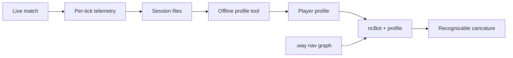

## Summary

Record per-player match telemetry from Nuclide multiplayer sessions, mine each player's **aggression** and **movement** signatures offline, and bias the existing `ncBot` so it recognizably "plays like" that person — a caricature, not a doppelganger. No neural net at runtime; build the data pipeline first, then aggression dials, then motion-clip playback.

---

## Problem Frame

Nuclide already has rule-based bots (`src/botlib/`) that pathfind and fight, but they feel generic. The goal is not smarter bots in the abstract — it is bots that evoke a specific human player well enough that someone who knows them would say "that's Bob's style."

Demo files were the original inspiration, but this build cannot lean on them as the primary data path: server MVD recording is disabled (`base/engine.h`), and SSQC has no API to read per-frame usercmds from demos. The workable path is **live match telemetry** that logs the same `(state, action)` pairs demos would ideally provide, tagged by player identity.

---

## Key Decisions

- **Homage fidelity, not Turing-test replication.** Capture recognizable habits (aggression posture, movement texture), not indistinguishable play.
- **Signature traits: movement + aggression only.** Weapon preference, route heatmaps, and aim curves are out of v1 scope even though the recorder may capture them for later.
- **Data source: own Nuclide matches.** No cross-game demo import (Q3/CS) in v1.
- **Telemetry over demo parsing.** Direct server-side logging is the primary capture mechanism; demo/MVD support is a future optional input, not v1.
- **Phased delivery: recorder → aggression dials → motion clips.** Each phase is independently shippable; later phases do not discard earlier work.
- **Extend `ncBot`, don't replace it.** Learned behavior feeds into the existing `RunAI` usercmd surface (`input_buttons`, `input_movevalues`, `input_angles`), not a parallel bot system.

---

## Actors

- A1. **Human player** — plays Nuclide matches; is the source of recorded behavior.
- A2. **Server / match host** — runs the telemetry recorder during live play.
- A3. **Offline profile tool** — ingests recorded sessions and emits per-player profile data.
- A4. **`ncBot` instance** — loads a player profile and produces usercmds each frame via `RunAI`.
- A5. **Map author / operator** — places nav nodes (`.way` graph) so bots can move; unchanged from today.

---

## Requirements

**Telemetry capture**

- R1. During a live multiplayer match, the server records per-player, per-tick **actions** (view angles, movement vector, button bits) and **state** (position, velocity, health, active weapon, visible enemies within a defined radius, line-of-sight flags) tagged by a stable player identity.
- R2. Recorded sessions are written to durable storage outside the match process and can be listed, filtered, and exported by player identity and map name.
- R3. The recorder adds negligible per-tick overhead during normal play (target: no perceptible server hitch on a typical match).

**Profile extraction**

- R4. Given one or more sessions for a single player, the offline tool produces a **player profile** containing at minimum: aggression parameters and movement-signature parameters (see R5–R6).
- R5. **Aggression parameters** capture macro disposition: preferred engagement range, push-vs-hold tendency, retreat health threshold, peek frequency, and time-to-commit after spotting an enemy.
- R6. **Movement-signature parameters** (v1 statistical layer) capture frequency and context of signature moves: jump rate while advancing, strafe-while-moving tendency, crouch-peek rate, and average move-speed scale relative to max.
- R7. **Motion clips** (v2 layer): the offline tool also segments short labeled usercmd sequences (e.g., bhop burst, peek-and-retreat, strafe jiggle) suitable for runtime playback.

**Bot integration**

- R8. A bot can be spawned (or reconfigured) to load a specific player's profile by name; the profile affects `RunAI` output for that bot instance.
- R9. Aggression parameters replace or override the hard-coded engagement thresholds and retreat logic in the current bot combat layer — a "Bob" bot pushes closer and peeks sooner than a "Alice" bot with the same nav graph and `bot_skill`.
- R10. Movement-signature parameters bias steering, jump/crouch timing, and move-speed scale so the bot's locomotion texture differs visibly between profiles without breaking pathfinding.
- R11. Motion-clip playback (v2): when the bot's situation matches a clip label, it plays back or blends a real recorded usercmd sequence toward its nav goal; when geometry diverges or no clip matches, it falls back to statistical movement (R10) and then to default `ncBot` steering.
- R12. Profile loading does not require a map restart; switching a bot's profile mid-session is supported for testing.

**Operator experience**

- R13. An operator can see which player profiles exist, how many sessions back each profile, and when it was last updated.
- R14. A bot running a player profile is identifiable in-game (name tag or equivalent) so observers know whose style it is emulating.

---

## Key Flows

- F1. **Record a session**
  - **Trigger:** A multiplayer match starts with recording enabled.
  - **Actors:** A1, A2
  - **Steps:** Server logs per-tick state+action for every connected player → session file written on match end.
  - **Outcome:** Raw telemetry available for offline mining.
  - **Covered by:** R1, R2, R3

- F2. **Build a player profile**
  - **Trigger:** Operator runs the offline tool against one player's sessions.
  - **Actors:** A3
  - **Steps:** Tool aggregates aggression stats (R5) and movement stats (R6); optionally segments motion clips (R7) → profile artifact emitted.
  - **Outcome:** Named player profile ready for bot loading.
  - **Covered by:** R4, R5, R6, R7, R13

- F3. **Spawn a caricature bot**
  - **Trigger:** Operator adds a bot with a named player profile.
  - **Actors:** A4, A5
  - **Steps:** Bot loads profile → `RunAI` applies aggression dials (R9) and movement bias (R10/R11) atop existing nav + combat FSM → usercmds sent each frame.
  - **Outcome:** Bot plays the map using recognizable player-specific aggression and movement habits.
  - **Covered by:** R8, R9, R10, R11, R12, R14

---

## Acceptance Examples

- AE1. **Covers R9.** Bob's profile shows high push tendency and low retreat threshold. A Bob-bot and a default bot on the same map, same `bot_skill`, nav to the same fight: the Bob-bot commits to the engagement sooner and closes distance more aggressively.
- AE2. **Covers R10.** Bob bhops while advancing; Alice walks. Bots with each profile on a flat corridor: Bob-bot jumps at Bob's recorded rate while moving forward; Alice-bot rarely jumps.
- AE3. **Covers R11.** Bob-bot approaches a corner Bob historically jiggle-peeks: bot plays a segmented peek clip instead of sliding smoothly to the node center; if the wall geometry blocks the clip, bot falls back to statistical movement without freezing.
- AE4. **Covers R4, R13.** Operator builds a profile from three Bob sessions: tool reports session count and warns if data is below a minimum threshold for stable caricatures.
- AE5. **Covers R14.** Observer sees the bot's display name (or tag) indicates it is emulating "Bob," not a generic `ncBot` profile from `scripts/bots.txt`.

---

## Success Criteria

- A player who knows Bob watches a bot with Bob's profile for one full round and correctly identifies whose style it is emulating without being told — at homage fidelity, not blind-test fidelity.
- Aggression caricature is achievable with Phase 1 (recorder + aggression dials) alone; movement caricature requires Phase 2 (statistical layer) and improves further with Phase 3 (motion clips).
- The telemetry pipeline is reusable: adding weapon or aim traits later requires only new profile fields and `RunAI` hooks, not a new capture mechanism.

---

## Scope Boundaries

**Deferred for later**

- Behavioral-cloning neural policy and external/native inference (Approach C).
- Weapon preferences, route heatmaps, and aim-signature modeling.
- Demo/MVD file parsing as an alternate input once MVD recording is re-enabled or an offline parser exists.
- Cross-game demo import (Q3, CS/HL).
- Climbing past homage toward stand-in or doppelganger fidelity.
- Automatic nav-node generation from recorded trajectories.

**Outside this product's identity**

- Replacing human players in ranked or stat-tracked competitive matches without disclosure.
- Bots that impersonate real players deceptively (homage bots should be clearly labeled per R14).

---

## Dependencies / Assumptions

- `ncBot` and its usercmd actuator in `src/botlib/Bot.qc` remain the runtime brain; profiles are inputs, not a replacement FSM.
- Nav coverage via `.way` files (`src/nav/`) is unchanged; caricature bots depend on the same graph as today's bots.
- `botpersonality_t` in `src/botlib/Bot.h` is currently unwired; aggression profiles may reuse this slot or a parallel profile struct — planning decides.
- Existing `scripts/bots.txt` profiles are cosmetic (name, colors, model); player-replication profiles are a separate artifact.
- Engine changes for telemetry logging are expected (`base/engine.h` shows MVD off; no SSQC demo-read API exists).
- TCP/HTTP hooks exist in the engine (`platform/tcp.qc`, `uri_get`) but are not bot-specific; external inference is out of v1 scope.

---

## Outstanding Questions

**Deferred to Planning**

- Minimum session count / playtime per player before a caricature is stable (cold-start UX).
- Player identity key: userinfo name vs persistent account ID.
- Motion-clip desync policy: blend-out threshold, max clip duration, collision abort rules.
- Telemetry storage format, rotation, and privacy (what to log, retention).
- Whether v1 logging lives in engine C, SSQC, or both.

**Resolve Before Planning**

- None — planning may proceed with the assumptions above.

---

## Sources / Research

- Existing bot framework: `src/botlib/` (`Bot.qc` `RunAI` usercmd surface, `profiles.qc` spawn path, `combat.qc` engagement thresholds).
- Nav system: `src/nav/route.qc`, `src/nav/NodeEditor.qc` (`.way` text format under `data/<mapname>.way`).
- MVD disabled: `base/engine.h` (`#undef MVD_RECORDING`).
- FTE demo capabilities documented in `src/common/fteextensions.qc` (`isdemo`, `getplayerstat` — CSQC-only, no SSQC usercmd read).
- Grounding dossier from repo scan (brainstorm Phase 1.1).
