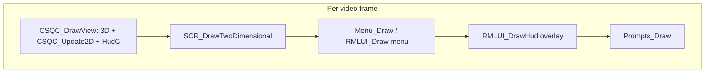

# feat: RmlUI in-game HUD layer (engine + assets + Nuclide handoff)

## Summary

Add a dedicated **in-game RmlUI document** path in the FTE fork so a `.rml` HUD can render **while the main menu is closed**, composited **after** the existing CSQC full-frame path (which already draws HudC in `CSQC_Update2D`). Feed it from a small, explicit **data bridge** (engine-side stats and/or QC-published cvars) so Nuclide can migrate widgets incrementally without blocking on a full Stiletto port.

---

## Problem Frame

RmlUI today is **menu-gated**: `RMLUI_Draw` returns unless `g_menu_open` is true (`../fteqw/engine/client/rml_menu.cpp`), so **no Rml draws during normal play** even with `ui_rmlmenus` on. Nuclide’s HUD remains **HudC** (`hud.dat`, `base/src/hud/hud.qc`) invoked from `src/client/entry.qc` inside `CSQC_Update2D`. The user wants to **start the in-game Rml HUD track** now, building on prior menu-first Rml work.

---

## Requirements

- R1. With a user-visible toggle (cvar or manifested game setting), the engine can **load and render** a dedicated in-game HUD `.rml` document when the client is in active play and the **pause/main menu is not open**.
- R2. The new path **does not replace** the existing menu Rml stack; opening the menu should still behave as today (menus remain authoritative for menu-time input when applicable).
- R3. **Input**: Default gameplay must remain first-person mouse-look capable; the HUD layer must **not** capture mouse or keys unless explicitly in an interactive HUD mode (defer complex focus rules to a follow-up if needed—see Open Questions).
- R4. **Data**: At least **health** (and one additional field such as armor or ammo) must update on screen every frame without manual console steps, proving the binding path.
- R5. **Compositing order** is defined and documented: where the HUD draws relative to CSQC 2D, `Menu_Draw`, console, and prompts so artists and implementers know what occludes what.
- R6. Respect project constraint: **do not modify vendored RmlUi**; only FTE integration files (`rml_menu.cpp` / related) and game-owned RML/RCSS under the gamedir.

---

## Scope Boundaries

- Not in v1: Full parity with `base/stilettohudsvg.txt` or complete removal of HudC; plan assumes **parallel run** (HudC can stay until Rml coverage is sufficient).
- Not in v1: Lua CSQC (`csprogs.lua`) bindings unless already trivially available—primary consumer remains **Nuclide QC + engine stats**.
- Not in v1: Vulkan-specific regressions beyond smoke verification on the user’s primary backend.

### Deferred to Follow-Up Work

- Rich **DataModel** (C++ types per widget) vs thin **cvar/string** bridge for all TF2-style stats.
- Interactive HUD hitboxes, controller focus, and `pointer-events` policy when overlapping VGUI.
- Packaging story for **which gamedir** ships `ui/rml/` when the git root is `nuclide` alone (symlink/copy into active `id1` for FTE runs).

---

## Context & Research

### Relevant Code and Patterns

- **Menu-only Rml draw**: `RMLUI_Draw` early-outs when `!g_menu_open` (`../fteqw/engine/client/rml_menu.cpp`).
- **Frame order (GL example)**: `CSQC_DrawView()` runs inside the GL screen path first; when it returns true, `SCR_DrawTwoDimensional` still runs afterward (`../fteqw/engine/gl/gl_screen.c`). Today `Menu_Draw` calls `RMLUI_Draw` which can short-circuit legacy menu drawing when the Rml menu is open (`../fteqw/engine/client/menu.c`).
- **Nuclide HUD**: `addprogs("hud.dat")` loader in `src/client/hud.qc`; draw entry `CSQC_Update2D` in `src/client/entry.qc`; default widgets in `base/src/hud/hud.qc` using `screen.HUDMins` / `screen.HUDSize`.
- **HudC contract** (optional replacement path): `src/client/api_func.h` documents implementing `HUD_*` in `csprogs.dat` instead of `hud.dat`.

### Institutional Learnings

- No `docs/solutions/` entries referenced Rml HUD; rely on `AGENTS.md` / parent tree guidance: RML under gamedir `ui/rml/`, stylesheet links relative to that folder, **do not edit vendored RmlUI**, and compat-profile **VAO** constraints (`fteqw/docs/specs/rmlui-vao-compat-pitfall-v1.md`) when touching GL init paths adjacent to UI.

### External References

- RmlUi **multiple documents** in one `Context` are supported upstream—favor a **second document** (`hud.rml`) over a second context unless profiling says otherwise.

---

## Key Technical Decisions

- **KD1 — Separate “hud document” from menu documents**: Extend the existing `Rml::Context` in `rml_menu.cpp` with a persistent `g_hud_doc` (names tentative) loaded from a fixed vfs path such as `ui/rml/hud.rml`, distinct from `main_menu.rml` / `pause_menu.rml` navigation.
- **KD2 — Draw injection site**: Invoke a new `RMLUI_DrawHud` (or equivalent) from `SCR_DrawTwoDimensional` in `../fteqw/engine/client/cl_screen.c` **after** `Menu_Draw` (or immediately before `Prompts_Draw`) so **pause/menu Rml stays above** the in-game hud when open; when the menu is closed, the hud layer still renders.
- **KD3 — Data bridge v1**: Prefer **engine reading `playerview` stats** (health/armor/ammo indices already used by sbar) into Rml `DataModel` variables on the hud document, to avoid ordering bugs with QC-authored cvars. Optionally mirror a **small set of `hud_*` cvars** if QC must force strings (weapon titles) before a richer model exists.
- **KD4 — Nuclide posture**: Keep `HUD_Draw` in HudC for v1; add a **cvar gate** (e.g. `g_showHud` companion or new `ui_rmlhud`) so QA can compare **Rml-only overlay**, **QC-only**, or **both** while iterating.

---

## Open Questions

### Resolved During Planning

- **Does CSQC run before `SCR_DrawTwoDimensional`?** Yes (`../fteqw/engine/gl/gl_screen.c`), so engine-driven Rml hud drawn in `SCR_DrawTwoDimensional` composites **on top of** HudC for that frame unless HudC is disabled.

### Deferred to Implementation

- **Exact input policy** when the hud contains buttons: whether to use Rml’s focus only when a modal is open vs never stealing mouse in v1.
- **Split-screen / per-seat hud**: whether one document clones per `r_refdef.grect` or v1 is **seat 0 only**.

---

## High-Level Technical Design

> *This illustrates the intended approach and is directional guidance for review, not implementation specification. The implementing agent should treat it as context, not code to reproduce.*

Data flows **Player stats / time** → **C++ sync function** → **Rml DataModel** on `hud.rml` each frame before `Render()` on that document (or context update—exact API choice is implementation-time).

---

## Implementation Units

- U1. **[Engine] Hud document lifecycle**

**Goal:** Load, show, hide, and unload an in-game `hud.rml` tied to a new enable cvar.

**Requirements:** R1, R2, R6

**Dependencies:** None

**Files:**
- Modify: `../fteqw/engine/client/rml_menu.cpp`, `../fteqw/engine/client/rml_menu.h`, `../fteqw/engine/client/rml_cvar.c` (or adjacent cvar registration)
- Modify: `../fteqw/engine/Makefile` only if new object wiring is required (unlikely for `.cpp` already in target)
- Test: *Manual / scripted in-game* — document exact launch flags in verification (no automated harness assumed)

**Approach:** Add `g_hud_doc` alongside existing menu docs; ensure `RMLUI_Init` creates context once; `vid_reload` / shutdown paths mirror menu doc teardown; guard all new calls with `#ifdef USE_RMLUI` and keep stubs in the `#else` branch of `rml_menu.cpp`.

**Patterns to follow:** Existing `Rml_LoadDocument` / `Rml_GetDocument` patterns in `rml_menu.cpp`; vfs paths remain lowercase `ui/rml/`.

**Test scenarios:**
- Happy path: `ui_rmlmenus 1`, new hud cvar `1`, in map → **hud visible**, menu closed.
- Edge case: Toggle hud cvar at runtime → document appears/disappears without leak warnings in console across 60s.
- Integration: Open main menu → **menu still interactive**; close menu → hud returns; no duplicate context errors.

**Verification:** In a USE_RMLUI build, no crash when toggling cvars and toggling menu; `rmltest` command still works for arbitrary docs.

---

- U2. **[Engine] Draw order hook**

**Goal:** Actually paint the hud document each frame at the agreed compositing point.

**Requirements:** R5, R1

**Dependencies:** U1

**Files:**
- Modify: `../fteqw/engine/client/cl_screen.c` (`SCR_DrawTwoDimensional`)
- Possibly modify: `../fteqw/engine/client/menu.c` only if a cleaner shared helper is needed—prefer minimal surface

**Approach:** Call the new draw function after `Menu_Draw` so fullscreen menu Rml occludes the hud; skip when `nohud` path intentionally suppresses overlays (respect `SCR_DrawTwoDimensional(nohud)` semantics).

**Test scenarios:**
- Happy path: Gameplay + hud cvar on → hud draws **above** HudC baseline (visual check with a translucent root in `hud.rml`).
- Edge case: `nohud` / loading / intermission modes → hud draw function **does not** assert or leave stale GL state.

**Verification:** Single-frame capture or visual checklist confirms ordering against console and prompts.

---

- U3. **[Engine] Data binding v1**

**Goal:** Prove live fields on the hud without requiring QC changes.

**Requirements:** R4

**Dependencies:** U1

**Files:**
- Modify: `../fteqw/engine/client/rml_menu.cpp` (DataModel registration / update helper)
- Reference: `../fteqw/engine/client/sbar.c` or stat accessors used by `Sbar_Draw` for canonical stat indices

**Approach:** On each hud draw tick, write **health + one other stat** into bound Rml variables; keep conversion in one helper to simplify future expansion.

**Test scenarios:**
- Happy path: Player takes damage → Rml health label decreases same frame as engine stats.
- Edge case: Spectator or missing local player → helper **no-ops** without log spam.

**Verification:** Damage self in-game; observe bound fields track `cl.playerview[0]` (or chosen seat) stats.

---

- U4. **[Game assets] Minimal `hud.rml` + stylesheet**

**Goal:** Ship a default layout artists can iterate.

**Requirements:** R1, R4, R6

**Dependencies:** U1, U3

**Files:**
- Create: `id1/ui/rml/hud.rml` (path relative to **active gamedir** at runtime—may live under Bulwark `id1/` or be copied from `nuclide` packaging; document the chosen checkout layout in verification notes)
- Create: `id1/ui/rml/hud.rcss` (or shared include from existing `common.rcss` if present)

**Approach:** Use **RML text elements** for dynamic numbers (per project guidance: avoid SVG-outlined text for dynamic fields). Follow `rgba()` 0–1 alpha rules for RCSS.

**Test scenarios:**
- Happy path: Fonts resolve via existing `LoadFontFace` / `font-family` wiring used by menus.
- Error path: Missing `hud.rml` → **graceful** console warning, no crash; hud cvar effectively no-ops.

**Verification:** File loads from vfs with `FS_GAME`; stylesheet `<link href="...">` resolves relative to `ui/rml/`.

---

- U5. **[Nuclide] Integration + documentation touchpoints**

**Goal:** Make the feature discoverable to Nuclide developers and allow turning off legacy HudC for A/B.

**Requirements:** R4, KD4

**Dependencies:** U2, U3 (for meaningful toggling)

**Files:**
- Modify (optional): `src/client/hud.qc` or `src/client/entry.qc` — only if a thin QC-side toggle is needed for `g_showHud` interaction with engine cvar
- Modify: `src/client/api_func.h` comment block — clarify relationship between HudC and **engine-managed** Rml hud (non-vendored integration lives in `fteqw/`)
- Modify: `AGENTS.md` (only if the user approves doc edits—**otherwise** skip and capture in PR description)

**Approach:** Prefer **engine cvar + autoexec** documentation over QC churn; if QC must set mirror stats for weapon titles before engine bridge expands, document ordering relative to `CSQC_Update2D`.

**Test scenarios:**
- Happy path: With hud overlay on and `g_showHud 0`, **only** Rml draws for numeric fields under test.
- Integration: `HUD_ConsoleCommand` / existing `Cmd` path does not regress when new cvar is present.

**Verification:** README or PR text lists required cvars and file paths for level designers.

---

## System-Wide Impact

- **Interaction graph:** `SCR_DrawTwoDimensional`, `Menu_Draw`, `RMLUI_*`, CSQC `CSQC_Update2D`, possible future `in_generic.c` if hud needs pointer input.
- **Error propagation:** Rml load failures must be soft; never block `SCR_DrawTwoDimensional` completion.
- **State lifecycle risks:** Document reload (`vid_reload`) must recreate DataModel handles or rebind cleanly.
- **API surface parity:** Stub builds without `USE_RMLUI` must link and behave as today.
- **Unchanged invariants:** Vendored RmlUi tree; existing menu navigation documents; Nuclide `addprogs("hud.dat")` contract.

---

## Risks & Dependencies

| Risk | Mitigation |
|------|------------|
| Double HUD clutter while migrating | Cvar to disable HudC or make Rml root transparent until parity |
| Mouse focus stolen by hud | v1 uses non-interactive elements; document deferred interactive policy |
| Wrong repo for `id1` assets in solo `nuclide` checkout | Explicit packaging note; copy step into active gamedir for FTE runs |
| GL state leakage from extra `Context::Render` | Follow existing `RMLUI_Draw` GL path; pair with `R2D_Flush` expectations |

---

## Documentation / Operational Notes

- Update PR / contributor notes with: required cvars, vfs paths, and **draw order** diagram.
- Mention compatibility with `docs/specs/rmlui-vao-compat-pitfall-v1.md` when touching related GL init.

---

## Sources & References

- Related engine code: `../fteqw/engine/client/rml_menu.cpp`, `../fteqw/engine/client/cl_screen.c`, `../fteqw/engine/gl/gl_screen.c`
- Nuclide HUD: `src/client/hud.qc`, `src/client/entry.qc`, `base/src/hud/hud.qc`, `src/client/api_func.h`
- Workspace guidance: `AGENTS.md` (parent), `fteqw/docs/specs/rmlui-vao-compat-pitfall-v1.md`
