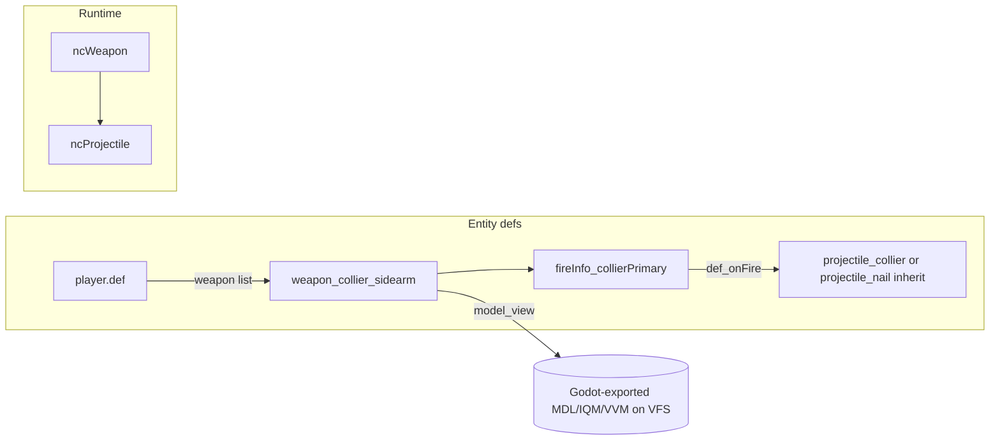

# feat: Base player single sidearm (revolver-style nails + Godot viewmodel)

## Summary

Introduce a dedicated sidearm weapon definition that fires existing physical nail projectiles at a tunable speed with a slower, revolver-like primary cadence, wire the base `player` spawn inventory to that weapon only, and ship the first-person viewmodel as an engine-loadable model on the game VFS referenced by `model_view`. Reference scene `stiletto_protophase2` / `ss_player_collier` is treated as design intent (single gun); it is not present in this repository.

---

## Problem Frame

The default `player` carries multiple weapons and Stiletto ability weapons (`base/decls/def/player.def`), which is heavier than the desired Bulwark/Stiletto prototype where the collier-style character effectively runs one firearm. The codebase already has a full nailgun stack (`base/decls/def/weapons/nailgun.def`, `ncProjectile`); the gap is product wiring (loadout, cadence, viewmodel asset path) rather than inventing a new projectile system from scratch.

---

## Requirements

- R1. Base `player` (and `player_mp` if it must stay equivalent) spawns with **one** primary firearm in inventory—no axe, shotgun, or separate Stiletto grapple/boot **items** unless explicitly scoped back in later.
- R2. That firearm fires **physical projectiles** using the existing nail spike path (`projectile_nail` or a thin inherit that only adjusts speed/offset/damage), not hitscan, unless product explicitly changes.
- R3. **Fire cadence and feel** approximate a TF2-style revolver: single projectile per press, **meaningfully slower** than the stock nailgun’s `0.1s` `fireRate`, with tuning values captured in def keys (`fireRate`, `velocity`, optional `punchSpring`) so designers can iterate without code changes where possible.
- R4. First-person presentation uses **`model_view`** on the weapon def (consumed in `src/shared/game/Weapon.qc`) pointing at the **Godot-authored viewmodel** file placed on the VFS under a stable path (e.g. `models/...` or `progs/...` consistent with existing weapons).
- R5. Spawn precaches (`base/decls/def/spawns.def` and any other `def_precache*` that still reference `weapon_shotgun` / `weapon_axe`) align with the new default so clients do not miss precaches for the actual starting kit.

**Origin actors:** Player (local + remote clients for viewmodel/prediction).

**Origin flows:** F1 Spawn with sidearm only; F2 Primary fire launches nail projectile at tuned speed; F3 No weapon cycling to alternate primaries (only one weapon).

**Origin acceptance examples:** AE1 New game / `map` load: player holds sidearm, viewmodel visible, primary fire spawns moving spike. AE2 Repeated fire respects cooldown. AE3 Spike impacts world/actors with existing nail feedback.

---

## Scope Boundaries

- Does not replicate Godot scene graph or animation state machines inside QC—only whatever FTE/Nuclide already supports for viewmodels (sequences, `animPrefix`, model events if used).
- Does not change global skill definitions or non-player weapon pickups unless required for broken references.
- Does not mandate automated tests: the repo has no established automated test harness for `.def`/QC gameplay (see Implementation Units—verification is manual/in-engine).

### Deferred to Follow-Up Work

- Reintroducing grapple/boot as **non-inventory** ability items if design wants movement kit without a second “gun” HUD slot (follows patterns in `base/decls/def/weapons/stiletto.def` and AGENTS.md Stiletto notes).
- RmlUI HUD slot artwork updates if the HUD assumes multiple weapon icons (`base/ui/rml/hud.rml` currently uses a static weapon icon asset).

---

## Context & Research

### Relevant Code and Patterns

- Default loadout: `base/decls/def/player.def` — `weapon` list and `current_weapon` index; `act_attack` still targets shotgun animation id today.
- Nailgun + projectile tuning: `base/decls/def/weapons/nailgun.def` — `fireInfo_*` `fireRate`, `def_onFire` → `projectile_nailLeft` / `Right`, `projectile_nail` `velocity` `"1000"`, damage via `damage_nailDirect`.
- Weapon viewmodel path: `src/shared/game/Weapon.qc` — `model_view` key → `m_viewModel` / `SetViewModel` pipeline.
- Projectile launch math: `src/shared/game/Projectile.qc` — `Launch` applies `velocity` relative to view axes (see `Projectile.h` header).
- Def includes: `base/decls/def/weapons.def` — add `#include` for any new weapon def file.
- Spawn precache: `base/decls/def/spawns.def` — `info_player_start` / `info_player_deathmatch` still precache shotgun+axe.

### Institutional Learnings

- No matching entries in `docs/solutions/` for this topic (none found).

### External References

- Godot → FTE model format is an **asset pipeline** decision (IQM, MDL, VVM per existing model viewer search patterns in `src/menu-vgui/ui_modelviewer.qc`); the plan assumes the team’s existing export path for Stiletto/Bulwark props.

---

## Key Technical Decisions

- **New weapon def vs. repurposing `weapon_nailgun`:** Add a **new** `entityDef` (e.g. `weapon_collier_sidearm`) that **inherits** or copies the minimal nailgun field set so stock nailgun remains available for monsters/mappers without surprise behavior changes.
- **Projectile reuse:** Inherit `projectile_nail` (or `projectile_nailLeft` only) to adjust **`velocity`** and spawn **`offset`** for a centered muzzle like a pistol; keep `detonate_on_world` / `detonate_on_actor` behavior unless design wants different impact rules.
- **Cadence:** Set primary `fireRate` in the new `fireInfo_*` to a revolver-scale interval (order of **0.4–0.65s**—tune in implementation; not fixed in the plan). Omit `def_altFireInfo` / `altAlternates` unless a secondary is explicitly requested.
- **Strip inventory:** `player.def` `weapon` key becomes a single def name; set `current_weapon` to `0` (first and only). Remove grapple/boot from the list to satisfy R1 as written; if product revokes that, it is a one-line revert.
- **Player animation hook:** Align `act_attack` (and related `act_*` if needed) in `player.def` with sequences that exist on the **player** model for the nailgun/sidearm attack, or document that the player mesh uses a shared generic attack until skeletal anim work lands—avoid a mismatch that leaves T-pose on attack.

---

## Open Questions

### Resolved During Planning

- **Where does `ss_player_collier` live?** Not in the Nuclide workspace; treated as **external design reference**. Implementer pulls timing/UX intent from that scene or author notes.
- **External research?** Skipped—local patterns (`nailgun.def`, `Weapon.qc`, `Projectile`) are sufficient for the technical approach.

### Deferred to Implementation

- Exact exported viewmodel **file format** and **sequence names** from Godot (depends on exporter and rig).
- Final numeric tuning (`fireRate`, `velocity`, damage def) after playtest.

---

## High-Level Technical Design

> *This illustrates the intended approach and is directional guidance for review, not implementation specification. The implementing agent should treat it as context, not code to reproduce.*

---

## Implementation Units

- U1. **Add sidearm weapon and fire/projectile defs**

**Goal:** A spawnable weapon entity that behaves like a single-shot revolver using nail physics.

**Requirements:** R2, R3, R4

**Dependencies:** None

**Files:**
- Create: `base/decls/def/weapons/collier_sidearm.def` (filename may be adjusted to match naming conventions)
- Modify: `base/decls/def/weapons.def`
- Test: *Manual only — no automated gameplay test target in repo*

**Approach:**
- Define `weapon_collier_sidearm` with `spawnclass` `ncWeapon`, `ammoType` `ammo_nails` (or new ammo def if magazines are desired later—default keep nails for speed), single `def_fireInfo`, `model_view` pointing at the exported Godot viewmodel path.
- Add `fireInfo_collierPrimary` with one `def_onFire` pointing at a projectile def that inherits `projectile_nail` with updated `velocity` / `offset`.
- Remove alt-fire alternation keys present on stock nailgun unless secondary fire is explicitly in scope.

**Patterns to follow:**
- `base/decls/def/weapons/nailgun.def`, `base/decls/def/weapons/shotgun.def` (simpler single-fireInfo weapons)

**Test scenarios:**
- Happy path: Load map, player holds sidearm, primary attack spawns visible spike, spike travels at expected speed, impacts produce nail audio/particles.
- Edge path: Fire underwater verifies inherited water slowdown (`Projectile.qc` divides velocity)—confirm still acceptable or override if undesired.
- Edge path: Hold primary—fires only after full `fireRate` interval (no nailgun-style double-bar alternation).
- Integration: Viewmodel precaches and draws; no `GetModelIndex` / missing model console errors.

**Verification:**
- In-engine spawn with only the new weapon; no fallback to axe/shotgun; viewmodel visible.

---

- U2. **Simplify `player` inventory to the sidearm**

**Goal:** Default player matches single-weapon collier intent.

**Requirements:** R1

**Dependencies:** U1

**Files:**
- Modify: `base/decls/def/player.def`
- Test: *Manual*

**Approach:**
- Replace `weapon` CSV with the new weapon def only; set `current_weapon` to the sole index.
- Drop `weapon_stiletto_grapple` and `weapon_stiletto_boot` from the list for this iteration (defer re-adding per Scope if needed).
- Update `act_attack` (and any weapon-class animation fields) so the player model uses a valid attack sequence for this weapon.

**Patterns to follow:**
- Existing `player.def` structure; compare with `player_enforcer` inherit pattern if creating a variant is cleaner than editing base `player` directly.

**Test scenarios:**
- Happy path: Spawn `player` — inventory count shows one weapon; impulse weapon slots do not crash or desync (smoke test weapon switch impulses if they exist in binds).
- Edge path: `player_mp` inherits changes correctly or is overridden explicitly if multiplayer needs a different kit.

**Verification:**
- `impulse` / scroll weapon cycling either no-ops safely or stays on the single weapon without errors.

---

- U3. **Align spawn precaches with the new kit**

**Goal:** Clients precache models/sounds actually used at spawn.

**Requirements:** R5

**Dependencies:** U1, U2

**Files:**
- Modify: `base/decls/def/spawns.def`
- Test: *Manual — watch for precache warnings on listen server / client*

**Approach:**
- Point `def_precache1` / `def_precache2` on relevant `info_player_*` defs to the sidearm (and projectile/world model if not transitively precached).

**Patterns to follow:**
- Existing `def_precache` usage in `spawns.def`

**Test scenarios:**
- Integration: Dedicated client connect to listen server with new player kit—no missing-model pink/black errors for viewmodel or spike.

**Verification:**
- No new precache warnings attributable to spawn defs.

---

- U4. **Godot viewmodel export and VFS placement**

**Goal:** The sidearm’s `model_view` resolves at runtime.

**Requirements:** R4

**Dependencies:** U1 (path must match def)

**Files:**
- Create or update under game content roots (e.g. `base/models/...` or documented `progs/...` path—exact tree chosen during implementation)
- Modify: `weapon` def `model_view` / optional `model` (ground pickup) if a world model is required

**Approach:**
- Export from Godot/Stiletto using the team’s established pipeline to a format FTE loads (same family as existing `progs/v_nail.mdl` or other shipped viewmodels).
- Ensure sequences needed for `idle` / `fire` (names must match `animPrefix` / weapon code expectations—confirm against `Weapon.qc` animation driving) exist.
- If model events drive muzzle flash timing, add matching `.events` sidecar only if already used elsewhere—otherwise keep particle hook on projectile `fx_path` only.

**Patterns to follow:**
- Existing `model_view` paths in `nailgun.def` / `shotgun.def`

**Test scenarios:**
- Happy path: First-person model visible, animates on fire.
- Error path: Intentionally break path locally once to confirm failure mode is obvious (then restore)—documents troubleshooting for artists.

**Verification:**
- Model loads in `ui_modelviewer` or equivalent precache path without errors.

---

## System-Wide Impact

- **Interaction graph:** Any tutorial text, pickup spawners, or maps that assume `weapon_shotgun` start may need mapper updates (out of code scope unless repo ships those maps).
- **Error propagation:** Bad `model_view` shows as missing model at runtime—catch early via precache list.
- **State lifecycle risks:** Low—defs are static; watch `current_weapon` indexing if multiple defs temporarily reintroduced during dev.
- **API surface parity:** N/A for external APIs.
- **Integration coverage:** Client viewmodel draw + server projectile spawn must be tested together (listen server).
- **Unchanged invariants:** `ncProjectile` physics and general `ncWeapon` API remain unchanged; only data defs and player default inventory.

---

## Risks & Dependencies

| Risk | Mitigation |
|------|------------|
| Godot export rig/sequence names do not match what `ncWeapon` expects | Early import test in model viewer; adjust `animPrefix` or rename sequences in export |
| Removing grapple/boot breaks Stiletto movement spec | Flag in Deferred; re-add abilities per AGENTS.md bind pattern without adding second HUD weapon if needed |
| Mapper content still gives shotgun/axe pickups | Accept for v1 or sweep known shipped maps in a follow-up PR |

---

## Documentation / Operational Notes

- Document the chosen VFS path and export settings beside the art asset (artist-facing README only if the team wants—optional, not required by this plan).

---

## Sources & References

- **External design reference:** Godot scene `stiletto_protophase2` → `ss_player_collier` (not in repo—verify locally).
- Related code: `base/decls/def/player.def`, `base/decls/def/weapons/nailgun.def`, `src/shared/game/Weapon.qc`, `src/shared/game/Projectile.qc`, `base/decls/def/spawns.def`
