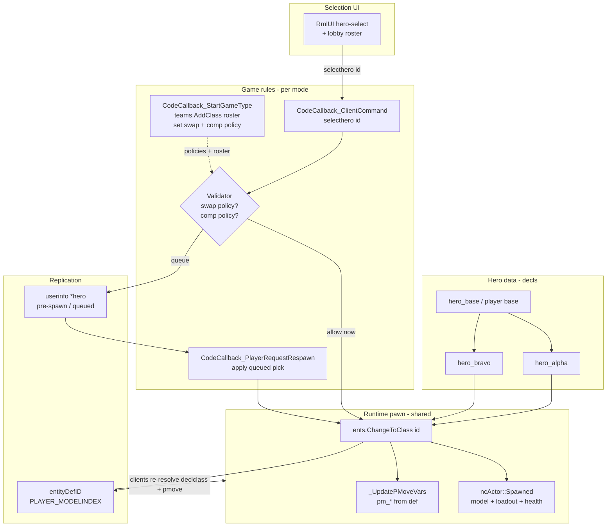

# feat: Hero roster system (data-driven playable character selection)

## Summary

Generalize the existing `player` / `player_mp` / `player_enforcer` `entityDef` trio into a first-class, data-driven **hero roster**: a set of playable characters that differ by **model, stats, movement tuning, and weapon loadout** (no special abilities this iteration), selectable through a roster UI, spawned via the existing `ents.ChangeToClass()` path, and replicated to clients through the already-networked `entityDefID`. Selection policy (when players may swap heroes) and team-composition policy (duplicates allowed vs. one-of-each hero-lock) are **per-ruleset configurable**, exposed as game-rule settings rather than hardcoded.

The system is intentionally scoped to reuse Nuclide's existing primitives (decls, class-switching, decl loadouts, replicated def id) and to leave clean seams for a future generic ability system (deferred).

---

## Problem Frame

Nuclide already contains a two-hero prototype: `teamdm.qc` maps team 1 → `player_enforcer` and team 2 → `player_mp`, and `player_enforcer` is a real hero-style variant (`inherit "player"` with a different model/animations). But:

- Heroes are **implicit** (a hero is just whatever player def a team happens to map to), not an enumerable roster.
- There is **no selection flow** — `cmd join <class>` exists (`vgui_changeclass.qc`, `teams.AddClass`) but `CodeCallback_ClientCommand` in the base rules is an empty switch.
- Swap and composition rules are **not modeled at all** — team join immediately re-classes the player with no notion of "locked until round end" or "this hero is taken."

The gap is **product structure and rule plumbing**, not new engine systems. All the runtime mechanics (per-def model/health/movement/loadout, replication, spawn) already work.

---

## Requirements

- **R1.** Heroes are defined as **data** — one `entityDef` per hero, each `inherit`-ing a shared base player def. Adding a hero requires **no new QC gameplay code** for the model/stats/loadout case.
- **R2.** Each hero may override: `model` (+ `act_*` animations), `health` / `max_health`, movement (`pm_walkspeed`, `pm_runspeed`, `pm_gravity`, hull/view if needed), and loadout (`weapon` / `item` CSV + `current_weapon`). These all already flow through `ncActor::Spawned()` and `ncPlayer::_UpdatePMoveVars()`.
- **R3.** A **roster registry** is exposed to game rules and UI so the playable heroes for the current mode/team can be enumerated (build on `teams.AddClass()` / `teams.ClassForIndex()`, which exist but are unused in base rules).
- **R4.** A player can **select a hero** through a client command (`join <hero_id>` or a new `selecthero <hero_id>`) routed through `CodeCallback_ClientCommand`, validated server-side against the registry, then applied via `ents.ChangeToClass(pl, hero_id)` + `game.TeleportToSpawn(pl)`.
- **R5.** The selected hero is **replicated to all clients** so models/animations/loadouts resolve correctly. Use the existing networked `entityDefID` (`PLAYER_MODELINDEX` flag group); clients already re-resolve `declclass` and refresh pmove vars on change (`Player.qc` ~L1155).
- **R6. Swap policy is per-ruleset configurable**, supporting at minimum: **swap at spawn / on death**, **swap only between rounds**, and **swap only between matches** (locked in-match). The active rule decides whether a `selecthero` request while alive/in-round is honored, queued for next respawn, or rejected.
- **R7. Composition policy is per-ruleset configurable**, supporting both **duplicates allowed** (any number of players may pick the same hero) and **hero-lock** (each hero may be taken by at most one player per team). Selection of a taken hero under hero-lock is rejected with feedback.
- **R8.** A **hero-select UI** lets players see and choose from the roster, reflects locked/taken state under hero-lock, and reflects whether swapping is currently permitted under the active swap policy.

**Origin actors:** Player (local + remote clients for model/loadout replication), Server game rules (authority on selection, swap, composition), Selection UI.

**Origin flows:** F1 Open roster → pick hero → spawn as that hero. F2 Request swap mid-match → honored / queued / rejected per swap policy. F3 Under hero-lock, taken heroes are unavailable; freed when the owner swaps or disconnects.

**Origin acceptance examples:** AE1 Two heroes defined; player selects hero B, spawns with B's model/health/speed/weapons; other clients see hero B. AE2 Ruleset = "lock in-match": mid-round `selecthero` is rejected (or queued to next respawn) per config; between-round swap is allowed. AE3 Ruleset = "hero-lock + swap on death": two players cannot both hold hero A on the same team; on death a player may switch to a free hero.

---

## Scope Boundaries

- **No generic ability system this iteration.** No ultimate/charge meters, cooldown framework, or ability input wiring. Heroes differ by model/stats/movement/weapons only. The data schema and HUD seams are designed to accept abilities later (see Deferred).
- Does not change core `ncPlayer` / `ncActor` / pmove mechanics — only data defs, rule logic, a roster registry, replication of selection state (reusing existing fields where possible), and UI.
- Does not author new hero **art** (models/animations); plan assumes the existing model/export pipeline. Example heroes may reuse existing player models.
- No automated test harness (repo has none for `.def`/QC gameplay); verification is manual/in-engine, consistent with prior plans.

### Deferred to Follow-Up Work

- **Generic ability system** (passive + abilities + ultimate): a new `ncAbility`-style component reading decl keys, `INPUT_BUTTON9–11` wiring in `src/client/cmd.qc` → server handler, a `PLAYER_ABILITY` networked flag group modeled on the existing `PLAYER_STILETTO` block, and driving `#abilitypip*` in `base/ui/rml/hud.rml`. (Architecture references: Overwatch Statescript, Unreal GAS — see Sources.)
- Per-hero HUD theming / portraits beyond basic select UI.
- Hero unlock/progression, cosmetics, or matchmaking concerns.

---

## Context & Research

### Relevant Code and Patterns

- **Hero data:** `base/decls/def/player.def` — `player`, `player_mp` (`inherit "player"`), `player_enforcer` (inherit + model/anim overrides). Template for hero defs.
- **Monster archetype pattern** (proves the inheritance/archetype approach): `base/decls/def/monsters/base.def` (`monster_base`) + concrete monsters inheriting it.
- **Class switch / spawn:** `src/shared/system/entityDef.qc` (`EntityDef_SwitchClass`, `EntityDef_Init` scans `decls/def/*.def`, resolves `inherit`), `src/shared/system/api.qc` (`changeClass`).
- **Loadout application:** `src/shared/game/Actor.qc` `ncActor::Spawned()` (~L457) parses `weapon` / `item` CSV, `current_weapon`, gives ammo, sets model.
- **Movement per-def:** `src/shared/game/Player.qc` `ncPlayer::_UpdatePMoveVars()` (~L235) → `ncPMoveVars::LinkToEntity(declclass)` reads `pm_*` from the active def (`src/shared/physics/pmove.qc`). Global movement tricks: `src/shared/physics/stiletto_tuning.qc`, `src/shared/physics/player_pmove.qc`.
- **Roster registry primitives (currently unused in base):** `teams.AddClass()` / `teams.ClassForIndex()` in `src/shared/system/api.qc`.
- **Rules callbacks:** `base/src/rules/teamdm.qc` — `CodeCallback_StartGameType` (team setup), `CodeCallback_CallRequestTeam` (team join → `ChangeToClass` to team player def), `CodeCallback_ClientCommand` (empty switch — the hook for `selecthero`), `CodeCallback_PlayerRequestRespawn`. Sibling modes: `deathmatch.qc`, `domination.qc`, `lastmanstanding.qc`, `invasion.qc`, `singleplayer.qc`. Shared helpers in `shared.qc`.
- **Selection state options:** `userinfo.SetString(pl, "*key", ...)` (used today for team colors) for pre-spawn/lobby selection; networked `entityDefID` for the live pawn.
- **Replication:** `ncPlayer::SendEntity`/`ReceiveEntity` in `Player.qc`; `entityDefID` in `PLAYER_MODELINDEX`; on client change → `declclass = EntityDef_NameFromNetID(...)` then `_UpdatePMoveVars()` (~L1155).
- **Selection UI (existing, legacy TFC-style):** `src/client/vgui_changeclass.qc` (`cmd join <classType>`), `src/client/vgui_chooseteam.qc`, registered in `src/client/cmd.qc` (`showClassSelectionMenu`). RmlUI alternative: `base/ui/rml/` (lobby roster precedent in `h3/main.rml` `#lobby-roster-list`; in-match HUD `hud.rml`).
- **Lobby mode/team registration (MenuQC):** `docs/lobby-mode-registration.md` — `lobby_registermode` / `lobby_addteam` in `menu.src` `m_init`; the lobby team columns are a natural place to surface hero picks pre-match.
- **Build:** `make game` (alias `make game GAME=base`) → fteqcc builds `progs.dat`, `csprogs.dat`, `hud.dat`, `menu.dat`, and per-gametype rules `base/progs/*.dat`. Def edits need **no recompile** (loaded at runtime by `EntityDef_Init`).

### Institutional Learnings

- AGENTS.md: target a **minimal reusable framework** (≈3 archetypes via base defs + MapC/RuleC), not the full engine surface. The hero roster should mirror the `monster_base` archetype approach with a single shared base player def.
- AGENTS.md: `entityDef`/`ncMonster`/MapC-RuleC is the intended content model; `base` runs `base/progs.dat` (not retail progs).
- Prior plan `2026-05-14-002` already simplified `player` to a single sidearm and notes the `player_enforcer` inherit pattern as the clean variant mechanism — directly reused here.

### External References

Industry hero-shooter architecture converges on **data-driven character definitions + server-authoritative state + decoupled logic** (relevant now for structure; the ability-specific parts inform the deferred follow-up):

- Overwatch (GDC): heroes/abilities are data-driven via **Statescript** over a strict **ECS**; only 3 systems touch netcode (movement, weapon, statescript), which is what keeps a large roster maintainable. Lesson applied: keep `Player.qc` hero-agnostic; carry differences in data.
- Unreal **Gameplay Ability System**: data assets (abilities/effects/tags) decoupled from the pawn; cooldowns = duration-effect-grants-tag; server authoritative with client prediction. Lesson applied (for deferred abilities): one generic cooldown/charge mechanism keyed by ability id, not bespoke per-ability timers.

(URLs in Sources.)

---

## Key Technical Decisions

- **Hero = player `entityDef` inheriting a shared base.** Introduce `hero_base` (or reuse `player` as the base) and define each hero as `hero_<name>` with `inherit`. Mirrors `monster_base`. Avoids touching runtime code for the stats/model/loadout case (R1).
  - Decision point for implementation: whether to keep `player`/`player_mp` as-is and add `hero_*` alongside, or refactor `player_mp`/`player_enforcer` to be the first two heroes. Recommended: add `hero_*` defs and migrate `teamdm.qc` to reference them, keeping `player` as the abstract base.
- **Selection routing through `CodeCallback_ClientCommand`.** Add a `selecthero <id>` (and/or extend the existing `join <id>`) case that calls a shared validator. Keeps per-mode policy in the rules layer where team/respawn logic already lives.
- **Roster registry via `teams.AddClass()`.** Populate per-team rosters in each mode's `CodeCallback_StartGameType`. UI enumerates via `teams.ClassForIndex()`. If per-team rosters are not desired, register a single shared roster.
- **Selection replication reuses `entityDefID`.** When a hero is applied, `ChangeToClass` already replicates the def id; no new networked field is required for the **live pawn**. For **pre-spawn/lobby** selection (before the pawn exists or while spectating), store the pending pick in `userinfo` (e.g. `*hero`) and apply it on spawn/respawn.
- **Swap policy as a rule-level enum (R6).** Model an explicit policy the active mode sets (e.g. `HEROSWAP_ATSPAWN`, `HEROSWAP_BETWEENROUNDS`, `HEROSWAP_BETWEENMATCHES`). The `selecthero` handler consults it: apply immediately, queue the pick to next respawn (store in `userinfo`/a player field and consume in `CodeCallback_PlayerRequestRespawn`), or reject with feedback. Round/match boundaries hook the mode's existing round/match lifecycle (e.g. `lastmanstanding.qc` round logic; generic modes treat "between matches" as map/intermission boundaries).
- **Composition policy as a rule-level enum (R7).** `HEROCOMP_DUPLICATES` vs `HEROCOMP_LOCK`. Under lock, maintain a per-team taken-set (array/bitfield keyed by hero index in the registry); the validator rejects taken heroes and frees a hero when its owner swaps away, dies-and-reselects, or disconnects. Keep the taken-set authoritative on the server.
- **No ability fields wired, but reserve schema.** Hero defs may carry inert `def_ability_*` keys documented as "reserved for future ability system" so content authors can pre-author intent without runtime effect. Avoids a schema break later.
- **HUD untouched beyond select screen.** In-match `hud.rml` ability pips stay static this iteration; only the hero-select UI is built/extended.

---

## Open Questions

### Resolved During Planning (from scoping)

- **Ability depth?** → **Weapons/stats/models only** this iteration; abilities deferred.
- **Swap timing?** → **Per-ruleset configurable**: between-rounds, between-matches, and swap-at-spawn all supported as policies a mode selects.
- **Composition?** → **Both** duplicates-allowed and hero-lock implemented and selectable per ruleset.
- **External research needed?** → Done; industry patterns confirm the data-driven + server-authoritative direction and inform the deferred ability work.

### Deferred to Implementation

- Whether to refactor `player_mp`/`player_enforcer` into `hero_*` or add heroes alongside them (recommended: alongside + migrate `teamdm`).
- Exact selection command name (`selecthero` vs. extend `join`) and whether per-team rosters or one shared roster.
- UI surface: extend legacy `vgui_changeclass.qc`, build a new RmlUI hero-select, and/or surface picks in the MenuQC lobby (`lobby_addteam`) — likely RmlUI in-match select + lobby for pre-match.
- "Between matches" definition per mode (map change vs. intermission vs. series).
- Storage of pending/queued pick and taken-set (player fields vs. `userinfo` vs. rules-local arrays).
- Exact numeric tuning per example hero (speeds, health, loadouts) — playtest.

---

## High-Level Technical Design

> *Directional guidance for review, not implementation specification.*

---

## Implementation Units

- **U1. Define `hero_base` + example heroes (data only)**

**Goal:** An enumerable set of playable heroes differing by model/stats/movement/loadout.

**Requirements:** R1, R2

**Dependencies:** None

**Files:**
- Create: `base/decls/def/heroes/hero_base.def`, `base/decls/def/heroes/hero_alpha.def`, `base/decls/def/heroes/hero_bravo.def` (names/count adjustable)
- Modify: `base/decls/def/player.def` or a defs `#include` aggregator so the new files are scanned (note: `EntityDef_Init` scans `decls/def/*.def` recursively — confirm subfolder globbing; if not recursive, add includes)
- Reserve (inert): `def_ability_*` keys documented as future-use
- Test: *Manual / in-engine*

**Approach:** `hero_base` inherits `player` (or becomes the shared base). Each hero overrides `model` + `act_*`, `health`/`max_health`, `pm_*`, and `weapon`/`item`/`current_weapon`. Reuse existing models for first examples.

**Patterns:** `player_enforcer` in `player.def`; `monster_base` + concrete monster defs.

**Verification:** Spawn each hero via console `ents.ChangeToClass` / devmap; correct model, health, speed, and starting weapons; no precache warnings.

---

- **U2. Roster registry in rules**

**Goal:** Rules and UI can enumerate the playable heroes (per team or shared).

**Requirements:** R3

**Dependencies:** U1

**Files:**
- Modify: `base/src/rules/teamdm.qc` (and other modes adopting heroes) `CodeCallback_StartGameType`
- Possibly: `base/src/rules/shared.qc` for a shared registration helper
- Test: *Manual*

**Approach:** Call `teams.AddClass(team, "hero_*")` for each hero. Provide a helper to list heroes for a team/mode. Decide per-team vs shared roster.

**Patterns:** `teams.SetUp` usage in `teamdm.qc`; `teams.AddClass`/`ClassForIndex` in `api.qc`.

**Verification:** Console/debug print enumerates the roster after `StartGameType`.

---

- **U3. Selection command + validator (swap + composition policy)**

**Goal:** Server-authoritative hero selection honoring per-ruleset swap and composition policy.

**Requirements:** R4, R6, R7

**Dependencies:** U1, U2

**Files:**
- Modify: `base/src/rules/teamdm.qc` `CodeCallback_ClientCommand` (add `selecthero`/`join`), `CodeCallback_PlayerRequestRespawn` (consume queued pick), `CodeCallback_StartGameType` (set `swap`/`comp` policy)
- Possibly: `base/src/rules/shared.qc` for a reusable validator + taken-set helpers
- Test: *Manual*

**Approach:**
- Define swap policy enum (`ATSPAWN` / `BETWEENROUNDS` / `BETWEENMATCHES`) and comp policy enum (`DUPLICATES` / `LOCK`) the mode sets.
- Validator: confirm hero in registry; check comp (reject if taken under LOCK); check swap timing (apply now / queue to respawn / reject). On apply: `ents.ChangeToClass(pl, hero)` + `game.TeleportToSpawn(pl)`; update taken-set. On queue: store pending in `userinfo *hero` / player field, consume in `PlayerRequestRespawn`.
- Free taken hero on swap-away, death-reselect, disconnect.

**Patterns:** `CodeCallback_CallRequestTeam` (existing class-switch + teleport flow), `CodeCallback_PlayerRequestRespawn` re-class pattern.

**Test scenarios:** swap-at-spawn applies immediately; between-rounds rejects/queues mid-round and applies at round start; LOCK rejects a taken hero and frees it on owner swap/disconnect; DUPLICATES allows same hero.

**Verification:** Each policy combination behaves per spec on a listen server with 2 clients/bots.

---

- **U4. Selection replication wiring**

**Goal:** All clients render the correct hero model/loadout; pre-spawn picks persist.

**Requirements:** R5

**Dependencies:** U3

**Files:**
- Likely **no** `Player.qc` change for the live pawn (uses existing `entityDefID` / `PLAYER_MODELINDEX`).
- Modify (if pre-spawn selection needed): `userinfo` read/apply on spawn in rules.
- Test: *Manual, 2 clients*

**Approach:** Verify `ChangeToClass` replicates and clients re-resolve `declclass` + `_UpdatePMoveVars`. Confirm movement params differing per hero do not break prediction (clients refresh pmove on `PLAYER_MODELINDEX`). Apply `userinfo *hero` on spawn/respawn for spectator/lobby picks.

**Patterns:** `Player.qc` `ReceiveEntity` `PLAYER_MODELINDEX` block (~L1155); `userinfo` color usage in `teamdm.qc`.

**Verification:** Remote client sees correct model + movement feel after a peer swaps; predicted local movement matches server for a faster/slower hero.

---

- **U5. Hero-select UI**

**Goal:** Players browse the roster and pick a hero; UI reflects locked/taken and swap-allowed state.

**Requirements:** R8

**Dependencies:** U2, U3

**Files:**
- Option A (fast): Modify `src/client/vgui_changeclass.qc` to enumerate the registry and send `selecthero`.
- Option B (preferred long-term): New RmlUI hero-select under `base/ui/rml/` (precedent: `h3/main.rml` lobby roster); register a client cmd in `src/client/cmd.qc`.
- Pre-match: surface picks via MenuQC lobby (`lobby_addteam`) per `docs/lobby-mode-registration.md`.
- Test: *Manual*

**Approach:** Enumerate roster (via a small client-readable channel or serverinfo from `teams.AddClass`), show availability under LOCK, gray out / disable when swap not currently permitted, send `selecthero <id>` on confirm.

**Patterns:** `vgui_changeclass.qc`, `vgui_chooseteam.qc`, `base/ui/rml/h3/main.rml`.

**Verification:** UI lists heroes; taken heroes disabled under LOCK; selecting routes through U3; rejection feedback shown.

---

## System-Wide Impact

- **Interaction graph:** Modes that adopt heroes change their team-join behavior (`teamdm.qc` today re-classes to `player_enforcer`/`player_mp`). Other modes (`deathmatch`, `domination`, etc.) are unaffected unless opted in.
- **Error propagation:** Invalid hero id → validator rejects (no crash); missing model on a hero def → runtime missing-model (catch via precache, same as U1 of prior sidearm plan).
- **State lifecycle risks:** Taken-set must be freed on disconnect/death/swap or heroes leak as "permanently taken" under LOCK. Queued picks must be consumed exactly once on respawn.
- **Prediction:** Per-hero `pm_*` differences are already handled by `_UpdatePMoveVars` on def change; verify no misprediction on swap.
- **API surface parity:** No external API; reuses `teams.*`, `ents.ChangeToClass`, `entityDef` system.
- **Integration coverage:** Server selection authority + client model/loadout replication + UI must be tested together on a listen server.
- **Unchanged invariants:** `ncPlayer`/`ncActor` mechanics, pmove core, weapon/projectile systems remain unchanged; this is data + rules + UI.

---

## Risks & Dependencies

| Risk | Mitigation |
|------|------------|
| `EntityDef_Init` may not glob `decls/def/heroes/*.def` subfolders | Verify recursive scan; if not, add explicit `#include`s in an aggregator def |
| Hero-lock taken-set leaks on disconnect/round reset | Centralize free logic; clear set on round/match start; hook disconnect |
| Queued-swap pick applied at wrong time / twice | Single consume point in `CodeCallback_PlayerRequestRespawn`; clear after apply |
| Per-hero movement causes client misprediction on swap | Confirm `_UpdatePMoveVars` fires on `PLAYER_MODELINDEX`; playtest fast vs slow heroes |
| UI cannot read server roster directly | Expose roster via serverinfo or a small networked channel; or define roster client-side mirrored from defs |
| Refactoring `player_mp`/`player_enforcer` breaks existing `teamdm` flow | Add `hero_*` alongside first; migrate `teamdm` references in one reviewed step |
| Reserved `def_ability_*` keys mistaken for active features | Document clearly as inert/future-use in `hero_base.def` |

---

## Documentation / Operational Notes

- Document the swap/composition policy enums and how a mode sets them (in `shared.qc` or a rules header), plus how to register a hero (one def + one `teams.AddClass` line).
- Note the build flow: def edits = no recompile; rules/UI QC edits = `make game GAME=base`.
- When the ability follow-up lands, update this doc's Deferred section and cross-link the ability plan.

---

## Sources & References

- Internal map: subagent codebase exploration of `src/shared/game/{Player,Actor}.qc`, `src/shared/system/entityDef.qc`, `base/decls/def/player.def`, `base/src/rules/teamdm.qc`, `src/shared/physics/{player_pmove,pmove,stiletto_tuning}.qc`, `src/client/vgui_changeclass.qc`, `base/ui/rml/`, `docs/lobby-mode-registration.md`.
- Overwatch ECS + Statescript netcode: https://edgegap.com/blog/game-backend-deep-dive-overwatch-2016-netcode-architecture-rollback
- Overwatch "Networking Scripted Weapons and Abilities" (GDC): https://gdcvault.com/play/1024041/Networking-Scripted-Weapons-and-Abilities
- Unreal Gameplay Ability System documentation (data-driven abilities, cooldowns-as-tags, prediction): https://github.com/tranek/GASDocumentation
- GAS conceptual overview / net execution policies: https://x157.github.io/UE5/GameplayAbilitySystem/
- Related prior plan: `docs/plans/2026-05-14-002-feat-base-player-collier-sidearm-plan.md`
