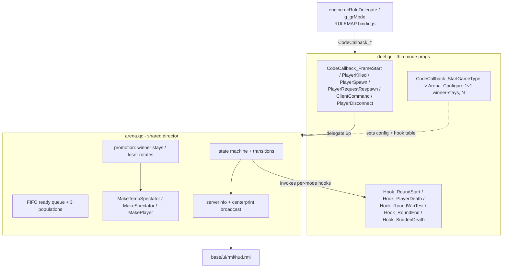

# feat: Arena gamemodes — queue, spectator, and round foundation (Duel v1)

## Summary

Build a mode-agnostic **arena match director** as a shared RuleC include (`base/src/rules/arena.qc`) that owns the on-map round/match state machine (WARMUP → COUNTDOWN → LIVE → SUDDEN_DEATH → ROUND_END → MATCH_END), the three-population queue model (ready / not-ready / pure spectator), and the promotion policy (winner stays, loser rotates). Each arena gamemode is a thin rules progs that `#include`s the director, configures team shape + promotion policy + best-of-N via `Arena_Configure()`, and supplies per-mode round behavior through a hook table. **Duel** (`progs/duel.dat`) is the v1 proving mode: 1v1, single-elimination rounds, best-of-N, sudden death with one-hit kills plus a reaper anti-stall timer, and warmup free-play. Freeze Tag, Archstiletto, and Duel Minus are designed-for future plug-ins, not v1 deliverables.

The plan reuses Nuclide's existing primitives end-to-end: the `ncRuleDelegate` / `g_grMode` `CodeCallback_*` hub, `MakeTempSpectator()` / `MakeSpectator()` / `MakePlayer()` for state transitions, the `.src` `#includelist` build seam (mirroring `shared.qc`), `CodeCallback_FrameStart` for the per-frame tick, and the RmlUI HUD (`base/ui/rml/hud.rml`) for match-state display. No new engine (C) work is required.

---

## Problem Frame

Nuclide ships several rulesets (`deathmatch`, `teamdm`, `domination`, `lastmanstanding`, `invasion`, `singleplayer`) but none support structured arena play: a waiting queue, spectator rotation, or round-based matches that run **multiple times on a single map load**. Every existing mode either runs continuously until `timelimit`/`scorelimit` then calls `game.EndMapDelayed()` (`domination.qc`, `lastmanstanding.qc`), or never rotates competitors at all. There is no on-map round state machine and no queue data model. Without a shared foundation, Duel, Freeze Tag, Archstiletto, and Duel Minus would each reimplement queue logic, spectator promotion, warmup, and round orchestration. (See origin: `docs/brainstorms/2026-06-14-arena-gamemodes-requirements.md`.)

---

## Requirements

**Match director (shared foundation)**

- R1. Three distinct player populations: ready queue, not-ready (present but ineligible), pure spectator (opted out).
- R2. Ready queue ordering is FIFO; promotion pulls from the front per team-shape slot count.
- R3. Director owns a state machine: WARMUP, COUNTDOWN, LIVE, SUDDEN_DEATH (conditional), ROUND_END, MATCH_END. Mode modules answer queries and receive lifecycle callbacks; they do not drive transitions.
- R4. In WARMUP, present non-spectators free-play (spawn/move/shoot/respawn, no scoring or progression).
- R5. WARMUP → COUNTDOWN when ready count meets the team-shape minimum.
- R6. COUNTDOWN demotes non-competitors to spectator before LIVE.
- R7. LIVE round behavior is delegated to mode hooks (round-start setup, death handling, round-win test, round-end cleanup).
- R8. Between rounds within a match (best-of-N not decided), the director resets the arena without queue rotation.
- R9. Round-timer expiry without elimination → SUDDEN_DEATH; mode is notified to apply sudden-death rules.
- R10. On match completion: winner stays, loser to back of queue, next ready player(s) promoted per team shape.
- R11. Insufficient ready players after match end → return to WARMUP rather than force a match.
- R12. Director parameterized by **team shape** (1v1, 2v2, 1-vs-many) and **promotion policy** (default winner-stays). Team shape sets minimum ready count and promotion slot count.
- R28. Mid-match competitor disconnect (in COUNTDOWN/LIVE/SUDDEN_DEATH/ROUND_END) ends the match via MATCH_END with **no winner credited** (survivor gets no auto-win); director cleans up the vacated slot/queue entry, promotes the next queued player(s), and starts a fresh match (COUNTDOWN if enough ready, else WARMUP). Server continues while the host player remains.

**Mode plug-in interface**

- R13. Each arena gamemode is a thin rules module declaring team shape, promotion policy, best-of-N, and round rules via config + hooks — not by reimplementing queue/state-machine logic.
- R14. Mode hooks cover at minimum: round-start setup, player death/incapacitation, round-win determination, round-end cleanup, sudden-death rule application.
- R15. Config variants of an existing mode (e.g. Duel Minus vs Duel) differ only in hook behavior and configuration, not director logic.

**Duel (v1 proving mode)**

- R16. Duel: team shape 1v1, promotion winner-stays, best-of-N rounds (N configurable).
- R17. Each Duel round is single elimination: killing the opponent wins the round.
- R18. On round timeout, sudden death activates: all hits are lethal (one-hit kills).
- R19. During sudden death, a reaper timer eliminates any player whose movement speed stays below a configurable threshold; the timer resets/clears when speed rises above threshold.
- R20. Duel match runs best-of-N rounds (N configurable); round points accumulate (incl. drawn rounds scoring both, R29). After N rounds the higher point total wins; a tie is resolved by a tiebreaker round (R30) rather than a strict odd-N / simple-majority constraint.
- R29. Both competitors dying in the same round (simultaneous mutual kill, possible under sudden-death one-hit kills) is a **draw**: each is awarded one round point and the round counter advances; neither is eliminated from the match.
- R30. Tie on round points after N rounds → **tiebreaker round**: a single sudden-death round with **no round time limit** (reaper still applies; runs until a competitor dies). Repeats if the tiebreaker itself draws.

**Spectator and queue UX**

- R21. Players can toggle ready / not-ready without disconnecting.
- R22. Players can enter pure-spectator mode and are never auto-promoted until they explicitly ready up.
- R23. Eliminated competitors and rotated-out players transition to an appropriate spectator state (fake-spec or real spec per existing patterns) until promoted or they change queue status.
- R24. Queue position, ready count, match state (warmup / countdown / round N of M / sudden death), and current competitors are visible to all connected players.

**Future plug-in modes (designed-for, not v1 deliverables)**

- R25. Freeze Tag: team shape 2v2, shared round/match pacing, freeze-on-hit instead of elimination as its death hook.
- R26. Archstiletto: team shape 1-vs-many (one boss vs many), asymmetric hooks, same queue + state machine.
- R27. Duel Minus: Duel config variant — each weapon limited to 2 magazines total, no infinite ammo; a single map ammo pickup restores ammo to full.

**Origin actors:** A1 Active competitor, A2 Queued (ready), A3 Queued (not-ready), A4 Pure spectator, A5 Match director, A6 Mode rules module.
**Origin flows:** F1 Server boot → warmup, F2 Ready-up → match start, F3 Round play → round end (Duel), F4 Match end → queue rotation, F5 Opt-in / opt-out of queue.
**Origin acceptance examples:** AE1 (R1,R2,R5), AE2 (R4,R11), AE3 (R8,R16,R20), AE4 (R9,R18,R19), AE5 (R10,R13), AE6 (R22), AE7 (R21), AE8 (R28,R10,R11), AE9 (R29), AE10 (R30,R20).

---

## Scope Boundaries

- v1 delivers the match-director foundation **and Duel only** as the proving mode. The director must be generic (team shape + promotion policy as parameters), but only the 1v1 / winner-stays path is exercised and verified in v1.
- Cross-server matchmaking, ranked ladders, and ELO are out of scope.
- Bot backfill for solo warmup or queue is out of scope.
- Map rotation and intermission changes beyond existing infrastructure are out of scope — arena modes run multiple matches per map load **without** triggering `game.EndMap*` / `nextmap`.
- Hero roster / class selection UX is out of scope; reuse the existing hero/teamdm spawn path (see `docs/plans/2026-06-14-001-feat-hero-roster-system-plan.md`) where a mode needs loadout choice.
- No new engine (C) work. Everything lands in `base/src/rules/`, `base/ui/`, and `base/progs/` build wiring.
- No automated test harness exists for QC/decl gameplay; verification is manual / in-engine, consistent with prior plans.

### Deferred to Follow-Up Work

- **Freeze Tag mode** (R25): new `base/src/rules/freezetag.{qc,src}` configuring 2v2 + a freeze-on-hit death hook. Separate plan/PR.
- **Archstiletto mode** (R26): new rules module configuring 1-vs-many asymmetric slot assignment. Separate plan/PR. The director's team-shape parameter must accommodate asymmetric slot counts in v1 design, but the asymmetric promotion path is not built or verified in v1.
- **Duel Minus mode** (R27): new `base/src/rules/duelminus.{qc,src}` `#include`-ing `duel.qc` behavior with a magazine-limit config + a map ammo-pickup entity. Enforcement point identified (see Deferred to Implementation) but not built in v1.
- **Rich queue-list HUD panel**: v1 surfaces match state via centerprint + serverinfo-backed HUD strings; a full scrollable queue/spectator roster panel in RmlUI is a follow-up.

---

## Context & Research

### Relevant Code and Patterns

- **RuleC hub:** `src/server/GameRules.qc` / `src/server/GameRules.h` — `ncRuleDelegate` class, `g_grMode` global, `RULEMAP` binding of `CodeCallback_*` to delegate methods, `RuleC_Init()` loading `progs/<g_gametype>.dat`, `Game_DefaultRules()`. The full overridable hook list is in `GameRules.h`.
- **Per-mode rules progs:** `base/src/rules/{deathmatch,teamdm,domination,lastmanstanding,invasion,singleplayer}.qc`. Each is one progs built from a `.src`.
- **Build seam (critical):** `base/src/rules/*.src` use `#pragma PROGS_DAT "../../progs/<mode>.dat"` and a `#includelist` that pulls `../../../src/rules.src` then `shared.qc` then `<mode>.qc`. **`shared.qc` is the proven shared-include mechanism** — the arena director follows the same pattern (mode `.src` includes `arena.qc` alongside `shared.qc`).
- **Shared helper precedent:** `base/src/rules/shared.qc` — `Util_*` helpers and the hero-roster policy enums/helpers (`Hero_SetPolicy`, `HEROSWAP_*`) demonstrate mutable-global config set per-mode and reusable helpers included into every rules progs. The arena director mirrors this `Set policy in StartGameType` shape.
- **Spectator/state transition primitives (reuse directly):** `src/shared/game/Player.qc`:
  - `ncPlayer::MakeTempSpectator()` (~L1638) — fake-spec: `FL_CLIENT`, modelindex 0, `SOLID_NOT`, `MOVETYPE_NOCLIP`, invulnerable, `VFL_FAKESPEC`, destroys weapon/items. Comment: *"what dead players in round matches become"* — exactly the eliminated-competitor / between-round state (R23).
  - `ncPlayer::MakeSpectator()` (~L1741) — `ClientKill()` + `MakeTempSpectator()` + `SetTeam(TEAM_SPECTATOR)` — full pure-spectator (A4).
  - `ncPlayer::MakePlayer()` (~L1702) — reverts fake-spec to a live player (promotion).
  - Fake-spec chase-cam: `IsFakeSpectator()` / `IsRealSpectator()` / `SpectatorTrackPlayer()` (`Player.qc` ~L360) keep eliminated players watching the live match.
- **Client → server command routing:** `src/server/cmd_cl.qc` `Cmd_ParseClientCommand` already handles `spectate` (→ `pl.MakeSpectator()`), `play` (spectator → spawn `player`), and `joinTeam <n>` (→ `g_grMode.PlayerRequestTeam`). New arena commands (`ready`, `notready`) route through `CodeCallback_ClientCommand` (the per-mode hook), mirroring `selecthero` in `teamdm.qc`.
- **Per-frame tick:** `CodeCallback_FrameStart` (used in `domination.qc` for periodic scoring) — the state-machine driver. Base `ncRuleDelegate::FrameStart` also runs `timelimit` → `IntermissionStart`; arena modes override `FrameStart` and must **not** invoke map-ending timelimit logic.
- **Player iteration / queries:** `next.Player()`, `is.Player()`, `is.Alive()` (used throughout the rules files); `ents.ChangeToClass()`, `game.TeleportToSpawn()`, `ents.Input(pl, "Damage"/"SetTeam", ...)` for spawn/teleport/forced death.
- **Transient + persistent client messaging:** `centerprint(pl, msg)` (used in `shared.qc` `Hero_Notify`), `combat.Obituary(...)`, `serverinfo.SetString(...)` (used in `GameRules.qc::LinkProgs` to publish `mode`). RmlUI HUD layer: `base/ui/rml/hud.rml` + `hud.rcss` (AGENTS.md: loaded as `ui/rml/hud.rml`; reload via `menu_restart`).
- **Ammo (for deferred Duel Minus only):** `src/shared/game/ammo.qc`, `src/shared/game/Weapon.qc` (clip/reload/magazine fields), `Util_SetItemRespawnTimers()` in `shared.qc` (ammo/weapon respawn precedent).
- **Cvar config precedent:** `autocvar_lms_lifeCounter` (`lastmanstanding.qc`), `autocvar_dom_scoreLimit` / `autocvar_dom_pointInterval` (`domination.qc`) — the pattern for tunable arena/Duel constants.

### Institutional Learnings

- AGENTS.md: target a **minimal reusable Nuclide framework** — ~3 monster archetypes, map goals via MapC/RuleC, not the full engine surface. The arena director should be a tight shared include, not a god object.
- AGENTS.md: `base` runs `base/progs.dat` and per-gametype `base/progs/*.dat`; `g_gametype` selects the rules progs. Build all base progs from repo root with `make game` (alias `make game GAME=base`).
- AGENTS.md: RmlUI in-game HUD lives at `base/ui/rml/hud.rml` / `hud.rcss`; FTE caches until `menu_restart`. If the HUD paints over pause menus, `RMLUI_DrawHud()` ordering in the engine matters (out of scope here, but relevant if a new HUD layer is added).
- Prior plan `docs/plans/2026-06-14-001-feat-hero-roster-system-plan.md`: established the "policy enum set in `CodeCallback_StartGameType`, helpers in `shared.qc`, picks stored in `userinfo *key`" pattern that this plan extends for queue state.
- No `docs/solutions/` or `STRATEGY.md` exist in the repo (verified) — no additional institutional constraints to honor.

### External References

- None. Local patterns are strong (6 existing rules modules, explicit round-spectator primitives, documented RuleC hook hub). External research skipped per ce-plan Phase 1.2 — Q3-duel / fighting-lobby rotation is a well-understood design with no version-sensitive dependency.

---

## Key Technical Decisions

- **Director as a shared include, modes as thin progs (hybrid A+C).** `base/src/rules/arena.qc` (+ `arena.h` for state enums/struct) is included via each arena mode's `.src` `#includelist`, exactly like `shared.qc`. Duel is `base/src/rules/duel.{qc,src}` → `base/progs/duel.dat`, selected by `g_gametype "duel"`. Rationale: idiomatic to Nuclide's one-progs-per-gametype model while keeping queue/state logic in one shared place (R13, R15; origin Key Decisions "Hybrid A+C").

- **Hook surface = a mode config struct of QC function pointers, populated in `Arena_Configure()`.** Resolves origin deferred Q1. The director exposes `Arena_Configure(teamShape, promotionPolicy, roundLimit, hookTable)` called from the mode's `CodeCallback_StartGameType`. The hook table carries `void(void) Hook_RoundStart`, `void(entity victim, entity attacker) Hook_PlayerDeath`, `int(void) Hook_RoundWinTest` (returns winning team/slot or 0), `void(void) Hook_RoundEnd`, `void(void) Hook_SuddenDeath`. The director calls these from the `CodeCallback_*` entry points it owns. Because the mode `.qc` and `arena.qc` compile into one progs, direct function references resolve at build time (no `externvalue` indirection needed inside a progs). Rationale: explicit, extensible contract (R7, R14); new modes implement hooks without touching the director.

- **Director owns the `CodeCallback_*` entry points; modes delegate up.** Each arena mode's `CodeCallback_FrameStart`/`PlayerKilled`/`PlayerSpawn`/`PlayerRequestRespawn`/`ClientCommand`/`PlayerDisconnect` call a single `Arena_*` dispatcher (e.g. `Arena_FrameStart()`), which advances the state machine and invokes mode hooks as needed. Rationale: keeps the engine→progs binding (`RULEMAP`) untouched; the director multiplexes behind the existing callbacks (origin Dependencies: "extends or wraps `g_grMode`, not replaces it").

- **Three populations stored as explicit player state + a FIFO ready list.** Per-player queue status (`ARENA_READY` / `ARENA_NOTREADY` / `ARENA_SPECTATOR` / `ARENA_COMPETITOR`) lives on a player field and is mirrored to `userinfo` (`*arena_state`) for client/HUD read, mirroring the hero `*hero` pattern. The ready queue is an ordered array of entities (FIFO append on ready, pop from front on promotion). Rationale: FIFO ordering (R2) needs explicit order the populations alone don't give; `userinfo` mirror feeds the HUD (R24).

- **Spectator transitions reuse engine primitives (resolves origin deferred Q5).** Eliminated competitors and rotated-out/between-round players use `MakeTempSpectator()` (fake-spec, retains chase-cam of the live match). Pure spectators use `MakeSpectator()` (real spec, `TEAM_SPECTATOR`). Promotion uses `MakePlayer()` + hero/loadout spawn + `game.TeleportToSpawn()`. Rationale: the engine comment names fake-spec as the round-death state; chase-cam keeps the social experience intact (R6, R23).

- **Multiple matches per map without intermission.** The director never calls `game.EndMap*` / `nextmap`; ROUND_END resets the arena in place (respawn competitors, increment round counter), MATCH_END runs promotion then loops to COUNTDOWN or WARMUP. Existing intermission/map-rotation is untouched (origin Dependencies/Assumptions).

- **Match state pushed to clients via serverinfo strings + centerprint (resolves origin deferred Q2).** Persistent state (state name, "round N of M", ready count, competitor names) is published with `serverinfo.SetString()` and rendered by `hud.rml`; transient events (countdown ticks, "FIGHT!", round/match winner, "SUDDEN DEATH") use `centerprint`. Rationale: serverinfo is already the publish channel for `mode`; avoids a new networked entity in v1. A richer panel is deferred.

- **Tunable constants as autocvars (resolves origin deferred Q3, Q4).** `autocvar_duel_roundLimit` (default 3, best-of-3), `autocvar_arena_countdownTime` (default 5), `autocvar_arena_roundTime` (round timer before sudden death), `autocvar_duel_reaperSpeed` (speed threshold), `autocvar_duel_reaperTime` (grace before reaper elimination). Best-of-N is also settable per-mode via `Arena_Configure` with the cvar as the override/default. Rationale: matches `lms_*` / `dom_*` precedent; tuning without rebuild.

- **Reaper resets on speed recovery.** The reaper tracks a per-competitor "below-threshold since" timestamp; if `vlen(velocity)` rises above `duel_reaperSpeed`, the timestamp clears; if it stays below for `duel_reaperTime`, the player is force-killed (`ents.Input(pl, "Damage", "1000", world)`). Rationale: origin R19 explicitly requires reset-on-movement.

- **Mid-match disconnect ends the match with no winner — not a forfeit-win (R28).** A `CodeCallback_PlayerDisconnect` for a current competitor while the match is active (COUNTDOWN/LIVE/SUDDEN_DEATH/ROUND_END) drives the state machine straight to `MATCH_END` with **no winner recorded**; the director clears the vacated competitor slot and any queue entry, then runs the normal promotion path (next ready player(s) in, → COUNTDOWN, or → WARMUP per R11). The director, not the mode, owns this so it applies to every arena mode. Rationale: crediting the survivor an auto-win would distort winner-stays standings and reward opponents for quitting; voiding + immediate re-seed keeps the server live and the rotation fair (origin Key Decisions; F4; resolves the doc-review P1 gap).

- **Drawn round awards both competitors a point (R29).** The director's round-resolution step treats "both competitors dead in the same round" as a draw: it increments each competitor's round-point counter and advances the round counter (no elimination, no replay). The Duel `Hook_RoundWinTest` / death dispatcher therefore must distinguish three outcomes — one survivor (normal win), zero survivors (draw), or no result yet — rather than assuming exactly one winner. Rationale: simultaneous mutual kills are guaranteed possible under sudden-death one-hit kills; awarding both a point is deterministic and order-independent, and advancing the counter prevents stalling on repeated draws.

- **Tiebreaker round — sudden death with no round timer (R30).** When the round-point totals are tied after the configured N rounds, the director plays a tiebreaker round instead of ending the match: it enters the sudden-death state with the reaper active but **suppresses the `arena_roundTime` timer** so nothing ends the round except a death. If the tiebreaker itself ends in a draw (both die same frame), another tiebreaker round is played until the tie breaks. Rationale: because draws award points to both players, ties are possible at any N, so the tiebreaker is the general resolution (replacing an odd-N / majority constraint); dropping the timer guarantees the tiebreaker yields a death — and thus a result — while the reaper still prevents stalling.

---

## Open Questions

### Resolved During Planning

- **Hook surface API (origin Q1)** → Mode config struct of QC function pointers set via `Arena_Configure()`; director owns `CodeCallback_*` and calls hooks. See Key Technical Decisions.
- **Client state communication (origin Q2)** → serverinfo strings (persistent, HUD-rendered) + centerprint (transient). See Key Technical Decisions.
- **Reaper tuning (origin Q3)** → autocvars `duel_reaperSpeed` / `duel_reaperTime` / `arena_roundTime`; reset-on-movement. See Key Technical Decisions.
- **Best-of-N default (origin Q4)** → `autocvar_duel_roundLimit` default 3, also settable via `Arena_Configure`.
- **fake-spec vs real-spec (origin Q5)** → fake-spec (`MakeTempSpectator`) for eliminated/rotated/between-round with chase-cam; real spec (`MakeSpectator`) for pure spectators.

### Deferred to Implementation

- Exact QC field name(s) for per-player queue state and reaper timestamp (`.float`/`.int` on player vs a parallel rules-local array) — pick during U1 based on what survives reconnect cleanly.
- Whether the FIFO ready queue is an `entity[]` array sized to `sv_playerslots` or a linked chain via a player `.entity` field — decide in U1; both work, array is simpler to reason about for promotion.
- Duel Minus magazine enforcement point (origin Q6, **future mode**): provisional point of enforcement is the reload/clip path in `src/shared/game/Weapon.qc` plus a per-weapon magazine counter; the map ammo pickup reuses the `ammo_*` entity + `Util_SetItemRespawnTimers` precedent. Not built in v1; confirmed during the Duel Minus follow-up.
- Exact `hud.rml` element ids/markup for the match-state strings — pin down against the live HUD layout in U7.
- Whether COUNTDOWN should hard-freeze competitor input or allow free movement — playtest decision in U5/U6.

---

## Output Structure

    base/
      src/
        rules/
          arena.h          # NEW: state enums (ARENA_WARMUP...), team-shape + promotion enums,
                           #      mode hook-table struct, Arena_* prototypes
          arena.qc         # NEW: match director — state machine, FIFO queue model,
                           #      promotion, spectator transitions, tick dispatcher, state broadcast
          duel.qc          # NEW: Duel mode — Arena_Configure(1v1, winner-stays, best-of-N),
                           #      round hooks, sudden-death + reaper hook, CodeCallback_* delegating to Arena_*
          duel.src         # NEW: #pragma PROGS_DAT "../../progs/duel.dat";
                           #      #includelist -> rules.src, shared.qc, arena.qc, duel.qc
      progs/
        duel.dat           # NEW (build output of duel.src)
      ui/
        rml/
          hud.rml          # MODIFY: add match-state elements (state, round N/M, ready count, competitors)
          hud.rcss         # MODIFY: styling for the match-state block

---

## High-Level Technical Design

> *This illustrates the intended approach and is directional guidance for review, not implementation specification. The implementing agent should treat it as context, not code to reproduce.*

### Match director state machine

```mermaid
stateDiagram-v2
    [*] --> WARMUP
    WARMUP --> WARMUP: free-play (spawn/move/shoot/respawn, no scoring) [R4]
    WARMUP --> COUNTDOWN: ready count >= team-shape minimum [R5]
    COUNTDOWN --> WARMUP: ready count drops below minimum
    COUNTDOWN --> LIVE: countdown elapsed; non-competitors -> spectator [R6]; Hook_RoundStart [R7]
    LIVE --> ROUND_END: Hook_RoundWinTest returns a winner (elimination) [R7,R17]
    LIVE --> ROUND_END: both competitors die same round -> drawn round, both +1 point [R29]
    LIVE --> SUDDEN_DEATH: round timer expired, no winner [R9]
    SUDDEN_DEATH --> ROUND_END: one-hit kill OR reaper elimination yields a winner [R18,R19]
    SUDDEN_DEATH --> ROUND_END: simultaneous one-hit kills -> drawn round, both +1 point [R29]
    ROUND_END --> COUNTDOWN: best-of-N not decided -> reset arena, ++round, no rotation [R8]
    ROUND_END --> MATCH_END: a competitor leads after N rounds [R20]
    ROUND_END --> TIEBREAKER: tied on points after N rounds [R30]
    TIEBREAKER --> ROUND_END: sudden-death, no time limit, runs until a death [R30]
    COUNTDOWN --> MATCH_END: competitor disconnects mid-match -> no winner credited [R28]
    LIVE --> MATCH_END: competitor disconnects mid-match -> no winner credited [R28]
    SUDDEN_DEATH --> MATCH_END: competitor disconnects mid-match -> no winner credited [R28]
    ROUND_END --> MATCH_END: competitor disconnects mid-match -> no winner credited [R28]
    MATCH_END --> COUNTDOWN: promote (winner stays / vacated slot filled, loser to back) AND enough ready [R10,R28]
    MATCH_END --> WARMUP: insufficient ready players [R11,R28]
```

> **Notes on the diagram.** `MATCH_END` is reached either by a normal result (a competitor leads after N rounds, or wins the R30 tiebreaker) **or** by a mid-match disconnect (R28), which voids the match with **no winner credited** — the survivor receives no auto-win. Both paths run the same promotion / queue-rotation step (and the disconnect path first cleans up the vacated competitor slot and queue entry so no phantom competitor leaks). `TIEBREAKER` is shown as a distinct node for clarity but is **not a new enum state** — it is implemented as the existing `SUDDEN_DEATH` state with the reaper active and the round timer suppressed (a no-timer flag; see U6, R30); it loops back through `ROUND_END` and replays if it too ends in a draw.

### Layering (who calls whom)



---

## Implementation Units

- U1. **Arena director core — state machine, queue model, tick scaffold**

**Goal:** A mode-agnostic director that holds the state enum, the three populations + FIFO ready queue, and a per-frame `Arena_FrameStart()` that advances WARMUP ↔ COUNTDOWN ↔ LIVE ↔ ROUND_END ↔ MATCH_END (SUDDEN_DEATH stubbed until U6). No Duel logic.

**Requirements:** R1, R2, R3, R8, R11, R12, R28; F1, F2, F4.

**Dependencies:** None.

**Files:**
- Create: `base/src/rules/arena.h` (state enums `ARENA_WARMUP/COUNTDOWN/LIVE/SUDDEN_DEATH/ROUND_END/MATCH_END`, `ARENASHAPE_*`, `ARENAPROMO_*`, hook-table struct, `Arena_*` prototypes, autocvar declarations)
- Create: `base/src/rules/arena.qc` (state vars, queue array, `Arena_Configure`, `Arena_FrameStart`, transition functions, round/match counters, arena-reset helper)
- Test: *Manual / in-engine* (no QC test harness)

**Approach:**
- Hold director state in mutable globals (mirroring `shared.qc` hero policy globals): current state, round index, per-team round wins, countdown deadline, FIFO ready queue array, configured team shape / promotion policy / round limit / hook table.
- `Arena_Configure(shape, promo, roundLimit, hookTable)` stores config; called by the mode in `StartGameType`.
- `Arena_FrameStart()` is the single tick: dispatch on current state, evaluate transition predicates (ready count vs minimum, countdown elapsed, round/match decided), call transition functions. Time via `time` + autocvar durations (precedent: `domination.qc` `nextPointDistribution`).
- Arena-reset helper respawns competitors and increments the round counter **without** queue rotation (R8); never calls `game.EndMap*` (multiple matches per map).
- `MATCH_END` → if enough ready for team shape, COUNTDOWN; else WARMUP (R11).
- `MATCH_END` is reachable from a normal result **and** from a mid-match competitor disconnect with **no winner credited** (R28); the state machine treats both identically downstream (run promotion → COUNTDOWN/WARMUP). The disconnect entry point itself (detection + slot/queue cleanup) lands in U3; U1 only ensures the `MATCH_END`-with-no-winner transition exists and that the no-winner case skips any winner-stays bookkeeping.

**Patterns to follow:** `base/src/rules/shared.qc` (mutable-global config + helpers in a shared include); `domination.qc` `CodeCallback_FrameStart` timed-tick; `GameRules.h` for the callback contract.

**Test scenarios:**
- Happy path: boot with 0 ready → state WARMUP; mark 2 ready (1v1 shape) → transitions to COUNTDOWN then LIVE. *Covers F1, F2.*
- Edge case: ready count drops below minimum during COUNTDOWN → returns to WARMUP. *Covers R5/R11.*
- Edge case: ROUND_END with best-of-N not decided → re-enters COUNTDOWN with round counter incremented and no queue rotation. *Covers R8, AE3 (partial).*
- Edge case: MATCH_END with only 1 ready player remaining → returns to WARMUP, no forced match. *Covers R11, AE2.*
- Edge case: forced `MATCH_END` with the no-winner flag set (simulating a mid-match disconnect) skips winner-stays bookkeeping and routes to COUNTDOWN (if enough ready) or WARMUP. *Covers R28, AE8 (state-machine portion).*

**Verification:** Console/`developer 1` state-trace prints show the documented transitions on a listen server as ready count changes; arena never triggers `nextmap` between matches.

---

- U2. **Mode hook interface & configuration contract**

**Goal:** Formalize the `Arena_Configure` hook table so a mode supplies round behavior without touching the director (the R13–R15 contract), and wire the director's hook-invocation points.

**Requirements:** R7, R12, R13, R14, R15; A5, A6.

**Dependencies:** U1.

**Files:**
- Modify: `base/src/rules/arena.h` (finalize hook-table struct: `Hook_RoundStart`, `Hook_PlayerDeath`, `Hook_RoundWinTest`, `Hook_RoundEnd`, `Hook_SuddenDeath`)
- Modify: `base/src/rules/arena.qc` (call hooks at the right transitions; null-guard each so a mode may omit optional hooks)
- Test: *Manual / in-engine*

**Approach:**
- Define the hook table as a struct of QC function pointers stored in the director config. Resolve calls directly (single-progs compilation).
- Invocation points: `Hook_RoundStart` on COUNTDOWN→LIVE; `Hook_PlayerDeath` from the death dispatcher; `Hook_RoundWinTest` polled in LIVE/SUDDEN_DEATH to detect a round result; `Hook_RoundEnd` on LIVE/SUDDEN_DEATH→ROUND_END; `Hook_SuddenDeath` on LIVE→SUDDEN_DEATH (full behavior in U6).
- Each hook null-guarded; a mode that sets none still runs warmup/queue/promotion (proves director is mode-agnostic).
- Team shape drives minimum-ready and promotion slot count generically (1v1 = min 2, fill 1 on promotion; design must not special-case Duel, supporting future 2v2 / 1-vs-many — R12, R25, R26).

**Patterns to follow:** `shared.qc` `Hero_SetPolicy` (mode sets policy enums consumed by shared helpers); `GameRules.qc` `RULEMAP` (function-pointer binding precedent).

**Test scenarios:**
- Happy path: a stub mode that registers only `Hook_RoundWinTest` still progresses warmup → countdown → live → round end driven solely by the director. *Covers R13.*
- Integration: setting team shape to a 2-min/1-fill config promotes exactly one player on match end; a 4-min config requires four ready before COUNTDOWN (proves shape generality without Duel hardcoding). *Covers R12.*
- Edge case: a mode supplying a null `Hook_SuddenDeath` does not crash when the round timer expires (director no-ops the hook). *Covers R14 robustness.*

**Verification:** A minimal stub mode (or Duel with hooks temporarily empty) runs the full state machine; toggling team-shape config changes the ready-minimum and promotion-fill counts as expected.

---

- U3. **Promotion & spectator population management**

**Goal:** Implement the three populations, FIFO promotion (winner stays / loser to back / fill slots), and the spectator-state transitions using engine primitives.

**Requirements:** R1, R2, R6, R10, R23, R28; F4, A1–A4.

**Dependencies:** U1, U2.

**Files:**
- Modify: `base/src/rules/arena.qc` (population tracking, `Arena_Promote()`, `Arena_DemoteToSpectator()`, `Arena_MakeCompetitor()`, disconnect cleanup)
- Test: *Manual / in-engine, 3 clients*

**Approach:**
- Per-player state field + `userinfo *arena_state` mirror. Ready → append to FIFO ready array; not-ready → remove from promotion eligibility, keep on server; pure spectator → `MakeSpectator()` and never enqueue.
- COUNTDOWN demotes all non-competitors via `MakeTempSpectator()` (fake-spec, chase-cam) (R6).
- `Arena_Promote()`: loser → `MakeTempSpectator()` + append to ready-queue tail; winner stays competitor; pop front-of-queue ready players to fill open slots via `MakeMakePlayer()`/spawn path; skip pure spectators entirely (R10, R22, AE5, AE6).
- Disconnect handling (`CodeCallback_PlayerDisconnect`) distinguishes two cases (R28): (a) a **non-competitor** disconnecting just removes them from the ready queue / populations; (b) a **competitor** disconnecting **during an active match** (COUNTDOWN/LIVE/SUDDEN_DEATH/ROUND_END) ends the match immediately via `MATCH_END` with **no winner credited** — the surviving competitor gets **no auto-win**. In case (b) the director clears the vacated competitor slot and any lingering queue entry (no phantom competitor / leaked slot), then runs the normal promotion path to seed a **fresh match**: promote next ready player(s) → COUNTDOWN, or → WARMUP if insufficient ready (R11). The host/listen-server player remaining keeps the server running. Implement this as `Arena_HandleDisconnect(pl)` calling an `Arena_AbortMatch()` (no-winner MATCH_END) helper rather than the normal win path, so winner-stays bookkeeping is bypassed.

**Patterns to follow:** `Player.qc` `MakeTempSpectator`/`MakeSpectator`/`MakePlayer`; `teamdm.qc` `CodeCallback_CallRequestTeam` (class-switch + `TeleportToSpawn` + forced `Damage` to clear a live pawn); `lastmanstanding.qc` `next.Player()` iteration.

**Test scenarios:**
- Happy path: P1 beats P2 best-of-N → P1 stays competitor, P2 to back of ready queue, next ready player promoted to face P1. *Covers R10, F4, AE5.*
- Edge case: pure spectator P3 is the only available player at match end → not promoted; arena returns to WARMUP. *Covers R22, AE6.*
- Edge case: a queued-ready player toggles not-ready mid-match → skipped at next promotion; still may free-play in WARMUP. *Covers R21, AE7.*
- Error/lifecycle: active competitor disconnects mid-match → match ends immediately with **no winner credited** (survivor gets no auto-win); vacated slot/queue entry cleaned; next ready player promoted and a fresh match starts in COUNTDOWN (no phantom competitor, no stuck LIVE). *Covers R28, AE8.*
- Edge case: competitor disconnects mid-match with **no other ready players** → match ends with no winner, director returns to WARMUP (not a forced/forfeit match). *Covers R28, R11, AE8.*
- Integration: eliminated competitor becomes fake-spec and chase-cams the ongoing round (not booted to menu). *Covers R23.*

**Verification:** On a 3-client listen server, winner-stays rotation, pure-spectator exclusion, and not-ready skipping all behave per AE5/AE6/AE7; a mid-match disconnect ends the match with no winner credited and immediately re-seeds the next challenger (or WARMUP) per AE8; no queue slot leaks on disconnect.

---

- U4. **Queue UX — ready/spectate client commands & state broadcast**

**Goal:** Players toggle ready/not-ready and pure-spectate at runtime; match state is published to all clients.

**Requirements:** R21, R22, R24; F5.

**Dependencies:** U3.

**Files:**
- Modify: `base/src/rules/duel.qc` `CodeCallback_ClientCommand` (route `ready` / `notready`; reuse existing `spectate`/`play` server commands) — implemented in U5 file but the command contract is defined here
- Modify: `base/src/rules/arena.qc` (`Arena_SetReady()`, `Arena_SetNotReady()`, `Arena_SetSpectator()`, `Arena_BroadcastState()`)
- Test: *Manual / in-engine*

**Approach:**
- `ready` / `notready` client commands route through `CodeCallback_ClientCommand` (mirroring `selecthero` in `teamdm.qc`) into `Arena_SetReady/NotReady`. Pure-spectate reuses the existing `spectate` server command (`cmd_cl.qc`) → ensure the director observes the resulting spectator state; `play`/ready re-enters the queue.
- `Arena_BroadcastState()` publishes serverinfo strings (state name, "round N of M", ready count, competitor netnames) each transition + on a throttled timer; transient events use `centerprint` (countdown ticks, "FIGHT!", round/match winner, "SUDDEN DEATH").
- Toggling ready/not-ready never disconnects the player (R21); pure spectator is never auto-promoted (R22).

**Patterns to follow:** `teamdm.qc` `CodeCallback_ClientCommand` switch + `Hero_Notify`/`centerprint`; `cmd_cl.qc` `spectate`/`play`/`joinTeam`; `GameRules.qc::LinkProgs` `serverinfo.SetString("mode", ...)`.

**Test scenarios:**
- Happy path: `ready` enqueues the player and is reflected in the ready count; `notready` removes them without disconnect. *Covers R21, F5, AE7.*
- Happy path: `spectate` makes a pure spectator who is never promoted; later `ready`/`play` re-enters the queue. *Covers R22, AE6, F5.*
- Integration: state string updates on every transition (WARMUP/COUNTDOWN/round N of M/SUDDEN DEATH) and is readable by a second connected client. *Covers R24.*
- Edge case: rapid ready/notready toggling does not double-enqueue the same player in the FIFO. *Covers R2 integrity.*

**Verification:** Two clients see consistent, correct match-state strings and ready counts; ready/notready/spectate behave per F5 without reconnects.

---

- U5. **Duel mode rules module + build wiring**

**Goal:** A playable Duel progs: 1v1, winner-stays, best-of-N single-elimination rounds, configured against the director.

**Requirements:** R16, R17, R20, R29, R30; F2, F3; AE1, AE3, AE9, AE10.

**Dependencies:** U2, U3, U4.

**Files:**
- Create: `base/src/rules/duel.qc` (`CodeCallback_Precaches/StartGameType/PlayerSpawn/PlayerRequestRespawn/PlayerKilled/ClientCommand/FrameStart/PlayerDisconnect` delegating to `Arena_*`; `Hook_RoundStart/RoundEnd/RoundWinTest/PlayerDeath`; `Arena_Configure(ARENASHAPE_1V1, ARENAPROMO_WINNERSTAYS, autocvar_duel_roundLimit, hooks)`)
- Create: `base/src/rules/duel.src` (`#pragma PROGS_DAT "../../progs/duel.dat"`; `#includelist` → `../../../src/rules.src`, `shared.qc`, `arena.qc`, `duel.qc`)
- Modify (build): ensure the project build picks up `duel.src` (mirror how existing `*.src` are built into `base/progs/*.dat` via `make game GAME=base`)
- Test: *Manual / in-engine, 2 clients, `g_gametype duel`*

**Approach:**
- WARMUP free-play spawn reuses the hero/teamdm spawn path (`ents.ChangeToClass` + `game.TeleportToSpawn`); during LIVE, only the two competitors are live, others fake-spec.
- `Hook_RoundWinTest`: in 1v1, resolves a round to one of three outcomes — **one survivor** (that competitor's slot wins the round), **zero survivors** (both dead → drawn round, R29), or **no result yet** (both alive). It must not assume exactly one winner.
- Drawn round (R29): when both competitors die in the same round (guaranteed possible under sudden-death one-hit kills), the director awards **each** competitor one round point and advances the round counter; neither is eliminated from the match. `Hook_PlayerDeath` must tolerate the other competitor already being dead this round (don't early-resolve to a single winner on the first death of a simultaneous pair — resolve at the round boundary).
- `Hook_PlayerDeath` records the round result and lets the director advance to ROUND_END.
- Best-of-N + tiebreaker (R20, R30): the director accumulates per-competitor round **points** across N rounds (a normal round → +1 to the survivor; a drawn round → +1 to both). After N rounds, the higher point total wins the match; if tied, the director plays a **tiebreaker round** (single sudden-death round, **no round timer**, reaper active — see U6) and repeats it until the tie breaks. This replaces a strict `floor(N/2)+1` majority test, since drawn rounds make ties possible at any N.
- `g_gametype "duel"` loads `progs/duel.dat` via existing `RuleC_Init`; no change to `Game_DefaultRules` needed (it already honors `g_gametype`).

**Patterns to follow:** `teamdm.qc` (full set of `CodeCallback_*` + `StartGameType` team/spawn setup); `deathmatch.src`/`teamdm.src` (the `.src` include order); `lastmanstanding.qc` (elimination bookkeeping with `next.Player`).

**Test scenarios:**
- Happy path: 2 ready players → countdown → round 1 LIVE; one kills the other → round won, arena resets for round 2 (best-of-3). *Covers R17, F3, AE3 (partial).*
- Happy path: best-of-3 at 1–1, P1 eliminates P2 in round 3 → MATCH_END with P1 winner, no round 4 played. *Covers R20, AE3.*
- Round-scoring: both competitors die in the same round (simultaneous one-hit kills) → drawn round, both awarded a point, round counter advances, match continues. *Covers R29, AE9.*
- Match resolution: round-point totals tied after the configured N rounds → director plays a no-time-limit sudden-death tiebreaker round; the surviving competitor wins the match. *Covers R30, R20, AE10.*
- Edge case: tiebreaker round itself ends in a simultaneous-death draw → another tiebreaker round is played (no false MATCH_END on a still-tied score). *Covers R30 robustness.*
- Integration: spawn/loadout in a Duel round matches the hero/teamdm spawn path (correct model/weapons), not a bare `player`. *Covers R16 spawn integration.*
- Edge case: `g_gametype duel` with `progs/duel.dat` present loads cleanly; absent progs logs the existing `RuleC_Init` error rather than crashing. *Covers build wiring.*

**Verification:** `+game base +set g_gametype duel +devmap <arena map>` runs an end-to-end best-of-N Duel with two clients: join → warmup → ready → countdown → rounds → winner stays.

---

- U6. **Sudden death + reaper anti-stall**

**Goal:** On round-timer expiry, activate one-hit kills and a reaper that eliminates players who stop moving, with reset-on-movement.

**Requirements:** R9, R18, R19, R30; F3; AE4, AE10.

**Dependencies:** U5.

**Files:**
- Modify: `base/src/rules/arena.qc` (SUDDEN_DEATH state entry/tick; round-timer expiry detection in LIVE)
- Modify: `base/src/rules/duel.qc` (`Hook_SuddenDeath` enabling one-hit damage scaling; reaper per-competitor speed tracking in the death/preframe path)
- Modify: `base/src/rules/arena.h` (reaper/round-timer autocvar declarations)
- Test: *Manual / in-engine, 2 clients*

**Approach:**
- LIVE round timer = `arena_roundTime`; on expiry with no winner → SUDDEN_DEATH (R9), `centerprint` "SUDDEN DEATH", invoke `Hook_SuddenDeath`.
- One-hit kills (R18): Duel's sudden-death hook flags lethal damage — simplest is amplifying applied damage in the death/pain hook so any hit is fatal (exact mechanism resolved in implementation; avoid touching shared weapon code).
- Reaper (R19): per-competitor "below-threshold-since" timestamp updated each frame from `vlen(velocity)` vs `autocvar_duel_reaperSpeed`; if below for `autocvar_duel_reaperTime`, force-kill via `ents.Input(pl, "Damage", "1000", world)`; clear the timestamp when speed recovers.
- Reaper only runs in SUDDEN_DEATH; clears on round reset.
- **Tiebreaker variant (R30):** when the director starts a tiebreaker round (tie on points after N rounds, driven by U5), it enters the same SUDDEN_DEATH state — one-hit kills + reaper active — but with the `arena_roundTime` timer **suppressed** so nothing ends the round except a death. A simple boolean (e.g. `g_arena.suddenDeathNoTimer`, set when entering a tiebreaker, cleared on round reset) gates the timer-expiry → end-round logic; the one-hit-kill and reaper paths are unchanged. The reaper still prevents stalling, but the round runs until a competitor dies (or, on a simultaneous draw, U5 starts another tiebreaker).

**Patterns to follow:** `domination.qc` time-based tick; `cmd_cl.qc` / `teamdm.qc` forced `Damage` input; `lastmanstanding.qc` elimination → spectator.

**Test scenarios:**
- Happy path: round timer expires with both alive → SUDDEN_DEATH announced; next clean hit is lethal. *Covers R9, R18, AE4.*
- Happy path: in sudden death, a player who stops below the speed threshold for `reaperTime` is eliminated by the reaper. *Covers R19, AE4.*
- Edge case: a player dipping below threshold then moving again before `reaperTime` is NOT eliminated (timer reset). *Covers R19 reset.*
- Edge case: sudden death resolves a round → normal ROUND_END/MATCH_END flow resumes (one-hit/reaper deactivate on reset). *Covers R8/R20 interaction.*
- Tiebreaker: a tiebreaker round (no-timer sudden death) ignores `arena_roundTime` expiry entirely and only ends on a death; the reaper remains active to prevent stalling. *Covers R30, AE10.*

**Verification:** With `arena_roundTime` set low, a stalled round enters sudden death; standing still triggers the reaper, movement resets it, and the first hit ends the round. In a tiebreaker round, the round does not end on timer expiry — only on a death — while the reaper still fires on a stalled player.

---

- U7. **Match-state HUD display (RmlUI)**

**Goal:** Show match state, round N of M, ready count, and current competitors to all connected players.

**Requirements:** R24; A1–A4.

**Dependencies:** U4.

**Files:**
- Modify: `base/ui/rml/hud.rml` (add a match-state block bound to the serverinfo/state strings published in U4)
- Modify: `base/ui/rml/hud.rcss` (styling, positioned in the HUD safe rect per AGENTS.md `screen.HUDMins`/`HUDSize` guidance)
- Test: *Manual / in-engine*

**Approach:**
- Add a compact match-state element (state label, "Round N / M", ready count, competitor names) reading the serverinfo strings broadcast by `Arena_BroadcastState()`.
- Keep transient prompts (countdown, "FIGHT!", winner, "SUDDEN DEATH") on `centerprint` (already wired in U4) so the HUD block stays stable.
- Reload via `menu_restart` during iteration (AGENTS.md: FTE caches RmlUI).

**Patterns to follow:** `base/ui/rml/hud.rml` + `hud.rcss` existing element/binding conventions; AGENTS.md HUD-rect placement notes.

**Test scenarios:**
- Happy path: HUD shows "WARMUP — waiting for players" with a live ready count, then "Round 1 / 3" and competitor names when LIVE. *Covers R24, AE1.*
- Edge case: pure spectator and not-ready players both see identical, correct match-state info. *Covers R24 for A3/A4.*
- Edge case: HUD does not stretch / stays in the HUD safe rect on a non-4:3 window. *Covers AGENTS.md HUD-rect constraint.*
- Test expectation: visual/manual only — no automated assertion (RmlUI, no harness).

**Verification:** All three player populations see consistent match-state text that updates on every transition; layout holds on widescreen.

---

## System-Wide Impact

- **Interaction graph:** A new `progs/duel.dat` selected by `g_gametype "duel"`; existing modes (`deathmatch`, `teamdm`, `domination`, `lastmanstanding`, `invasion`, `singleplayer`) are untouched. The director multiplexes behind the existing `CodeCallback_*` bindings (no `RULEMAP`/engine change). `base/ui/rml/hud.rml` gains an element shared by all clients.
- **Error propagation:** Missing `progs/duel.dat` → existing `RuleC_Init` logs `ncError` and runs no rules (no crash). Null mode hooks are no-op'd by the director. Invalid `ready`/`notready` from a spectator is ignored with feedback, not fatal.
- **State lifecycle risks:** FIFO queue and competitor slots must be cleaned on `PlayerDisconnect`/death or slots leak (mirrors the hero-lock taken-set risk). Reaper timestamps and one-hit/sudden-death flags must clear on round reset or they bleed into the next round. The director must never call `game.EndMap*` between matches.
- **API surface parity:** No external API. Future modes (Freeze Tag, Archstiletto, Duel Minus) reuse the same `Arena_Configure` + hook contract — the team-shape parameter must be general enough (min-ready + fill-slot counts, asymmetric-capable) so they need no director change (R12, R15, R25, R26).
- **Integration coverage:** Server-side queue/state-machine authority + spectator transitions + client HUD must be verified together on a 3-client listen server; unit-style reasoning alone won't prove rotation/chase-cam/HUD sync.
- **Unchanged invariants:** `ncRuleDelegate`/`g_grMode` engine binding, `RuleC_Init`, intermission/map-rotation, `ncPlayer`/`ncActor` mechanics, weapon/ammo systems, and all existing rules progs remain unchanged. The arena work is additive (new shared include + new mode + HUD additions).

---

## Risks & Dependencies

| Risk | Mitigation |
|------|------------|
| Director accidentally ends the map between matches (calls timelimit/`EndMap` path) | Arena modes override `CodeCallback_FrameStart` and never call the base timelimit→`IntermissionStart` logic; ROUND_END/MATCH_END reset in place only |
| Queue/competitor slot leak on disconnect or mid-round death | Centralize cleanup in `Arena_*` and hook `CodeCallback_PlayerDisconnect`; re-evaluate state after any population change |
| Sudden-death flags / reaper timers bleed into next round | Clear all sudden-death + reaper state in the arena-reset helper on every ROUND_END→COUNTDOWN |
| One-hit-kill mechanism touches shared weapon code and breaks other modes | Implement lethality in the Duel death/pain hook (damage amplification), not in `src/shared` weapon code |
| `duel.src` not picked up by the build | Mirror existing `*.src` exactly (same `#includelist` head `rules.src` + `shared.qc`); verify `base/progs/duel.dat` is produced by `make game GAME=base` |
| Team-shape generality regressed to Duel-only, blocking future 2v2 / 1-vs-many | Drive min-ready and fill-slot counts from the shape parameter in U2; add a non-1v1 config smoke test even though only Duel ships |
| HUD state strings race / stale on rapid transitions | Broadcast on transition + throttled timer; keep transient events on centerprint so the persistent block changes infrequently |
| Function-pointer hook table misbehaves under fteqcc | Hooks compile in the same progs as the director (direct references); null-guard each call; fall back to direct function calls if pointers prove fragile |

---

## Documentation / Operational Notes

- Document the arena hook contract (`Arena_Configure` signature, the five hooks, team-shape + promotion enums) at the top of `arena.h` so a future Freeze Tag / Archstiletto / Duel Minus author can implement a mode without reading the director body.
- Note the build flow: rules/HUD QC + `.src` edits require `make game GAME=base`; RmlUI iteration reloads via `menu_restart`; def edits need no recompile.
- Document the new autocvars (`duel_roundLimit`, `arena_countdownTime`, `arena_roundTime`, `duel_reaperSpeed`, `duel_reaperTime`) and the `ready`/`notready` client commands (plus existing `spectate`/`play`).
- When Freeze Tag / Archstiletto / Duel Minus land, cross-link their plans here and confirm they required no `arena.qc` change (the success criterion for R13/R15).

---

## Sources & References

- **Origin document:** [docs/brainstorms/2026-06-14-arena-gamemodes-requirements.md](docs/brainstorms/2026-06-14-arena-gamemodes-requirements.md)
- RuleC hub: `src/server/GameRules.qc`, `src/server/GameRules.h`
- Existing rules modules: `base/src/rules/{deathmatch,teamdm,domination,lastmanstanding}.qc` and their `.src` files; shared helpers in `base/src/rules/shared.qc`
- Spectator/state primitives: `src/shared/game/Player.qc` (`MakeTempSpectator`, `MakeSpectator`, `MakePlayer`, fake-spec chase-cam)
- Client→server command routing: `src/server/cmd_cl.qc` (`spectate`, `play`, `joinTeam`)
- HUD surface: `base/ui/rml/hud.rml`, `base/ui/rml/hud.rcss`
- Ammo (deferred Duel Minus): `src/shared/game/ammo.qc`, `src/shared/game/Weapon.qc`
- Related prior plan: `docs/plans/2026-06-14-001-feat-hero-roster-system-plan.md` (policy-enum-in-StartGameType + shared.qc helper pattern reused here)
