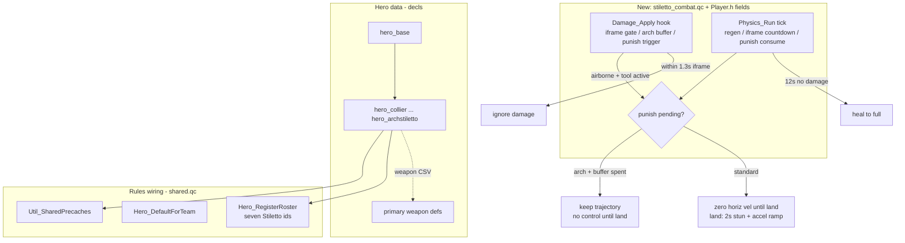

# feat: Stiletto character roster (seven heroes + health pacing + tool punish)

## Summary

Populate the existing data-driven hero roster framework with the **seven-character Stiletto cast** — Collier, Vagrant, Beaumont, Skipstream, Angel, Motionblue, Archstiletto — replacing the `hero_alpha` / `hero_bravo` placeholders. Each hero is an `entityDef` inheriting `hero_base`, carrying prototype-tuned health and a single **primary weapon**; all six standard heroes share one movement kit and the same speeds. The plan also ports three **new shared gameplay systems** the framework lacks: health pacing (1.3s post-hit invulnerability + 12s out-of-combat heal-to-full), **tool punish** for shared-kit air actions (air dodge / air stall / kickback), and **Archstiletto's** 8-HP duel form (2-HP super armor, then a trajectory-preserving punish).

Scope is the v1 cut locked in the brainstorm: **primary weapons only** (no secondaries, no signature movement tools), placeholder art (existing player models), and Arch's 100-HP arena behavior deferred to the arena-gamemodes plan.

---

## Problem Frame

The hero roster framework (`docs/plans/2026-06-14-001-feat-hero-roster-system-plan.md`) shipped the plumbing — `hero_base`, `teams.AddClass` registration, `selecthero` routing through `Hero_TrySelect`, replicated `entityDefID`, and a VGUI select menu — but only two throwaway heroes exist (`hero_alpha` Scout / `hero_bravo` Heavy, in `base/decls/def/heroes/`). The actual product roster is the Stiletto cast extrapolated from the Godot prototype (`stiletto-protophase2`).

Two gaps remain:

1. **No real roster data.** The seven characters, their HP, and their primary weapons are not defined; `Hero_RegisterRoster` / `Hero_DefaultForTeam` / shared precache still reference the placeholders.
2. **Three combat systems are unported.** The prototype's health pacing (`player_health.gd`: i-frames + OOC regen) and tool punish (`punish_state_machine.gd`) have no Nuclide equivalent. The Stiletto **movement** kit is already ported (`src/shared/physics/stiletto_tuning.qc`), but the **combat-reaction** layer that punishes getting hit mid-air is not. Archstiletto's HP/stun exceptions don't exist at all.

This is data defs + new shared QC systems + rules rewiring — not engine changes.

---

## Requirements

Traceability is to the origin requirements doc (`see origin`).

- **R1.** Define seven hero defs (`hero_collier`, `hero_vagrant`, `hero_beaumont`, `hero_skipstream`, `hero_angel`, `hero_motionblue`, `hero_archstiletto`) inheriting `hero_base`; remove `hero_alpha` / `hero_bravo`. (origin R1, R6)
- **R2.** Six standard heroes use **4 HP**; Archstiletto uses **8 HP** in normal/duel play. All inherit the shared movement kit and speeds with no per-hero `pm_*` override. (origin R-HP1, R-HP3, R-MOVE1)
- **R3.** Each standard hero carries exactly **one primary weapon** def tuned to prototype numbers; no secondaries or signature movement tools. Archstiletto ships with **no primary weapon** (placeholder loadout). (origin R8, Arch v1 decision)
- **R4.** All bullet/projectile primaries deal **1 damage** per hit (Beaumont's revolver included — explicit override of the prototype's 25). Explosive/special damage values follow the per-character table. (origin per-character tables, user correction 2026-06-14)
- **R5.** Register all seven on the shared roster (`Hero_RegisterRoster`) and update `Hero_DefaultForTeam` + shared precache to the Stiletto cast. (origin R2)
- **R6.** Port **health pacing**: a damaged hero is invulnerable for **1.3s**, and after **12s** without taking damage heals to full. Applies to all heroes. (origin R-HP2)
- **R7.** Port **tool punish** for shared-kit actions: when a hero is hit **while airborne and mid air-dodge / air-stall / recent-kickback**, zero horizontal velocity for the remaining fall, then on landing apply a **2.0s** punish (**1.0s** full stun + **1.0s** acceleration recovery 30%→100%). (origin R-STUN1, R9)
- **R8.** Archstiletto duel exceptions: **2 HP** of damage must accumulate (super armor) before any punish applies; once it does, punish **preserves trajectory** (no velocity-zero / straight-down) with **no player control until landing**. Super-armor buffer resets on heal/respawn. (origin R-HP4, R-STUN2)
- **R9.** Hero-select UI lists the seven Stiletto display names and routes through the existing `selecthero` path. (origin R5)

**Origin actors:** Player (local + remote for model/loadout replication), Server game rules (selection + combat authority), Selection UI.

**Origin flows:** Pick Collier → spawn with revolver + 4-HP shared movement kit. Air-dodge → take a hit → horizontal velocity killed, land into a 2s punish. Arch duel → first 2 HP ignore punish, then trajectory punish.

**Origin acceptance examples:** AE1 Each of the seven spawns with correct HP, model, speed, and primary weapon; remote clients see the correct hero. AE2 A standard hero hit mid air-dodge loses horizontal control and lands stunned for ~2s. AE3 Arch takes 2 HP with no punish, then a third hit triggers the trajectory-preserving punish; healing resets the buffer.

---

## Scope Boundaries

- **Primary weapons only.** No secondaries (Vagrant throw, Collier hook melee, Angel flechettes, Motionblue grenade), no signature movement tools (grapple, lasso, warpstrike, sticky mine, jets, bullet jump, double jump).
- **Placeholder art.** Heroes reuse existing player models (jennifer2 / natasha2 / yuri2 / alice2 families); no Godot mesh export this pass.
- **No generic ability system.** `def_ability_*` keys stay inert (already reserved in `hero_base`).
- **Movement unchanged.** The Stiletto movement kit in `stiletto_tuning.qc` is consumed as-is; this plan adds a combat-reaction layer beside it, not new locomotion.
- Manual / in-engine verification only (no automated QC test harness exists in the repo).

### Deferred to Follow-Up Work

- **Archstiletto arena mode** (100 HP, 2× mid-air damage, boss weapon kit) → arena-gamemodes plan (`docs/plans/2026-06-14-002-feat-arena-gamemodes-plan.md`).
- Per-hero **secondary weapons** and **signature movement tools** (own pass; tool-punish "punishable tool" list expands then).
- Per-hero **art export** (Godot models → FTE `model` / `model_view`).
- Angel **Drive gauge** system; full flechette/triangle weapon.
- Per-hero HUD portraits / theming beyond the select list.

---

## Context & Research

### Relevant Code and Patterns

- **Hero data template:** `base/decls/def/heroes/hero_base.def` (inherits `player`, reserves inert `def_ability_*`), `hero_alpha.def` (model + health + `pm_*` + `weapon`/`current_weapon` override pattern). Aggregator note: `base/decls/def/heroes.def` `#include`s the subfolder because `EntityDef_Init` does not recurse into subfolders.
- **Weapon template:** `base/decls/def/weapons/collier_sidearm.def` — `ncWeapon` + `fireInfo_*` (`fireRate`, `reloadTime`, `semiAuto`, `clipSize`) + `projectile_*` (`inherit projectile_nail`, `def_damage`, `velocity`) + `damage_*` (`damage` = 1–2). Direct model for the other primaries.
- **Roster rules:** `base/src/rules/shared.qc` — `Hero_RegisterRoster` (L72), `Hero_DefaultForTeam` (L136), `Hero_ResolveSpawnHero`, `Hero_TrySelect`, `Util_SharedPrecaches` (L25, precaches `hero_alpha`/`hero_bravo`). Consumers: `teamdm.qc` (L37) and `duel.qc` (L56) call `Hero_RegisterRoster` + `Hero_SetPolicy`.
- **Movement kit (consume as-is):** `src/shared/physics/stiletto_tuning.qc` — air dodge/stall (`Stiletto_PmGunjumpAir`, `m_stilettoAirDodgeCharges` / `m_stilettoAirStallEnd`), wall jump/slide/cling, `Stiletto_OnPhysicsStart` (refills charges on ground), `Stiletto_EndPhysicsFrame` (stores `m_stilettoPrevButtons`). Called from `ncPlayer::Physics_Run` in `src/shared/physics/player_pmove.qc` (L602–708).
- **Damage path (hook point for R6/R7/R8):** `src/shared/game/Player.qc` `ncPlayer::Damage_Apply` (~L2300–2446, `#ifdef SERVER`): armor → `SetHealth(GetHealth() - damagePoints)` → death vs `rules.PlayerPain` + `Pain()`. No i-frame/regen today. Player state fields live in `src/shared/game/Player.h` (existing `m_stiletto*` fields are declared there).
- **Pain callback:** `rules.PlayerPain(this, attacker, damageDecl)` fires on non-fatal hits; `CodeCallback_PlayerDamage` exists in `duel.qc`/`invasion.qc` as a rules-side damage hook precedent.
- **Selection UI:** built by framework plan U5 — `src/client/vgui_changeclass.qc` enumerates the roster via `teams.ClassForIndex()` / serverinfo and sends `cmd selecthero <id>`; `showHeroSelectionMenu` alias in `src/client/cmd.qc`.
- **Build:** def edits need **no recompile** (runtime `EntityDef_Init`). QC edits (rules + shared systems + client) need a progs rebuild; `make game GAME=base` is the documented path, with the repo-root `fteqcc.exe` direct build as the Windows-PowerShell fallback used previously.

### Institutional Learnings

- AGENTS.md: target a **minimal reusable framework** (≈3 archetypes); the roster mirrors the `monster_base` archetype approach with one shared `hero_base`.
- Stiletto movement tuning lives in `src/shared/physics/stiletto_tuning.qc` (constants in-file, no decl tuning layer) — the new combat-reaction systems should follow the same shape (a sibling module with `#define` constants, hooked from the existing per-frame + damage entry points).
- `base` runs `base/progs.dat` (Nuclide entityDef/MapC content model), not retail progs.

### Prototype Source Values (origin)

Per-character primary weapon tuning extrapolated from `stiletto-protophase2` (`resource/entities/player/ss_player_*.tscn`), with damage normalized to **1 per bullet** for hitscan/projectile primaries:

| Hero | HP | Primary weapon | Fire cadence | Mag | Damage |
|------|----|----|----|----|----|
| Collier | 4 | revolver (nail projectile) | 0.3s | 6 | 1 |
| Beaumont | 4 | fast revolver | 0.07s | 10 | **1** (override of proto 25) |
| Vagrant | 4 | knife (melee swing) | 0.8s | n/a | 1 (10× backstent deferred) |
| Skipstream | 4 | burst revolver (3-round burst) | 0.13s intra / 0.75s between | 9 | 1 |
| Angel | 4 | sniper | 1.5s / 2.75s reload | — | 1 |
| Motionblue | 4 | explosive slug launcher | 0.5s | 3 | explosive (radius/blast tuned in playtest) |
| Archstiletto | 8 | **none (v1)** | — | — | — |

---

## Key Technical Decisions

- **Heroes = `entityDef` per character inheriting `hero_base`.** Pure data; no per-hero QC. Reuse existing player models as placeholders, vary `health`/`max_health` and `weapon`/`current_weapon`. Standard heroes omit `pm_*` so they inherit identical movement (R2). (extend existing pattern)
- **Backstab / 10× modifier deferred** — Vagrant ships a 1-damage melee swing only; the backstab multiplier is a secondary-weapon/positional mechanic in the deferred tool pass.
- **Combat-reaction systems live in a new shared module**, e.g. `src/shared/physics/stiletto_combat.qc` (or `stiletto_punish.qc`), mirroring `stiletto_tuning.qc`: `#define` constants + functions hooked from `ncPlayer::Physics_Run` (per-frame: punish consume on landing, regen tick, i-frame countdown) and from `ncPlayer::Damage_Apply` (i-frame gate, Arch air scaling, punish trigger). New player state fields added to `Player.h`. (build net new, beside existing pattern)
- **Health pacing as a damage gate + per-frame tick (R6).** In `Damage_Apply`, before `SetHealth`, return early if within the 1.3s i-frame window; on a real hit, stamp `m_stilettoInvulnEnd` and `m_stilettoLastDamageTime`. A per-frame tick heals to full once `time - m_stilettoLastDamageTime >= 12s`. 1 damage = 1 HP.
- **Tool punish as a small state machine (R7).** Trigger detection reads the already-tracked Stiletto air state (mid air-dodge/stall, or recent kickback) at damage time; if airborne + tool-active, set a "punish pending" flag and zero horizontal velocity each frame until `FL_ONGROUND`; on landing, start a 2.0s timer (1.0s movement-locked, 1.0s accel ramp 30%→100%). Reuses the existing `Stiletto_ApplyMoveTuning` injection point for the accel scaling.
- **Archstiletto exceptions keyed off the def, not a hardcoded class check where avoidable (R8).** Detect Arch via a def key (e.g. an `arch`-flagging key on `hero_archstiletto`) read into a player field on spawn, so the 2-HP super-armor buffer and trajectory-preserving punish branch are data-gated. Buffer (`m_stilettoArchBuffer`) decrements with damage, resets on heal/respawn. Arena 100-HP / 2×-air behavior is **not** implemented here.
- **Roster rewiring is a single reviewed edit (R5).** `Hero_RegisterRoster`, `Hero_DefaultForTeam`, and `Util_SharedPrecaches` all move to the seven Stiletto ids together; `hero_alpha`/`hero_bravo` defs are deleted in the same unit to avoid a dangling placeholder roster.

---

## Open Questions

### Resolved During Planning (from brainstorm)

- Ability depth, swap/composition policy, Arch role, v1 kit scope, gating, health pacing, tool-punish scope — all resolved in the origin doc's Resolved Decisions.
- Beaumont damage → **1** (user, 2026-06-14).

### Deferred to Implementation

- New module filename (`stiletto_combat.qc` vs `stiletto_punish.qc`) and exact new field names in `Player.h`.
- Whether the i-frame gate lives directly in `Damage_Apply` or behind a `rules.`-style hook; pick whichever keeps `Player.qc` edits minimal and shared across modes.
- Exact placeholder model assignment per hero (which existing model maps to whom).
- Motionblue explosive slug radius/blast-jump tuning and Skipstream burst timing fidelity — playtest.
- Whether kickback counts as a punishable "tool" on the same frame it's used, or only during an active air-dodge/stall window — confirm against prototype feel in playtest.
- Display-name source for the select UI (def key vs id-to-name map in the client).

---

## High-Level Technical Design

> *Directional guidance for review, not implementation specification.*

---

## Implementation Units

### U1. Define the seven Stiletto hero defs (data)

**Goal:** Seven playable hero defs with correct HP, shared movement, placeholder models; placeholders removed.

**Requirements:** R1, R2

**Dependencies:** None

**Files:**
- Create: `base/decls/def/heroes/hero_collier.def`, `hero_vagrant.def`, `hero_beaumont.def`, `hero_skipstream.def`, `hero_angel.def`, `hero_motionblue.def`, `hero_archstiletto.def`
- Delete: `base/decls/def/heroes/hero_alpha.def`, `hero_bravo.def`
- Verify: `base/decls/def/heroes.def` aggregator `#include`s pick up the new files
- Test: *Manual / in-engine*

**Approach:** Each def `inherit "hero_base"`, sets `model` (existing placeholder), `health`/`max_health` (4; Arch 8), `weapon`/`current_weapon` (U2 ids; Arch empty). Omit `pm_*` so movement is identical. Add a data key flagging Arch for combat rules (consumed in U6).

**Patterns:** `hero_alpha.def`; `player_enforcer` in `player.def`.

**Test scenarios:** Each hero spawns via console `ents.ChangeToClass` with correct model + HP + speed; Arch spawns at 8 HP; no precache/missing-model warnings.

**Verification:** `devmap` + per-hero spawn shows correct stats and no console errors.

---

### U2. Per-hero primary weapon defs

**Goal:** One primary weapon per standard hero, tuned to prototype cadence, all bullets = 1 damage.

**Requirements:** R3, R4

**Dependencies:** None (referenced by U1)

**Files:**
- Exists: `base/decls/def/weapons/collier_sidearm.def` (reuse; confirm damage = 1 per R4)
- Create: `base/decls/def/weapons/beaumont_revolver.def`, `vagrant_knife.def`, `skipstream_burst.def`, `angel_sniper.def`, `motionblue_slug.def`
- Test: *Manual / in-engine*

**Approach:** Model each on `collier_sidearm.def` structure (`ncWeapon` + `fireInfo_*` + `projectile_*`/melee + `damage_*`). Beaumont: `fireRate` 0.07, `clipSize` 10, damage 1. Skipstream: 3-round burst (0.13 intra / 0.75 between), damage 1. Angel: `fireRate` 1.5, `reloadTime` 2.75, damage 1. Vagrant: melee swing, damage 1 (no backstab). Motionblue: explosive slug, `clipSize` 3, `fireRate` 0.5 (radius/blast = playtest). Reuse existing view/world models as placeholders.

**Patterns:** `collier_sidearm.def`; `nailgun.def` / `supershotgun.def` for cadence + projectile/explosive shapes.

**Test scenarios:** Each weapon fires at its cadence, reloads correctly, deals 1 damage per bullet (Beaumont confirmed 1, not 25); Motionblue slug explodes; no missing precache.

**Verification:** Fire each primary in-engine; damage numbers and cadence match the table.

---

### U3. Roster rewiring to the Stiletto cast

**Goal:** Rules register, default to, and precache the seven Stiletto heroes; no placeholder references remain.

**Requirements:** R5

**Dependencies:** U1

**Files:**
- Modify: `base/src/rules/shared.qc` — `Hero_RegisterRoster` (seven `teams.AddClass`), `Hero_DefaultForTeam`, `Util_SharedPrecaches`
- Verify: `base/src/rules/teamdm.qc` and `duel.qc` still call `Hero_RegisterRoster` + `Hero_SetPolicy` (no change expected)
- Test: *Manual*

**Approach:** Replace the two `AddClass` lines with the seven Stiletto ids; point `Hero_DefaultForTeam` at a sensible default (e.g. `hero_collier`); precache all seven. Confirm `Hero_ResolveSpawnHero` / `Hero_TrySelect` need no change (id-agnostic).

**Patterns:** existing `Hero_RegisterRoster` / `Util_SharedPrecaches`.

**Test scenarios:** After `StartGameType`, roster enumerates seven; `selecthero hero_angel` spawns Angel; default spawn (no pick) yields the configured default; no precache warnings.

**Verification:** 2-client listen server: both can select any of the seven; models replicate to the peer.

---

### U4. Health pacing — i-frames + out-of-combat regen

**Goal:** Damaged heroes get 1.3s invulnerability; 12s without damage heals to full.

**Requirements:** R6

**Dependencies:** U1

**Files:**
- Create: `src/shared/physics/stiletto_combat.qc` (constants + `Stiletto_Combat_*` functions) and register it in the relevant `progs.src`/`*.src` build lists
- Modify: `src/shared/game/Player.h` (new fields: invuln-end, last-damage-time), `src/shared/game/Player.qc` (`Damage_Apply` i-frame gate + stamps), `src/shared/physics/player_pmove.qc` (`Physics_Run` regen + i-frame tick)
- Test: *Manual*

**Approach:** Define `STILETTO_IFRAME_TIME 1.3`, `STILETTO_REGEN_DELAY 12.0`. In `Damage_Apply` (server), before `SetHealth`: if `time < m_stilettoInvulnEnd` return; else stamp invuln + last-damage-time. Per-frame tick: if alive and `time - m_stilettoLastDamageTime >= 12` and health < max, set to max (instant heal-to-full per prototype). Guard so it never resurrects a dead player.

**Execution note:** Add the damage-gate edit minimally and shared across all modes (heroes spawn in every mode).

**Test scenarios:** Two hits within 1.3s only register the first; a hit then 12s untouched restores full HP; taking damage resets the regen timer; dead players don't heal; i-frame does not block the kill blow logic incorrectly (lethal hit before i-frame still kills).

**Verification:** In-engine: rapid double-hit deals 1 not 2; wait 12s after a hit → HP returns to max.

---

### U5. Tool punish — shared-kit air actions

**Goal:** Being hit mid air-dodge/stall/kickback kills horizontal control and lands the hero in a ~2s punish.

**Requirements:** R7

**Dependencies:** U4 (shares the combat module + damage hook)

**Files:**
- Modify: `src/shared/physics/stiletto_combat.qc` (punish state machine + constants), `src/shared/game/Player.h` (punish-state fields), `src/shared/game/Player.qc` (`Damage_Apply` trigger detection), `src/shared/physics/player_pmove.qc` (`Physics_Run` air-zero + landing consume; hook accel scaling via `Stiletto_ApplyMoveTuning` neighbor)
- Test: *Manual*

**Approach:** Constants `STILETTO_PUNISH_STUN 1.0`, `STILETTO_PUNISH_RECOVER 1.0`, accel ramp 0.30→1.0. At damage time, if `!(FL_ONGROUND)` and (air-dodge/stall active or kickback within a short window), set `m_stilettoPunishPending`. While pending + airborne: zero horizontal velocity each physics frame. On landing: start `m_stilettoPunishEnd = time + 2.0`; first 1.0s lock movement input, next 1.0s scale acceleration 30%→100%. Clear on expiry/respawn.

**Test scenarios:** Hit during air-dodge → horizontal velocity drops to ~0, fall continues, lands stunned ~1s then sluggish ~1s; hit while grounded (no tool) → no punish; hit airborne with no tool active → no punish (only tool-active triggers); punish clears on respawn; movement fully restored after 2s.

**Verification:** 2-client/bot: attacker hits a mid-air-dodging target; target visibly loses control and lands stunned.

---

### U6. Archstiletto duel exceptions

**Goal:** Arch (8 HP) ignores punish for the first 2 HP of damage, then takes a trajectory-preserving, control-locked punish; buffer resets on heal/respawn.

**Requirements:** R8

**Dependencies:** U4, U5

**Files:**
- Modify: `src/shared/physics/stiletto_combat.qc` (Arch branch), `src/shared/game/Player.h` (`m_stilettoArchBuffer`, arch flag), `src/shared/game/Player.qc` (spawn reads Arch def key; damage decrements buffer), `base/decls/def/heroes/hero_archstiletto.def` (arch-flag key)
- Test: *Manual*

**Approach:** On spawn, read the Arch flag from the def into a player field. `STILETTO_ARCH_SUPERARMOR 2`. Track accumulated damage since last reset; while buffer not spent, suppress the punish trigger (damage still applies to HP). Once spent, the punish branch **does not** zero horizontal velocity or force straight-down — it preserves current trajectory and locks player control until `FL_ONGROUND`. Reset buffer on heal-to-full (U4) and on respawn. **Do not** implement the 100-HP arena / 2×-air-damage path here (deferred).

**Test scenarios:** Arch takes 2 separate hits airborne mid-tool → no punish (HP drops to 6); third hit → trajectory-preserving punish (keeps moving in prior direction, no control until land); regen-to-full resets buffer so the cycle repeats; respawn resets buffer; standard heroes are unaffected by the Arch branch.

**Verification:** In-engine as Arch: confirm the 2-HP grace, the momentum-preserving punish, and buffer reset.

---

### U7. Hero-select UI display names

**Goal:** The existing select menu lists the seven Stiletto display names and routes through `selecthero`.

**Requirements:** R9

**Dependencies:** U3

**Files:**
- Modify: `src/client/vgui_changeclass.qc` (display-name mapping for the seven ids); possibly a name key consumed from the roster
- Test: *Manual*

**Approach:** Ensure the menu enumerates the seven-hero roster (already via `teams.ClassForIndex()` / serverinfo from framework U5) and shows friendly names (Collier, Vagrant, Beaumont, Skipstream, Angel, Motionblue, Archstiletto) rather than raw `hero_*` ids. Confirm via id→name map client-side or a def-provided name key.

**Patterns:** framework plan U5 VGUI wiring; `vgui_changeclass.qc` enumeration.

**Test scenarios:** Menu shows seven friendly names; selecting each sends `cmd selecthero <id>` and spawns the right hero; rejection feedback (hero-lock, if a mode enables it) still works.

**Verification:** Open select menu in-engine; pick each hero by name; correct spawn.

---

## System-Wide Impact

- **Interaction graph:** All modes that register the shared roster (`teamdm`, `duel`) now field the Stiletto seven. The new combat systems hook the shared `Damage_Apply` + `Physics_Run`, so they affect **every** hero in **every** mode that spawns heroes — verify non-hero entities (monsters) are unaffected by the i-frame/punish gates (guard on `is.Player` / hero class).
- **Error propagation:** Missing hero model → runtime missing-model (same class as prior plans); invalid weapon ref → no-fire (catch via precache). I-frame gate must not early-return for non-player damage takers.
- **State lifecycle:** Punish-pending, i-frame, regen-timer, and Arch buffer fields must all reset on spawn/respawn; punish must clear if the player dies mid-air.
- **Prediction:** Punish zeroes horizontal velocity server-side; confirm client prediction doesn't fight it (the movement lock should be applied in the shared `Physics_Run` path so client + server agree). Health/i-frames are server-authoritative.
- **Unchanged invariants:** Locomotion (`stiletto_tuning.qc`), weapon/projectile core, `ncPlayer`/`ncActor` mechanics unchanged; this is data + a new combat-reaction module + rules wiring + UI labels.

---

## Risks & Dependencies

| Risk | Mitigation |
|------|------------|
| Combat hooks in shared `Damage_Apply` affect monsters / non-heroes | Gate every new branch on player/hero identity; verify monster damage unchanged |
| Client misprediction during punish movement-lock | Apply the lock in shared `Physics_Run` so prediction matches server; playtest a swap mid-punish |
| I-frame gate accidentally blocks lethal hits | Place gate to ignore only non-lethal repeats inside the window; confirm kill blows still register |
| Tool-punish trigger over/under-fires (kickback timing) | Define a precise "tool active" window; tune against prototype feel; flagged as playtest item |
| Arch buffer leaks (never resets) makes Arch unpunishable | Centralize reset on heal-to-full + respawn; assert buffer bounds |
| Beaumont 1-dmg + 0.07s fire feels like a non-stop hitscan | Playtest TTK on 4 HP; cadence/mag are easy data tweaks |
| New `.qc` module not added to build lists | Add to the correct `*.src` progs list; rebuild `make game GAME=base` (fteqcc.exe fallback on Windows) |
| Placeholder models read as final art | Document clearly as placeholders; art export is deferred |

---

## Documentation / Operational Notes

- Document the new combat constants (i-frame, regen delay, punish timings, Arch super-armor) at the top of the new module, matching the `stiletto_tuning.qc` convention.
- Note the build flow: def edits = no recompile; QC edits (rules + combat module + client) = rebuild progs (`make game GAME=base`, or repo-root `fteqcc.exe` direct build on Windows PowerShell).
- Cross-link the arena-gamemodes plan for Arch's 100-HP mode when that work lands.

---

## Sources & References

- Origin requirements: `docs/brainstorms/2026-06-14-stiletto-character-roster-requirements.md`
- Hero roster framework plan: `docs/plans/2026-06-14-001-feat-hero-roster-system-plan.md`
- Arena gamemodes plan (Arch 100-HP mode): `docs/plans/2026-06-14-002-feat-arena-gamemodes-plan.md`
- Code: `base/decls/def/heroes/`, `base/decls/def/weapons/collier_sidearm.def`, `base/src/rules/shared.qc`, `src/shared/physics/stiletto_tuning.qc`, `src/shared/physics/player_pmove.qc`, `src/shared/game/Player.qc` (`Damage_Apply` ~L2300), `src/client/vgui_changeclass.qc`
- Prototype: `stiletto-protophase2` `resource/entities/player/ss_player_*.tscn`, `player_health.gd`, `punish_state_machine.gd`
