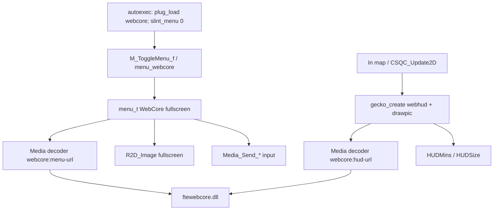

# feat: WebCore default fullscreen menu + HUD overlay

## Goal Capsule

- **Objective:** Make WebCore the **default fullscreen main menu** (`menu_t` + stretch blit, not console chrome / not `playfilm` letterbox), **auto-load** the plugin at boot, and ship a **first in-game HUD** as a second transparent WebCore view composited into the letterboxed HUD rect.
- **Authority:** Follow CEF/`Media_VideoDecoder` seams and historical `m_cefmenu` / Slint fullscreen blit patterns. Parent WebCore CPU renderer plan remains the paint/host contract; this plan owns engine/Nuclide menu+HUD integration.
- **Stop when:** Boot lands on interactive local HTML fullscreen menu without Slint; Esc returns to game or closes title appropriately; HUD HTML draws over 3D in `HUDMins`/`HUDSize` with transparent clear; plugin loads from `autoexec` with no manual `plug_load`.
- **Non-goals:** Replacing all HudC widgets, lobby transport, CEF removal packaging, multiplayer-safe remote HTML, RmlUI revival.

## Product Contract

### Summary

Players see trusted local HTML as the title/pause menu (fullscreen, mouse + keys). In a map, a separate WebCore HUD document shows status chrome in the letterboxed HUD safe area with the world visible through transparent regions. Operators do not load the plugin by hand.

### Requirements

- **R1.** On boot (title), the default menu path is WebCore fullscreen HTML at a documented `fte://data/web/...` URL — not Slint, not classic Quake menus, not a subconsole window.
- **R2.** `plug_load webcore` runs from Nuclide `autoexec` (or equivalent early load) so the decoder exists before the first menu push.
- **R3.** Fullscreen menu uses stretch `R2D_Image` (not `R2D_Letterbox`), resizes the view to the framebuffer, and routes mouse/keys via `Media_Send_*` / decoder callbacks. Esc must **not** act as “skip cinematic.”
- **R4.** Pause/toggle menu in-game opens the same WebCore menu surface (or a pause-specific local URL) when Slint is disabled.
- **R5.** Content remains trusted-local only (`fte://data/...`).
- **R6.** HUD: a **second** WebCore decoder view (not the menu view) draws into `screen.HUDMins` / `screen.HUDSize` with premultiplied alpha over the 3D view; `html,body` clear is transparent.
- **R7.** HUD v1 is display-oriented (stats via `fte_query` / existing GetStats bridge); it must not steal mouse from gameplay unless explicitly focused later.
- **R8.** `playfilm webcore:...` remains a debug smoke tool only.
- **R9.** Console `webcore` command (CEF-shaped subconsole) is optional debug aid, not the default menu.

### Scope Boundaries

- **In scope:** Engine fullscreen `menu_t` (adapt film path or thin dedicated menu), Slint bypass + fallback rewires, Nuclide `autoexec`, menu HTML URL (H3 or smoke), transparent-clear host/plugin support, CSQC or engine HUD draw of second view, HUD HTML fixture, docs/README.
- **Not in scope:** Full HudC feature parity, replacing Slint pause with partial hybrid, remote inspector, CEF uninstall, lobby ICE work.
- **Deferred:** HUD input capture, multiple HUD documents, replacing `g_showHud` / native/Slint HUD flags entirely, true 1:1 port of every H3 menu screen.

### Acceptance Examples

- **AE1.** Cold start → fullscreen green/yellow font-smoke or H3 menu; clickable; no Slint chrome.
- **AE2.** Restart without typing `plug_load` → menu still works.
- **AE3.** `devmap` → world visible; HUD HTML widgets in letterbox; transparent areas show world; menu toggle still works.
- **AE4.** Open/close menu repeatedly without host init failure or stuck film menu.
- **AE5.** Esc on title menu does not instantly “skip” like a ROQ; Esc in-game closes pause menu or returns to game per chosen policy.

### Product Contract preservation

Changed from prior revision: **R1–R4, R6–R9** expanded — user requested fullscreen default, auto-load, and HUD (was deferred). Console-only coexistence path demoted to optional debug (R9).

## Planning Contract

### Key Technical Decisions

- **KTD1. Default menu = dedicated fullscreen `menu_t`, not console `backvideomap`.** Console path is windowed chrome; Slint already proves fullscreen `R2D_Image`. Historical `m_cefmenu.c` is gone; reintroduce a thin WebCore menu (new `m_webcore_menu.c` **or** carefully gated film-menu fork) rather than overloading every cinematic.
- **KTD2. Prefer a thin dedicated menu module over permanently changing all films to stretch.** Gating inside `MediaView_DrawFilm` (letterbox vs stretch by scheme/prefix) is acceptable **only** if Esc/eof behavior is also gated for `webcore:` — otherwise ship `m_webcore_menu.c` + `menu_webcore` / toggle hook.
- **KTD3. Disable Slint menu via `slint_menu 0` and rewire Slint fallbacks + `M_ToggleMenu_f`.** When Slint is off today, classic menus or `cef` fallbacks win — those must push WebCore instead of Quake main / CEF.
- **KTD4. Auto-load plugin in `base/autoexec.cfg`.** Keep `forceqmenu 1` unless MenuQC is required; drop reliance on `plug_load cef` for menu (CEF may remain loaded for A/B but is not the menu).
- **KTD5. Two views: menu vs HUD.** Never reuse the menu decoder as the HUD surface. HUD uses `gecko_create`/`drawpic` (CSQC) **or** an engine draw sibling to `SlintHud_Draw`; first milestone prefers **CSQC `gecko_*` + HudC hook** to avoid a new engine HUD module if QC APIs suffice.
- **KTD6. Transparent clear for HUD only.** Menu pages may stay opaque. Host/plugin: support `cmd:transparent` (or URL/query flag) so ImageBuffer clear is A=0; keep premul BGRA; CSQC media shader already uses `gl_one, gl_one_minus_src_alpha`.
- **KTD7. Letterbox HUD to `HUDMins`/`HUDSize`.** Full-bleed overlays (hurt) stay out of v1 or use full `screen.Mins/Size` later.
- **KTD8. Default menu URL:** `fte://data/web/h3-main-menu/index.html` if assets resolve; else `fte://data/web/webcore-test/font-smoke.html` until H3 is verified. Document the cvar/command override (`webcore_menu_url` or `menu_webcore <url>`).

### High-Level Technical Design

### Assumptions and Risks

| Risk | Mitigation |
|------|------------|
| Esc skips film (`MediaView_KeyEvent`) | Dedicated menu key handler; never treat Esc as skip for interactive WebCore |
| `CINSTATE_ENDED` stops interactive UI | Ensure decoder never reports ended; menu draw ignores end-stop |
| Absolute mouse / `cursor` null on film menu | Set menu cursor policy like Slint; normalize coords every frame |
| Stretch vs letterbox for movies | Do not globally remove `R2D_Letterbox` for all films |
| Slint off → classic menu surprise | Explicit toggle hook / fallback strings to WebCore |
| Opaque HUD clear hides world | Transparent clear + smoke over `devmap` |
| Two views × CPU cost | Dirty paint; HUD static-ish; measure later (not a gate for functional Done) |
| Host DLL / Cairo missing at boot | Fail with Con_Printf; do not silently fall into broken classic menu without message |

### Existing Patterns to Follow

- Fullscreen blit: `engine/client/m_slint_menu.c` (`R2D_Image` 0,0,sw,sh).
- Film menu_t + `Media_Send_*`: `engine/client/m_mp3.c` (`MediaView_*`).
- Toggle gate: `engine/client/menu.c` `M_ToggleMenu_f`; Slint fallbacks in `m_slint_menu.c`.
- Decoder: `plugins/webcore/webcore.c`.
- CEF windowed debug: `plugins/cef/cef.c` `Cef_ExecuteCommand` (optional U-debug).
- HUD letterbox: `base/src/hud/hud.qc`, `src/client/api.qc` `HUDMins`/`HUDSize`.
- Premul media shader: `PF_cs_media_create` in `engine/client/pr_clcmd.c`.

### Open Questions (deferred, non-blocking)

- **Q1.** Title Esc → quit confirm vs ignore? Default: ignore Esc on title; provide on-page Quit. *(deferred)*
- **Q2.** Engine `cl_webcore_hud.c` vs CSQC-only for HUD? Default for v1: **CSQC**. *(deferred unless QC media APIs block)*

## Implementation Units

### U1: Plugin auto-load + operator defaults

**Goal:** WebCore plugin is present at boot; Slint menu is off; defaults documented.

**Files:**
- Modify: `base/autoexec.cfg`
- Modify: `plugins/webcore/README.md` (worktree)

**Approach:**
- `plug_load webcore` early (before `menu_restart`).
- `set slint_menu 0` (and keep `forceqmenu 1` unless needed otherwise).
- Optional: keep `plug_load cef` commented for A/B.
- Comment the default menu URL and HUD URL.

**Test scenarios:**
- Boot log shows webcore plugin load; no manual plug_load.
- With later units incomplete, boot must not hard-crash (fallback message OK).

**Verify:** Boot Nuclide; `plug_load` list / command availability.

---

### U2: Fullscreen WebCore `menu_t` + toggle as default

**Goal:** Title and menu toggle show fullscreen interactive WebCore HTML.

**Files:**
- Add or modify: `engine/client/m_webcore_menu.c` (preferred) **or** gated changes in `engine/client/m_mp3.c`
- Modify: `engine/client/menu.c` (`M_ToggleMenu_f` when `!slint_menu`)
- Modify: `engine/client/m_slint_menu.c` (fallback `Cbuf_AddText` targets → WebCore menu command)
- Modify: engine Makefile / build list if new `.c`
- Modify: `plugins/webcore/webcore.c` only if menu needs a stable decoder name / property

**Approach:**
- Push opaque fullscreen `menu_t`: draw = `setsize(pixel)` + normalized `cursormove` + `R2D_Image` fullscreen; key/mouse → `Media_Send_*`.
- Register `menu_webcore` / reuse internal push from toggle.
- Default URL cvar e.g. `webcore_menu_url` → `fte://data/web/h3-main-menu/index.html` with smoke fallback.
- Esc: close pause menu in-game; on title, do not `Media_StopFilm`-style skip — match Q1 default.
- Ensure interactive stream never auto-stops on “ended.”

**Test scenarios:**
- Cold start → fullscreen menu page (AE1).
- Mouse click / hover works; resize window updates layout.
- Esc in-game closes menu and returns to play; Esc on title does not blank to nothing without a menu.
- `slint_menu 1` still allows Slint for rollback.
- Regression: normal `playfilm` of a real cinematic still letterboxes (if film path untouched).

**Verify:** Manual boot + in-map toggle; screenshot optional.

---

### U3: Optional debug `webcore` console command

**Goal:** CEF-like subconsole launcher for debugging without being the default.

**Files:**
- Modify: `plugins/webcore/webcore.c`

**Approach:** Clone `Cef_ExecuteCommand` with `backvideomap=webcore:...`; local URLs only.

**Test scenarios:**
- `webcore fte://data/web/webcore-test/font-smoke.html` opens windowed UI.
- Default menu path (U2) unaffected.

**Verify:** Manual.

---

### U4: Transparent clear + HUD host support

**Goal:** WebCore can produce premul frames with transparent background for overlays.

**Files:**
- Modify: FTE host paint path under `Tools/FTE/host/fte_render_harness.cpp` (webcore-fte) — clear policy
- Modify: `plugins/webcore/webcore.c` — honor `cmd:transparent` / `cmd:opaque` via `changestream`
- Test fixture: `base/data/web/webcore-test/hud-smoke.html` (+ CSS)

**Approach:**
- Default menu views opaque; HUD navigations or explicit cmd switch transparent clear (A=0) before paint.
- Fixture: transparent body, opaque status chip; headless or in-engine over 3D.

**Test scenarios:**
- Over `devmap`, transparent regions show world; chip visible (AE3 precursor).
- Menu pages remain opaque when not in transparent mode.
- Premul edges look correct (no black fringes on semitransparent CSS).

**Verify:** In-engine; optional headless pixel A channel check.

---

### U5: In-game HUD view (letterbox)

**Goal:** Second WebCore view shows HUD HTML in `HUDMins`/`HUDSize`.

**Files:**
- Modify: `base/src/hud/hud.qc` and/or `src/client/entry.qc` (create/resize/drawpic; cvar gate e.g. `webcore_hud 1`)
- Add: `base/data/web/.../hud.html` (and CSS)
- Possibly: `src/client/api` / defs for cvar
- Rebuild game progs (`make game GAME=base` or `fteqcc` path)

**Approach:**
- `gecko_create` / `cin_open` equivalent with `webcore:fte://data/web/.../hud.html`.
- Each frame or on resize: `gecko_resize` to HUD size; `drawpic(HUDMins, shader, HUDSize, ...)`.
- Poll `fte_query("getstats")` or page-side timer for health readout (v1 can be static text + one live field).
- Do not forward mouse to HUD in v1.
- Coordinate with existing `g_showHud` / Slint/native HUD: when `webcore_hud 1`, prefer disabling overlapping Slint/native HUD or draw underneath intentionally — document the gate.

**Test scenarios:**
- In map with `webcore_hud 1`: letterboxed widgets; world visible through clear (AE3).
- `webcore_hud 0`: no WebCore HUD draw; game still playable.
- Menu toggle does not destroy HUD view (or recreates cleanly — pick one and test).
- Aspect letterbox (`cg_hudAspect`) still centers HUD content.

**Verify:** Manual `devmap` + menu toggle stress.

---

### U6: Packaging / staging checklist (docs)

**Goal:** Runtime deps are explicit so “auto-load” is real.

**Files:**
- Modify: `plugins/webcore/README.md`
- Optional: short note in Nuclide `docs/` linking the plan

**Approach:** List `fteplug_webcore_x64.dll`, `ftewebcore.dll`, Cairo stack, default URLs, `slint_menu 0`, HUD cvar.

**Test scenarios:** Fresh machine checklist dry-run (docs only).

## Verification Contract

- Runtime: Nuclide root; staged plugin/host/Cairo; `+game base`.
- Menu: cold boot, toggle, Esc policy, resize.
- HUD: `devmap`, transparency, letterbox, cvar off.
- Smoke regression: `playfilm webcore:fte://data/web/webcore-test/render-smoke.html`.
- Progs rebuild when U5 QC changes.
- No CI assumed; checklist in PR.

## Definition of Done

- [ ] U1: auto-load + `slint_menu 0` in autoexec.
- [ ] U2: fullscreen WebCore is the default title/pause menu path.
- [ ] U4: transparent clear works for HUD fixture.
- [ ] U5: letterboxed HUD HTML over 3D with cvar gate.
- [ ] U3 optional but recommended for debug.
- [ ] U6 docs match reality.
- [ ] AE1–AE5 satisfied; playfilm letterbox for real cinematics preserved if film path shared.

## Appendix

### Confidence / deepening notes (2026-07-16)

| Area | Finding | Plan action |
|------|---------|-------------|
| Console-only MVP | Insufficient for “default menu” | Demoted to U3 debug |
| Film `menu_t` | Esc skip + letterbox + ended-state risks | Prefer dedicated menu or hard gates |
| Slint | `slint_menu` + three CEF fallbacks + `M_ToggleMenu_f` | Explicit bypass + rewire |
| `m_cefmenu.c` | Deleted; only docs remain | New thin module OK |
| RmlUI HUD | Not in this worktree; Slint/native before `Menu_Draw` | CSQC gecko HUD instead |
| Alpha | CEF `cmd:transparent` stubbed; Berkelium had it; media shader is premul-ready | U4 required before U5 |

### Research breadcrumbs

- `engine/client/m_mp3.c` — `MediaView_DrawFilm`, `Media_Send_*`
- `engine/client/m_slint_menu.c` — fullscreen blit, CEF fallbacks
- `engine/client/menu.c` — `M_ToggleMenu_f`
- `base/autoexec.cfg` — `slint_menu 1`, `plug_load cef`
- `plugins/webcore/webcore.c` — decoder
- `base/src/hud/hud.qc` — HUD letterbox consumers
- `docs/plans/2026-05-14-001-feat-rmlui-ingame-hud-plan.md` — historical Rml ordering
