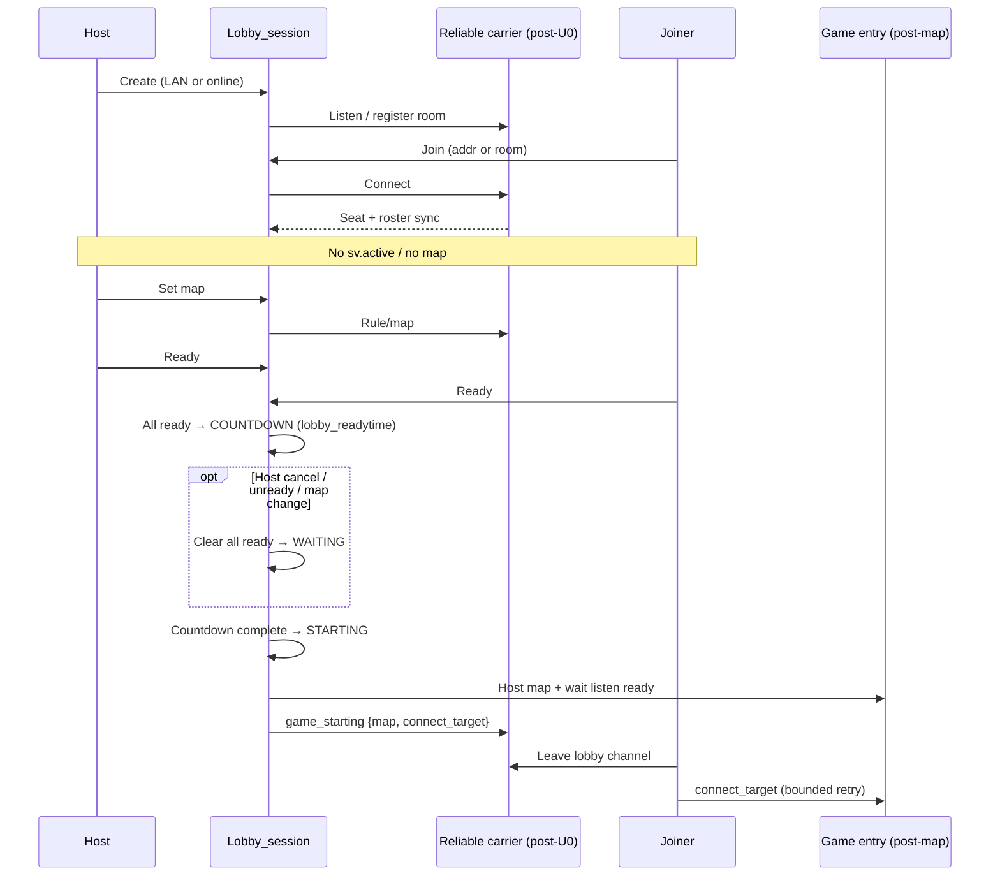

# feat: Serverless lobby session (LAN + online + basemod room)

**Target trees:** Nuclide game/UI in this repo. FTE lobby/session C lives in sibling `../workspace/fteqw/` (canonical). WebCore plugin and menu host live under `../workspace/fteqw/_worktrees/webcore-cpu-renderer/`.

**Build-of-record (hard prerequisite):** Pick **one** FTE tree that produces the runtime `fteqw64.exe` used with WebCore for this feature. Before U1, copy full `lobby_session.c` / `.h` (and related lobby backends as needed) so SyncCvars, join, and transport behavior match. Treat worktree vs canonical drift as a merge gate, not a soft reminder.

## Summary

Rebuild the pre-game lobby on the existing `Lobby_*` session API with **one shared reliable message schema** (KEX-style seat/player/rule/countdown/start/leave) for LAN, same-machine, and online—retiring fire-and-forget custom UDP as the lasting design—then wire a reduced basemod WebCore session room around roster, map, ready, all-ready countdown (host cancel clears ready), and a correct post-countdown game connect handoff. Carrier choice (ICE listen vs reliable LAN adapter + ICE online) is gated by a short U0 spike; do not assume today’s `lobby_backend_ice.c` is already a lobby datachannel.

---

## Problem Frame

Players cannot trust the current pre-game lobby: joiners stick on empty/joining, ready/roster drift, and start can point clients at the lobby UDP peer instead of the game listen address. Prior patches on the custom text datagram path did not yield a dependable LAN/same-machine loop, and online must work on the same architecture without a second redesign (see origin: `docs/brainstorms/2026-07-17-serverless-lobby-session-requirements.md`).

---

## Requirements

- R1. Pre-game session has no listen server and no map loaded until start commits (origin R1).
- R2. One session architecture supports LAN, same-machine, and online with **equal priority**—all three are prove-it acceptance surfaces (origin R2, plan-scoped).
- R3. Prefer proven FTE/KEX session **semantics** and ICE peering where they fit—over inventing another fire-and-forget lobby protocol (origin R3). Q2 `NET_KexLobby_*` is a message-shape reference, not the Nuclide listen-server backbone.
- R4. Host creates from WebCore title and lands in the session room (origin R4).
- R5. Joiners join via LAN discovery and direct address; same-machine `127.0.0.1` two-client join works (origin R5).
- R6. After join, both sides share the same roster (names, host, ready) without a Ready click to “populate” (origin R6).
- R7. Host selects map; joiners see the pick while still in lobby (origin R7).
- R8. Ready toggles sync to all peers (origin R8).
- R9. When all players are ready, a short countdown starts automatically (origin R9); default length from `lobby_readytime`.
- R10. Host can cancel countdown; lobby returns to waiting **and ready is cleared for everyone** (origin R10 + plan decision).
- R11. On countdown complete, host starts map/server only then; joiners use the **connect-target policy** (not lobby channel `net_from` / `lobby_port`) (origin R11 + known gap).
- R12. Host Start/Leave controls fit reduced basemod UX; Leave returns to title (origin R12).
- R13. Host leave/close ends the session for joiners with clear feedback to title (origin R13).
- R14. WebCore lobby UI uses reduced basemod GameLobby layout language (origin R14 + plan: reduced, not full chrome).
- R15. Session room stays live-synced (roster, ready, map, countdown/cancel, leave) (origin R15).
- R16. Lobby chat deferred (origin R16).
- R17. Rules/game-options beyond map deferred (origin R17).

**Origin actors:** A1 Host, A2 Joiner, A3 Session system, A4 WebCore lobby UI  
**Origin flows:** F1 Create, F2 Join, F3 Ready/countdown, F4 Game start, F5 Leave  
**Origin acceptance examples:** AE1–AE6

---

## Scope Boundaries

### Deferred for later

- Lobby chat (origin R16).
- Rules / game-options panel beyond map pick (origin R17).
- Full matchmaking, friends, invites, party system.
- Wire-interoperability with Quake II remaster clients.
- Building new TURN/relay infrastructure (use existing FTE ICE/broker only).

### Outside this product's identity

- Listen-server or `map_background` “PlayRoom” lobby.
- H3 decorative chrome as the lobby visual target.
- Treating spectator target cycling on same-machine multi-client as part of this lobby work (`docs/deferred/spectator-target-cycling.md`).

### Deferred to Follow-Up Work

- Capturing post-ship learnings into `docs/solutions/` via compound (KB currently AGENTS-only for this domain).
- Deprecating MenuQC VGUI / Slint lobby as primary UX after WebCore room is solid (leave those surfaces functional if cheap; do not block on them).

---

## Context & Research

### Relevant Code and Patterns

- Session spine: `../workspace/fteqw/engine/common/lobby_session.c` (+ `.h`), backends `lobby_backend_{offline,lan,ice}.c`, fragile LAN path `lobby_transport.c`.
- Today both LAN and ICE backends still call `Lobby_Transport_*` UDP; `send_rule` is a no-op; online `connect rtc://…` is a **game** ICE path, not a lobby datachannel.
- Semantics reference: KEX-style seat/player/rule/start message shape (`Lobby_Kex_On*` apply hooks)—not Q2 listen-server lifecycle.
- ICE infrastructure: `../workspace/fteqw/engine/common/net_ice.c`, existing broker APIs.
- Frame pump: `Lobby_RunFrame` from client main (must stay the poll point for transport + countdown).
- WebCore: `base/data/web/title-menu/`, `base/data/web/lobby-menu/`; plugin `getlobby` in `../workspace/fteqw/_worktrees/webcore-cpu-renderer/plugins/webcore/webcore.c`; host `m_webcore_menu.c`.
- Basemod layout reference: `base/data/web/basemod-wireframes-foundation/` (`#view-gamelobby`).
- Prior transport intent: `docs/plans/2026-07-06-001-feat-serverless-lobby-transport-plan.md` (ICE-for-lobby not fully landed; UDP was).
- Prior UI bridge: `docs/plans/2026-07-17-001-feat-webcore-lobby-ui-plan.md` (entry points done; session gaps remain).
- Post-map RuleC `base/src/rules/lobby.qc` is **in-game**—leave alone until after `map`.

### Institutional Learnings

- Prefer mapless pre-game sessions when `Lobby_*` can avoid loading a gameplay map (`AGENTS.md`).
- WebCore title Create/Join Lobby is the entry contract; prefer workspace FTE / webcore-cpu-renderer for menu work.
- Same-machine two-client is a hard acceptance path; spectator cycling is a separate deferred bug—do not pull it into this plan.

### External References

- None required beyond in-tree FTE ICE/KEX—local patterns are sufficient.

---

## Key Technical Decisions

- **One session, one schema; carriers chosen after U0:** Keep `Lobby_*` + one apply path. Message shape is KEX-style. Discovery differs (LAN list / address vs room code / broker); session state does not fork.
- **U0 carrier spike gates U2:** Timebox mapless host listen + second-process join + reliable roster with `!sv.active`. **Pass** → ICE (or ICE-backed) for LAN and online lobby. **Fail** → still one schema/apply path; LAN/localhost may use a sequenced/reliable adapter while online uses ICE/broker for lobby signaling—do not revive fire-and-forget as destiny.
- **No dual start encodings:** Only one `game_starting` wire format. Prefer deleting lasting `S:`+`net_from` dependence in the same change set as the new handoff.
- **Countdown owns start gating:** `lobby_readytime` drives auto-countdown when all seats are ready (host included—remove implicit host-ready). Cancel / peer unready / map change mid-countdown → abort + clear all ready. Arm countdown only on a stable roster generation (short settle after join/leave).
- **Host Start:** Force-commit only when all ready; otherwise no-op with feedback. Solo-host may arm countdown when the single player is ready.
- **Connect-target policy:** Never lobby `net_from` / `lobby_port`. After listen ready: localhost join → `127.0.0.1:<gameport>`; LAN join → host IP the joiner already used + **game** port; online → reachable game URI (`rtc://` / existing ICE game path)—not a blind private `ip:port` through NAT. Fail closed to title with clear feedback rather than silent hang.
- **Listen-ready gate:** STARTING is host-local: `map` → poll until listen accepting → one `game_starting`. Timeout/map fail → tear down all to title. Clients: bounded retry then title.
- **Online host must register a lobby room:** Generate/store room code and register with existing broker APIs so joiners attach to the **lobby** channel before any map.
- **State vocabulary:** Map phases onto existing enums (`READY_CHECK` / add `COUNTDOWN` explicitly). Fix PlayRoom/listen-server comments in `lobby_session.h` during U1.
- **Reduced basemod UI; mapless create; join while COUNTDOWN/STARTING/INGAME rejected; host leave hard-tears-down.**
- **Primary verification:** Two-process localhost + console/`getlobby`. Do not invent engine `lobby_*_test.c` unless a common/ harness already exists; WebCore smoke JSON may be created if missing.

---

## Open Questions

### Resolved During Planning

- Cancel countdown clears ready?: **Yes** (user confirmed).
- Online vs LAN priority?: **Equal** for lobby session (user confirmed). Online **game** entry uses reachable-URI policy, not classic private-IP `connect` through NAT.
- Basemod UI depth?: **Reduced** (user confirmed).
- Countdown length?: **`lobby_readytime`**.
- Unready / map-change mid-countdown?: **Abort + clear all ready**.
- Backbone?: **Shared reliable schema + U0 spike** chooses carriers; KEX is semantics reference only.

### Deferred to Implementation

- Exact ICE listen/connect helpers from U0 (pass/fail recorded in PR).
- Exact `getlobby` JSON field names.
- Listen-ready predicate symbol and retry timing constants.
- Residual `lobby_transport.c` adapter vs delete (must still obey no dual start encodings).

---

## High-Level Technical Design

> *This illustrates the intended approach and is directional guidance for review, not implementation specification. The implementing agent should treat it as context, not code to reproduce.*

**States:** `WAITING` → `COUNTDOWN` → `STARTING` → `INGAME` (cancel/unready/map-change → `WAITING` with cleared ready). Reject joins in `COUNTDOWN`/`STARTING`/`INGAME`.

---

## Implementation Units

- U0. **Carrier spike (gate)**

**Goal:** Falsify or confirm a mapless reliable lobby carrier before U2’s transport rewrite.

**Requirements:** R2, R3

**Dependencies:** Build-of-record tree sync

**Files:**
- Spike against: `../workspace/fteqw/engine/common/net_ice.c`, `lobby_backend_*.c`, `lobby_transport.c`
- Record outcome in the feature PR (pass/fail + carrier matrix)

**Approach:**
- Timebox 1–2 days: host mapless listen, second process joins (`127.0.0.1` minimum), reliable roster, prove `!sv.active`.
- Probe online: room-code register + same schema before any `map`.
- On fail: document fallback (reliable LAN adapter + ICE online signaling) still sharing one apply path.

**Test scenarios:**
- Happy path: spike criteria succeed or explicitly fail with recorded fallback.
- Error path: requiring `map_background` / `sv.active` for lobby messaging = spike failure.

**Verification:**
- Written spike result before U2 starts.

---

- U1. **Session state machine: ready, countdown, cancel, map sync**

**Goal:** `Lobby_RunFrame` owns all-ready countdown, cancel/clear-ready, map sync, and honest host ready—without starting a map.

**Requirements:** R1, R7–R10, R12, R15

**Dependencies:** Build-of-record sync

**Files:**
- Modify: `../workspace/fteqw/engine/common/lobby_session.c`
- Modify: `../workspace/fteqw/engine/common/lobby_session.h`
- Sync into build-of-record worktree copy when that tree is the runtime source

**Approach:**
- Wire `lobby_readytime`; remove implicit host-ready; stable-roster settle before arming.
- Cancel / unready / map-change mid-countdown → abort + clear all ready.
- Expose phase/countdown/map via cvars; Host Start force-commit only when all ready.
- Align state enum/comments with mapless model.

**Execution note:** Characterization-first around current ready/start before changing host-ready shortcuts.

**Patterns to follow:** `Lobby_SyncCvars` / `LOBBY_EVT_*`; KEX message-shape apply hooks.

**Test scenarios:**
- Happy path: both ready → countdown at `lobby_readytime`.
- Happy path: host cancel → WAITING, all ready false, no map.
- Edge case: peer unready / map change mid-countdown → abort + clear all.
- Edge case: solo host ready → countdown arms.
- Error path: Start while not all ready → no commit.
- Integration: SyncCvars/events after each transition.

**Verification:**
- Two-process / console checks; no `sv.active` during lobby.

---

- U2. **Reliable lobby carrier + shared message schema (LAN and online)**

**Goal:** Replace lasting fire-and-forget UDP with the U0-chosen carrier matrix and one shared schema.

**Requirements:** R2, R3, R5, R6

**Dependencies:** U0 (recorded), U1

**Files:**
- Modify: `../workspace/fteqw/engine/common/lobby_backend_lan.c`
- Modify: `../workspace/fteqw/engine/common/lobby_backend_ice.c`
- Modify or retire: `../workspace/fteqw/engine/common/lobby_transport.c`
- May modify: `../workspace/fteqw/engine/common/net_ice.c` if U0 requires it
- Online host room registration in session/backends as needed

**Approach:**
- One message set: seat, roster/player, map/rule, ready, countdown, leave, game_starting.
- Online create: room code + broker register **lobby** channel (game `rtc://` is not lobby backbone).
- Real `send_rule` / player sync; reject full lobby and joins during COUNTDOWN/STARTING/INGAME.
- No `map_background`; no dual start encodings.

**Patterns to follow:** U0 decision; KEX-style semantics; existing broker APIs.

**Test scenarios:**
- Happy path: `127.0.0.1` join → shared roster without Ready click (AE2).
- Happy path: online room-code → same lobby schema as LAN.
- Edge case: LAN discovery + same-machine both work.
- Error path: timeout / bad address / join-during-countdown.
- Integration: loss/reorder must not permanently empty roster.

**Verification:**
- LAN, localhost, and online **lobby** joins populate the same fields; no map loaded.

---

- U3. **Game-start handoff to correct connect target**

**Goal:** On commit, host loads map; joiners enter via connect-target policy—not lobby peer address.

**Requirements:** R1, R11, AE5

**Dependencies:** U1, U2

**Files:**
- Modify: `../workspace/fteqw/engine/common/lobby_session.c`
- Modify: backend send/receive for `game_starting`
- May modify: worktree `m_webcore_menu.c` if create still injects background maps

**Approach:**
- STARTING → `map` → wait listen accepting → one `{map, connect_target}` → clients leave lobby → bounded retry connect.
- Apply localhost / LAN / online URI policy.
- Map/listen failure → tear down all to title.

**Patterns to follow:** Prior plan transition sketch where still true; extend today’s too-early STARTING→INGAME path.

**Test scenarios:**
- Happy path: AE5 localhost map entry; lobby was mapless until commit.
- Error path: never connect to lobby peer port alone.
- Edge case: connect-before-listen → bounded retry succeeds.
- Error path: host map/listen fail → title, not zombie.
- Online: enter via reachable URI **or** fail closed with clear feedback (lobby session already proven in U2).

**Verification:**
- Two-client localhost lands in chosen map; lobby port is not the connect target.

---

- U4. **WebCore `getlobby` + reduced basemod session room**

**Goal:** Live-sync reduced basemod room for roster, map, ready, countdown/cancel, Start/Leave.

**Requirements:** R4, R12–R15, AE1, AE3, AE4, AE6

**Dependencies:** U1, U2, U3

**Files:**
- Modify: `../workspace/fteqw/_worktrees/webcore-cpu-renderer/plugins/webcore/webcore.c`
- Modify: `base/data/web/lobby-menu/index.html`
- Modify: `base/data/web/lobby-menu/app.js`
- Modify: `base/data/web/lobby-menu/style.css`
- Reference: `base/data/web/basemod-wireframes-foundation/`
- May create: `base/data/web/lobby-menu/smoke.json`

**Approach:**
- Extend `getlobby` (map, ready[], countdown/phase, host).
- Reduced basemod room; no chat/rules; SyncCvars trustworthy on build-of-record.

**Patterns to follow:** WebCore lobby UI plan allowlist/colon-query; foundation layout; no `@font-face`.

**Test scenarios:**
- AE1, AE3, AE4, AE6; map pick sync; no Ready-to-populate.

**Verification:**
- Manual two-client WebCore loop on the reduced room.

---

- U5. **Title entry, mapless create, and equal-path join surfaces**

**Goal:** Title Create/Join feed the session without background maps; LAN, address, and room code are live equal-priority methods.

**Requirements:** R2, R4, R5, R14

**Dependencies:** U2, U4

**Files:**
- Modify: `base/data/web/title-menu/`
- Modify: `../workspace/fteqw/_worktrees/webcore-cpu-renderer/engine/client/m_webcore_menu.c`
- May modify: `webcore.c` allowlist

**Approach:**
- Strip `sv_background` / background01 from create.
- All three join methods interactive; empty/error states; no sticky joining placeholder.

**Patterns to follow:** Existing `menu_lobby_create` / `lobby_join:` / hostcache wiring—extend.

**Test scenarios:**
- Create → mapless room; join via LAN / `127.0.0.1` / room code; bad input feedback; leave clears `lobby_active`.

**Verification:**
- All three join methods reach a shared roster room with no map loaded.

---

## System-Wide Impact

- **Interaction graph:** `Lobby_RunFrame`, backends, `getlobby`, title create/join, hostcache, broker, `Lobby_StartGame` → `map` / connect-target.
- **Error propagation:** Join/carrier failures → title/dialog; start failures → tear down STARTING; no half-open seats.
- **State lifecycle risks:** Double create/join; countdown vs leave; connect-before-listen; port collision; tree drift.
- **API surface parity:** Cvars + `getlobby` + cmds; VGUI/Slint secondary.
- **Integration coverage:** Localhost, LAN discovery, online room-code lobby; map entry per connect-target policy.
- **Unchanged invariants:** Post-map RuleC lobby; console while WebCore menus up; no new broker infra.

---

## Risks & Dependencies

| Risk | Mitigation |
|------|------------|
| ICE lobby listen thinner than assumed | U0 spike; fallback carrier matrix; never fire-and-forget as destiny |
| Worktree vs canonical drift | Build-of-record + full `lobby_session` sync merge gate |
| Start connect race / wrong address | Listen-ready gate + connect-target policy + bounded retry |
| Online NAT after lobby succeeds | Reachable game URI for online; fail closed with UX—not private-IP theater |
| Dual start encodings during cutover | Single `game_starting` format; delete `S:`+`net_from` path with handoff |
| Scope creep (chat/rules/full chrome) | Reduced room; deferred lists stay deferred |
| Same-machine port collisions | U3 bind strategy; two-client start required |

---

## Documentation / Operational Notes

- Rebuild/stage via existing WebCore/FTE scripts; copy runtime binary to nuclide root per engine rules.
- PR note: two-client localhost + online room-code lobby check; record U0 spike outcome.
- Origin outstanding questions resolved by this plan (clear-ready, equal online/LAN, reduced UI, backbone+spike).

---

## Alternative Approaches Considered

- **Keep patching `lobby_transport.c` UDP only:** Rejected—not the lasting solution; online still forks.
- **Assume ICE lobby already works / ICE online only + UDP LAN forever:** Rejected—backends are still UDP stubs; user requires one architecture and equal priority.
- **One schema + reliable LAN adapter + ICE online (post-U0 fallback):** Accepted as the **fail path** of U0, not a second product.
- **Full basemod GameLobby chrome:** Rejected—reduced room chosen.
- **Preserve “host always ready”:** Rejected—conflicts with Ready gating.

---

## Success Metrics

- AE1–AE6 pass on WebCore with two processes on one PC.
- Online room-code create/join/roster/ready/countdown works on the same session/UI; game entry follows connect-target policy (reachable URI or clear fail-closed).
- No map / no listen server during lobby phase in those runs.
- U0 spike outcome recorded before transport rewrite lands.

---

## Sources & References

- **Origin document:** [docs/brainstorms/2026-07-17-serverless-lobby-session-requirements.md](../brainstorms/2026-07-17-serverless-lobby-session-requirements.md)
- Related plans: [docs/plans/2026-07-06-001-feat-serverless-lobby-transport-plan.md](2026-07-06-001-feat-serverless-lobby-transport-plan.md), [docs/plans/2026-07-17-001-feat-webcore-lobby-ui-plan.md](2026-07-17-001-feat-webcore-lobby-ui-plan.md)
- Related UI prior art: [docs/brainstorms/2026-07-17-webcore-lobby-ui-requirements.md](../brainstorms/2026-07-17-webcore-lobby-ui-requirements.md)
- Related code: `../workspace/fteqw/engine/common/lobby_*.c`, `base/data/web/lobby-menu/`, `base/data/web/basemod-wireframes-foundation/`
