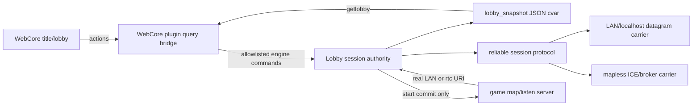

# feat: Mapless WebCore party lobby (LAN, localhost, online)

## Goal Capsule

- **Objective:** Deliver a host-authoritative pre-game party lobby with L4D / Halo / KEX-remaster behavior: create or join a room, see a shared roster, choose a map, ready up, run a synchronized countdown, then create the listen server and load the map only after start commits.
- **UI:** WebCore title menu and reduced basemod-style lobby room.
- **Topologies:** Two processes on one PC, LAN discovery/direct address, and online room-code joining are all required acceptance surfaces.
- **Authority:** Requirements R1–R17 and acceptance examples AE1–AE6 in the origin document.
- **Non-goals:** Lobby chat, rules beyond map selection, matchmaking/friends/invites, host migration, KEX wire compatibility, a background-map/PlayRoom lobby, or new TURN infrastructure.

## Why the Superseded Plan Cannot Be Executed Safely

The previous plan has the right product goal but is built on several false or incomplete code assumptions:

1. **The WebCore integration tree is internally split and currently cannot be treated as a synchronized build-of-record.** Canonical `workspace/fteqw/engine/common/lobby_session.c` contains the custom datagram transport, while `_worktrees/webcore-cpu-renderer/engine/common/lobby_session.c` declares newer transport/start APIs in its header but does not define or include them. The worktree Makefile compiles `lobby_session.o` and the three backends, but not standalone `lobby_transport.o`; therefore the current worktree shape is not a valid transport baseline.
2. **The claimed “reliable UDP” carrier is not reliable.** The worktree `lobby_transport.c` sends raw `NET_SendPacket` datagrams. Its `lobby_msg_seq` is incremented but never encoded, acknowledged, deduplicated, or replayed. Periodic full-state pushes can heal some loss but are not ordered delivery and cannot make start/leave/countdown commits dependable.
3. **The current protocol is not host-authoritative.** Clients can send player/rule messages carrying arbitrary seat IDs; the host applies and relays them. There is no session ID, peer identity, anti-replay, source-address ownership check, state revision, or authoritative snapshot boundary.
4. **WebCore does not pump the lobby.** `Lobby_RunFrame()` is called from the Slint lobby draw/sync path, not from the always-running client frame used by WebCore. A WebCore room can poll `getlobby` forever while transport, retries, countdown, and timeout work never advance.
5. **WebCore’s state contract is too small and non-atomic.** `getlobby` reconstructs state from separate cvars and only four player-name strings. It does not expose local seat, host flag, per-player ready state, selected map, phase, countdown deadline, connection state, or errors.
6. **Create Lobby still violates mapless intent.** `m_webcore_menu.c` sets `sv_background 1` and `lobby_defaultmap background01` before `lobby_create_lan`.
7. **The in-tree KEX implementation is a reference, not a reusable mapless host.** It is compiled only under the Q2/KEX feature gate, accepts inbound peers only while a Q2 game server is alive, initializes rules from `sv.mapname`, and is disabled by default because of amplification risk. Reuse its reliability/message semantics, not its Q2 server lifecycle.
8. **The existing ICE/broker path is game-connection-oriented.** ICE protocols bind to client/server socket collections and the broker heartbeat publishes game server info. The current `lobby_backend_ice.c` merely opens the same raw UDP socket as LAN; it neither registers a room nor establishes an ICE lobby peer. A dedicated mapless lobby use of the broker/ICE machinery must be implemented and proven rather than assumed.
9. **Start handoff is underspecified.** The host must preserve the lobby channel while the asynchronous `map` command creates the game listener, obtain a real game connect URI, publish exactly one authoritative start commit, and handle timeout/failure. Replacing the lobby port with a guessed game port is not sufficient online.
10. **Host-loss and failure behavior are incomplete.** There is no dependable heartbeat/timeout, host-close commit, join rejection response, full-lobby response, or UI-visible terminal reason.

## Product Behavior

### Session phases

`IDLE -> CREATING/JOINING -> WAITING -> COUNTDOWN -> STARTING -> INGAME`

Terminal failures go through `CLOSING` long enough to publish a reason, then `IDLE` and the WebCore title menu.

- `WAITING`: joins allowed; host may select map; players may ready.
- `COUNTDOWN`: joins rejected; roster/map changes cancel countdown and clear all ready.
- `STARTING`: host has committed start and is creating the game listener; joins and mutable lobby actions rejected.
- `INGAME`: start handoff was published; the pre-game session is closed after peers acknowledge or timeout.

### Host authority

- Host owns seat assignment, roster, map, phase, countdown deadline, ready clearing, close reason, and start commit.
- Joiners send intents only: join, ready/unready, leave, and acknowledgement.
- A peer may mutate only its assigned local seat.
- Every authoritative state change increments a session revision.
- A complete authoritative snapshot is sent on join/rejoin and periodically as repair; deltas are optional optimization, never the only source of truth.

### Ready/countdown rules

- Host is a normal player and must ready.
- All occupied seats ready starts the countdown using `lobby_readytime`.
- Host Cancel, any unready, player join/leave, or map change during countdown returns to `WAITING` and clears ready for every seat.
- The Start control is host-only. It may force the normal countdown only when all occupied seats are ready; it never bypasses readiness.
- A solo host may start after readying.

### Start handoff

1. Host reaches countdown deadline and publishes `STARTING` revision.
2. Host queues `map <selected-map>` locally. Lobby transport remains alive.
3. Host polls a real listen-ready predicate and game endpoint publication state.
4. Once ready, host publishes one idempotent `GAME_STARTING` commit containing session ID, start nonce, map, and per-peer/reachable game connect target.
5. Joiners acknowledge, close the lobby carrier, and connect with bounded retry.
6. Failure to load/listen/publish before timeout sends a terminal failure reason and returns every peer to title.

Connect-target policy:

- Same-machine direct join: loopback game address and actual game port.
- LAN: host address learned from the authenticated lobby peer, with the actual game port.
- Online: URI produced by the existing game ICE/broker publication path after the listen server exists. Never send a private-IP guess through NAT and never use lobby `net_from` as the game endpoint.

## Architecture

### Boundaries

- **Session layer:** topology-independent state machine and validation.
- **Protocol layer:** one versioned message schema, reliable ordered delivery where required, revisions, snapshots, identities, timeout/close semantics.
- **Carrier layer:** LAN socket or online ICE/broker connection. Carriers move bytes and report peer lifecycle; they do not own lobby rules.
- **WebCore bridge:** returns one atomic JSON snapshot and accepts constrained lobby actions. It does not infer state from UI placeholders.
- **Game server:** absent until `STARTING`; post-map RuleC remains separate.

## Protocol Guardrails

The exact C structs are implementation-time decisions, but the wire contract must include:

- Protocol version and message type.
- Random session ID and per-connection peer ID/token.
- Monotonic packet sequence plus acknowledgement window for reliable messages.
- Authoritative state revision and idempotent start nonce.
- Message types: `HELLO`, `JOIN_REQUEST`, `JOIN_ACCEPT`, `JOIN_REJECT`, `INTENT_READY`, `INTENT_LEAVE`, `SNAPSHOT`, optional `DELTA`, `PING/PONG`, `CLOSE`, `GAME_STARTING`, `ACK`.
- Bounded payload and roster sizes; strict parsing before mutation.
- Source endpoint bound to its assigned peer/seat after acceptance.
- Host validates every intent; clients reject stale revisions and non-host authoritative messages.
- Required-reliable messages: join accept/reject, snapshot, close, and game start. Never rely on one fire-and-forget datagram for a phase transition.

For LAN, adapt the existing KEX resend/ack/fragment/keepalive ideas into a lobby-owned generic reliability module; do not route through the Q2-only `NET_KexLobby_*` server path. For ICE, feed the same protocol bytes over a dedicated peer connection and keep protocol reliability/idempotence so carrier changes do not change session semantics.

## WebCore Contract

### Atomic snapshot

The engine publishes one `lobby_snapshot` JSON document whenever the session revision or local connection state changes. `getlobby` returns it verbatim after size/schema validation.

Minimum shape:

- `active`, `sessionId`, `revision`, `network`, `isHost`, `localSeat`
- `phase`, `status`, `error`, `roomCode`
- `map`, `countdownEnd`, `serverTime`
- `canReady`, `canStart`, `canCancel`, `canChangeMap`, `canLeave`
- `players[]`: `seat`, `name`, `host`, `ready`, `connected`

This replaces four-player name cvars and `[READY]` string decoration. Compatibility cvars may remain for MenuQC/Slint, but WebCore uses the atomic snapshot.

### Actions

Use dedicated allowlisted query actions rather than unrestricted command text:

- create LAN / create online
- join address / join room code
- set ready
- set map
- start/countdown
- cancel countdown
- leave/close

Each action returns structured acceptance/error JSON. Navigation to the room happens only after create acceptance or join enters `JOINING`; terminal failures return to title with a visible reason.

## Implementation Units

### U0. Establish one integration/build-of-record tree

**Goal:** Remove tree drift before changing behavior.

**Files/trees:**
- Canonical source: `workspace/fteqw/engine/`
- WebCore integration worktree: `workspace/fteqw/_worktrees/webcore-cpu-renderer/`
- Build copy: `/c/bld/fteqw_src2/` only when required by the existing ccache build script

**Requirements:** All.

**Decisions:**
- Compare every lobby/session/backend/transport and WebCore host file.
- Choose the WebCore worktree branch as the integration branch for this feature, but port lobby changes from a single reviewed canonical patch set; do not hand-copy partial files in both directions.
- Remove declarations with no definition and decide whether `lobby_transport.c` is compiled separately or intentionally included once. The Makefile and source must agree.
- Preserve unrelated local changes; no branch reset or broad sync.

**Verification:**
- Engine and WebCore plugin link from a clean incremental build with ccache.
- Runtime binary/plugin hashes come from that build and are staged to the Nuclide root.

### U1. Make the session runtime independent of UI

**Goal:** Lobby networking and state advance every client frame whether WebCore, Slint, MenuQC, console, or no menu is visible.

**Requirements:** R1, R6–R15.

**Files:**
- `engine/client/cl_main.c`
- `engine/common/lobby_session.c/.h`
- Remove Slint-only ownership from `engine/client/m_slint_menu.c` while keeping Slint property sync if retained.

**Decisions:**
- Call `Lobby_RunFrame()` exactly once from the main client frame.
- Frame pump owns carrier polling, retransmits, heartbeat/timeouts, countdown, snapshots, and start/listen polling.
- No UI draw function mutates or advances session state.

**Test scenarios:**
- Close/cover the WebCore room while two peers remain joined; heartbeat and roster stay alive.
- Open console during countdown; countdown still completes or cancels correctly.
- Verify exactly one poll per frame.

### U2. Replace ad-hoc mutation with host-authoritative session state

**Goal:** Implement the phase model, authoritative roster/map/ready/countdown rules, revisions, and terminal reasons without any map/server in lobby phases.

**Requirements:** R1, R6–R10, R12, R13, R15.

**Files:**
- `engine/common/lobby_session.c/.h`
- `engine/common/lobby_backend_offline.c` for single-process characterization

**Decisions:**
- Add explicit `JOINING`, `COUNTDOWN`, `CLOSING` phases as needed.
- Host is not implicitly ready.
- Clear all ready on cancellation-triggering mutations.
- Reject mutable actions outside allowed phases.
- Generate session ID, revisions, start nonce, and atomic snapshot.
- Separate connection state/status/error from human-readable phase labels.

**Test scenarios:**
- Host create produces seat 0, ready false, WAITING, selected default map, and `!sv.active`.
- Two seats ready -> synchronized countdown.
- Cancel/unready/map change/join/leave during countdown -> WAITING and all ready false.
- Host leave -> terminal close reason on joiner.
- Stale/invalid actions do not mutate revision.

### U3. Build one secure, reliable session protocol over the LAN carrier

**Goal:** Make localhost and LAN trustworthy before adding online transport.

**Requirements:** R2, R3, R5–R8, R10, R13, R15; AE2–AE4, AE6.

**Files:**
- Replace or refactor `engine/common/lobby_transport.c`
- `engine/common/lobby_backend_lan.c`
- `engine/common/lobby_session.c/.h`
- Reference only: KEX reliability code in `engine/common/net_wins.c`

**Decisions:**
- Implement the protocol guardrails above.
- Host binds `lobby_port`; localhost joiners bind ephemeral ports.
- Full snapshot on accept and periodic repair.
- Explicit full/busy/phase/version rejection responses.
- Heartbeat expiry removes joiners; host expiry closes joiner session.
- LAN discovery response advertises lobby phase, protocol version, player/max counts, and selected map without claiming a running game server.

**Test scenarios:**
- Two local processes join through `127.0.0.1`; both see identical revision/roster before Ready.
- Duplicate/reordered reliable packets are idempotent; dropped start/close/snapshot messages retransmit.
- Spoofed seat/rule update from an unbound endpoint is ignored.
- Lost join accept recovers without duplicate seats.
- Full lobby and join-during-countdown return explicit errors.
- No `sv.active` and no gameplay map throughout.

### U4. Implement the atomic WebCore bridge and reduced basemod room

**Goal:** Make WebCore a faithful view/controller of the session rather than a cvar-string approximation.

**Requirements:** R4, R6–R10, R12–R15; AE1, AE3, AE4, AE6.

**Files:**
- `plugins/webcore/webcore.c`
- `base/data/web/lobby-menu/index.html`
- `base/data/web/lobby-menu/app.js`
- `base/data/web/lobby-menu/style.css`
- Reference: `base/data/web/basemod-wireframes-foundation/`

**Decisions:**
- `getlobby` returns `lobby_snapshot` atomically.
- Add structured action queries with strict input validation and JSON results.
- Render host marker, local player, ready state, map, phase, countdown, errors, and capability-based controls.
- Escape all player/map/status text; no `innerHTML` with untrusted strings.
- Reduced basemod room only; no chat/rules/full decorative chrome and no `@font-face`.

**Test scenarios:**
- 1–16 players serialize without a four-seat cap.
- Ready/map/countdown/cancel update within one poll interval with internally consistent revision.
- Host-only controls never appear enabled for joiners.
- Host close and timeout return joiner to title with reason.
- Invalid JSON/action result produces a visible recoverable error, not a sticky placeholder.

### U5. Fix mapless title create/join and LAN discovery

**Goal:** Create and join the session without `sv_background`, `background01`, or a gameplay server.

**Requirements:** R1, R4, R5, R14; AE1, AE2.

**Files:**
- `engine/client/m_webcore_menu.c`
- `plugins/webcore/webcore.c`
- `base/data/web/title-menu/index.html`
- `base/data/web/title-menu/app.js`
- `base/data/web/title-menu/style.css`
- `engine/client/net_master.c` only for the existing localhost/LAN lobby discovery probe where needed

**Decisions:**
- Delete background-map setup from `menu_lobby_create`.
- Keep Create LAN, LAN list, and direct address live.
- Add room-code UI but enable it only with U6 online carrier.
- Hostcache distinguishes mapless lobby advertisements from game servers.
- Do not enter the lobby room on a rejected action.

**Test scenarios:**
- Cold title -> Create LAN -> WebCore room, host in roster, `!sv.active`.
- Second local process discovers or directly joins `127.0.0.1:lobby_port`.
- Empty list, malformed address, timeout, full, and wrong-version errors are visible.
- Leave clears session state and returns to title.

### U6. Add a dedicated mapless online ICE/broker carrier

**Goal:** Room-code create/join carries the same protocol online without creating a game server.

**Requirements:** R1–R3, R5–R10, R13, R15.

**Files:**
- `engine/common/lobby_backend_ice.c`
- `engine/common/net_ice.c` and its API header/exports as required
- Broker connection code in `engine/common/net_wins.c`
- Master/broker metadata handling in `engine/server/sv_master.c` only if protocol metadata must be extended
- Session/protocol files only for generic carrier callbacks, not online-specific rules

**Decisions:**
- Add a lobby/opaque-data ICE protocol or generic ICE datagram endpoint that can use client-owned networking while `sv.active == false`.
- Host registers a random room code and lobby metadata through the existing broker connection without advertising a live game server.
- Broker performs signaling/lookup; lobby payload travels peer-to-peer or through existing TURN when selected.
- Each online peer gets a dedicated authenticated carrier connection; host remains session authority.
- If the existing broker cannot register a non-server room cleanly, extend its message/metadata type rather than faking `sv.active` or publishing a false game heartbeat.

**Proof gate before UI enablement:**
- Two internet-separated processes create/join by room code, exchange reliable protocol snapshots, and remain `!sv.active` with no map.
- TURN/relay behavior uses existing FTE configuration; if no relay is available, show a precise connection failure.

**Test scenarios:**
- Room code create/join -> same snapshot fields and phase rules as LAN.
- Bad/expired code, broker loss, ICE failure, host timeout, and reconnect attempt are explicit.
- LAN and online protocol traces differ only below the carrier boundary.

### U7. Implement start/listen-ready/game-endpoint handoff

**Goal:** Start the real game only after countdown and connect every peer to the correct endpoint.

**Requirements:** R1, R9–R11, R13; AE5.

**Dependencies:** U2, U3, U6.

**Files:**
- `engine/common/lobby_session.c/.h`
- LAN/ICE carrier endpoint helpers
- Existing server/broker publication code needed to expose listen readiness and the published game URI
- `engine/client/m_webcore_menu.c` for loading/menu handoff only

**Decisions:**
- Keep the lobby carrier alive through host map startup.
- Use real readiness and endpoint APIs; no fixed sleep and no guessed `net_from` target.
- One idempotent `GAME_STARTING` commit; remove/ignore legacy `S:` start encoding.
- Online host waits for actual game broker URI before commit.
- Bounded client connect retry; terminal failure closes to title.

**Test scenarios:**
- Localhost and LAN peers enter the selected map; lobby port is never used as game port.
- Delayed server startup succeeds within timeout.
- Bad map, bind failure, publication failure, or timeout closes all peers with reason.
- Online room transitions to the real `rtc://` game URI after, not before, listener creation.
- Duplicate `GAME_STARTING` does not issue duplicate destructive transitions.

### U8. End-to-end verification and compatibility cleanup

**Goal:** Prove the product contract and remove misleading legacy paths.

**Requirements:** All; AE1–AE6.

**Files:**
- Test scripts/config under the existing project testing convention
- Compatibility updates to Slint/MenuQC only where engine API changes break them
- Documentation comments in lobby headers/backends

**Decisions:**
- Keep WebCore primary.
- Remove “PlayRoom/listen-server lobby,” “reliable” raw UDP, and fake ICE comments that no longer match code.
- Do not expand into lobby chat/rules/host migration.

**Verification matrix:**

| Surface | Create/join | Roster/map/ready | Cancel/leave/loss | Start into map | Mapless before start |
|---|---|---|---|---|---|
| Same PC, 2 processes | Required | Required | Required | Required | Required |
| LAN, 2 machines | Required | Required | Required | Required | Required |
| Online room code | Required | Required | Required | Required via real game URI | Required |

Also verify:
- Engine and plugin builds use ccache and the established MSYS2 build script.
- `git diff --check`, compile/link, and WebCore plugin tests pass.
- Runtime binary and plugin are staged together; no mixed-version test.
- Console remains usable while WebCore is open.
- Post-map RuleC lobby code is unchanged.

## Dependency Order

`U0 -> U1 -> U2 -> U3 -> U4/U5 -> U6 -> U7 -> U8`

- U4 and U5 may proceed in parallel after U3 stabilizes the snapshot/actions.
- U7 requires the LAN and online carrier endpoint contracts; do not ship a localhost-only guessed start target as the final design.
- Online room-code UI stays disabled until U6 proof gate passes.

## Risks and Mitigations

| Risk | Mitigation |
|---|---|
| Existing ICE API is tied to game client/server sockets | Add a client-owned opaque lobby protocol/collection; never fake a running server |
| Broker assumes every room is a game server | Add explicit lobby-room registration metadata/message type |
| Raw UDP protocol repeats current loss bugs | Sequence/ack/retry, authoritative snapshots, revisions, and idempotent commits are acceptance requirements |
| Amplification/spoofing | Small challenge/join exchange, bounded replies, endpoint binding, strict sizes, no unauthenticated state mutation |
| Worktree/canonical/build-copy drift | U0 integration gate and one reviewed patch source; build/stage engine and plugin together |
| WebCore observes torn cvar state | One atomic JSON snapshot per revision |
| Map startup races lobby close | Preserve carrier through listener readiness and start acknowledgement |
| Online lobby succeeds but game publication fails | Fail closed with clear reason; do not emit private-IP theater |
| Scope creep toward full matchmaking | Room code + LAN/direct only; friends/invites/host migration deferred |

## Completion Criteria

The feature is complete only when all of the following are demonstrated with the staged runtime:

1. Host creates from WebCore and enters a reduced basemod room with no map and no active listen server.
2. A second local process and a LAN machine can join, receive an immediate authoritative roster, change ready state, observe map selection, cancel countdown, and handle host close.
3. An internet-separated peer can do the same through a room code and existing ICE/broker/TURN infrastructure.
4. All-ready starts a shared countdown; cancellation clears every ready state.
5. Countdown completion starts the host map/listener, then sends the actual topology-appropriate game endpoint exactly once.
6. Localhost, LAN, and online peers enter the selected map or all receive a clear bounded failure and return to title.
7. WebCore is the primary UI; Slint/MenuQC do not own the session frame pump.
8. No background map, fake game heartbeat, or listen server exists during the pre-game lobby.

## Sources

- Origin: `docs/brainstorms/2026-07-17-serverless-lobby-session-requirements.md`
- Superseded plan: `docs/plans/2026-07-17-002-feat-serverless-lobby-session-plan.md`
- Existing WebCore plan: `docs/plans/2026-07-17-001-feat-webcore-lobby-ui-plan.md`
- Session code: `workspace/fteqw/engine/common/lobby_session.c/.h`
- Current custom carrier: `workspace/fteqw/engine/common/lobby_transport.c`
- KEX reliability/semantics reference: `workspace/fteqw/engine/common/net_wins.c`
- ICE implementation/API: `workspace/fteqw/engine/common/net_ice.c`
- Broker/master paths: `workspace/fteqw/engine/common/net_wins.c`, `engine/client/net_master.c`, `engine/server/sv_master.c`
- WebCore bridge/host: `workspace/fteqw/_worktrees/webcore-cpu-renderer/plugins/webcore/webcore.c`, `engine/client/m_webcore_menu.c`
- Web UI: `base/data/web/title-menu/`, `base/data/web/lobby-menu/`, `base/data/web/basemod-wireframes-foundation/`
