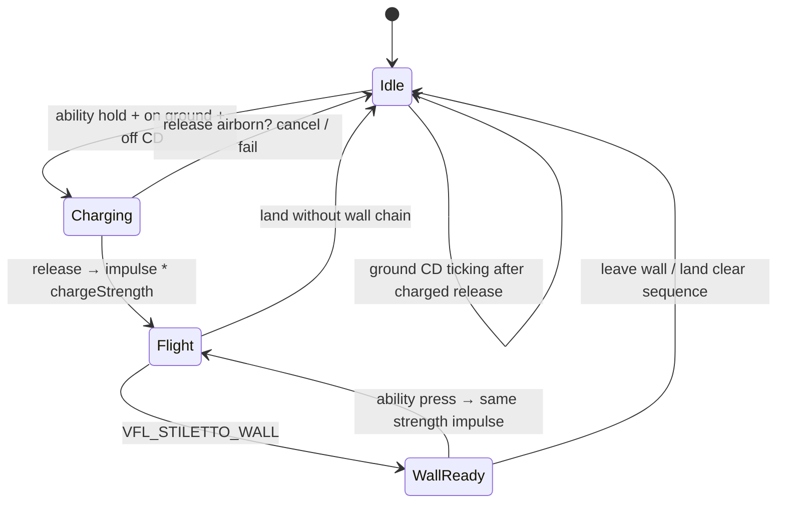

# feat: Archstiletto mobility lunge

## Goal Capsule

**Objective:** Ship Archstiletto’s class tool — a ground-charged, look-directed, mobility-only lunge with wall re-lunges that reuse opening charge strength — wired through the existing hero-ability input.

**Authority:** Origin requirements (`docs/brainstorms/2026-07-21-archstiletto-lunge-requirements.md`) for product behavior; this plan for HOW. Session-settled HOW decisions below override ad-hoc implementer invention.

**Stop when:** All U-IDs done, AE1–AE8 playtested, Definition of Done satisfied. Do not expand into arena boss kit, damage-on-impact, or charge HUD polish.

**Execution profile:** Shared QuakeC (weapon + player + stiletto physics/combat); rebuild with `make game GAME=base` (or `fteqcc` from nuclide root on Windows).

---

## Product Contract

### Summary

Archstiletto gets a Hale/Hunter-style **mobility lunge**: hold ability on ground to charge (mild slow), release to launch along look; short ground cooldown; wall-touch + ability press re-lunges instantly at the **same strength** as the opening charge; mid-lunge hits use Arch’s existing tool-punish path; charging on ground does not.

### Problem Frame

Arch is selectable with 8 HP duel rules and long-range melee but has **no class tool**, so he lacks the signature mobility other heroes express on the hero-ability key.

### Requirements

- **R1.** Lunge is Arch’s class tool (hero-ability input); mobility only — no damage/pin/body-check. *(see origin)*
- **R2.** Charge only on ground.
- **R3.** Hold to charge (~1.0–1.25s full); release launches look-direction; early release weaker; min charge still hops.
- **R4.** Mild move slow while charging (~70–80%).
- **R5.** Short fixed ground cooldown (~1–2s) after charged release.
- **R6.** Wall re-lunge: wall-touch during sequence + ability press → immediate re-lunge, no charge.
- **R7.** Wall re-lunges reuse opening charge strength for the whole sequence.
- **R8.** Wall re-lunges ignore ground cooldown for chaining; they do not start a new ground meter.
- **R9.** Tool punish: flight only (not charging); Arch duel punish path when hit mid-lunge.
- **R10.** Shared air dodge / stall / kickback unchanged.

**Origin acceptance examples:** AE1–AE8 (full/weak ground, charge not punishable, flight punishable, weak/full wall chain, fresh charge after land, no damage on skim).

**Origin flows:** Ground-charged lunge; Wall re-lunge chain.

### Success Criteria

- Ability key feels like a distinct Arch tool.
- Full vs weak charge is readable; wall chains preserve strength.
- Mid-lunge vulnerability matches existing Arch punish.
- Shared air tools still work independently.

### Scope Boundaries

- Damage / pin / grab on impact
- Arch arena mode (100 HP / 2× air / boss kit)
- Dedicated charge HUD / VFX beyond playtest needs
- New lunge viewmodel / third-person anims (placeholder OK)
- Reworking shared dodge / stall / kickback
- Generic multi-hero ability framework beyond the dispatch cleanup needed for Arch

### Dependencies

- Hero-ability press/release path (`+stiletto_grapple` / `nuclide_abi_grapple`)
- Wall contact via `VFL_STILETTO_WALL`
- Arch duel punish in `stiletto_combat.qc`

---

## Planning Contract

### Key Technical Decisions

- **KTD1 — New Arch weapon class:** Add `ncWeaponArchstiletto` extending melee base; keep primary swing, own ability charge/release. *(session-settled: user-approved — chosen over bolting lunge onto generic axe)*
- **KTD2 — Generalize ability dispatch:** On ability press, always call active weapon `DoAbilityAction`; default `ncWeapon::DoAbilityAction` performs existing grapple; Vagrant and Arch override. Removes Vagrant-only hardcode in `cmd_cl.qc`. *(session-settled: user-approved)*
- **KTD3 — Lunge state on player:** Charge/sequence/flight/cooldown fields live on `ncPlayer` so shared physics and combat can read them; weapon owns input edge timing. *(session-settled: user-approved)*
- **KTD4 — Shared movement applies impulse:** Launch / wall re-lunge set velocity in shared Stiletto movement (same family as air dash) for predictable feel. *(session-settled: user-approved)*
- **KTD5 — Verification is playtest AEs:** No QC unit harness for this; ship a playtest checklist covering AE1–AE8; constants clustered for tuning. *(session-settled: user-approved)*

### High-Level Technical Design

State machine (directional):

Component split:

| Piece | Owns |
|-------|------|
| `cmd_cl` + default `DoAbilityAction` | Ability key → weapon; default grapple |
| `ncWeaponArchstiletto` | Charge start/stop, wall re-lunge request, min/full charge |
| Player fields | `chargeStrength`, `inLungeFlight`, `groundCD`, charging flag |
| `stiletto_tuning` | Charge move scale; apply look-vector impulse |
| `stiletto_combat` | `inLungeFlight` → toolActive |

### Assumptions

- Exact impulse magnitudes, cooldown seconds, slow %, and wall-contact grace are playtest-tunable within origin bands.
- Ability hold while airborne does nothing for charge (wall re-lunge is press-edge, not hold-charge).
- Sequence strength clears when Arch lands without performing a wall re-lunge (origin AE7).

### Sequencing

U1 → U2 → U3 → U4 (U4 can start once U2 fields exist; prefer after U3 impulse path). U5 last.

### Sources & Research

- Ability dispatch: `src/server/cmd_cl.qc` (`nuclide_abi_grapple`), `src/shared/game/Weapon.qc` (`DoAbilityAction` empty today), `src/client/cmd.qc` (`+stiletto_grapple`)
- Pattern peer: `src/shared/game/WeaponVagrantKnife.qc` / `.h`
- Melee base: `src/shared/game/WeaponBaseMelee.qc`, `base/decls/def/weapons/archstiletto.def`
- Wall + dash: `src/shared/physics/stiletto_tuning.qc` (`VFL_STILETTO_WALL`, air-dash impulse)
- Punish: `src/shared/physics/stiletto_combat.qc` (`toolActive` check)
- Player fields: `src/shared/game/Player.h`
- Bind: `base/autoexec.cfg` (MOUSE2 → `+stiletto_grapple`)
- Origin: `docs/brainstorms/2026-07-21-archstiletto-lunge-requirements.md`
- External research skipped — local ability/wall/dash/punish patterns sufficient

### Open Questions

#### Deferred to Implementation

- Exact min/max impulse, charge curve (linear vs ease), wall re-lunge input debounce, and whether leaving wall without re-lunge immediately ends sequence vs short grace — tune in playtest within origin bands.
- Whether charge slow multiplies wish before or after punish move-scale when both could apply (should not overlap: charge is ground-only, punish flight is airborne).

---

## Implementation Units

### U1. Generalize hero-ability dispatch

**Goal:** Ability press routes through weapon `DoAbilityAction`; default behavior remains Collier/other grapple; Vagrant keeps warp override.

**Requirements:** R1 (input path); enables Arch wiring

**Dependencies:** None

**Files:**
- Modify: `src/server/cmd_cl.qc`
- Modify: `src/shared/game/Weapon.qc`
- Modify: `src/shared/game/Weapon.h` (comment only if needed)
- Test: `docs/verification/2026-07-21-archstiletto-lunge-playtest.md` (section: non-Arch grapple still works)

**Approach:**
- Replace Vagrant-only `declclass` branch with unconditional `DoAbilityAction()` on press; keep `OnAbilityReleased()` on release.
- Implement default `ncWeapon::DoAbilityAction` to call existing `Stiletto_FireGrapple` on owner (same as today’s non-Vagrant path).
- Confirm Vagrant override still wins via virtual dispatch.

**Patterns to follow:** Comment intent already in `cmd_cl.qc`; empty base hooks in `Weapon.qc`.

**Test scenarios:**
- Happy path: Non-Arch hero with grapple still fires grapple on ability press.
- Happy path: Vagrant ability press still throws/teleports warpknife (no grapple).
- Edge case: Ability press with no active weapon — no crash; no-op or safe return.

**Verification:** Collier (or any non-Vagrant/non-Arch) grapple unchanged; Vagrant warp unchanged after rebuild.

---

### U2. Player lunge state + Arch weapon class

**Goal:** Arch weapon owns charge/release/wall-re-lunge requests; player stores sequence strength, flight flag, cooldown, charging.

**Requirements:** R1–R3, R5–R8

**Dependencies:** U1

**Files:**
- Create: `src/shared/game/WeaponArchstiletto.h`
- Create: `src/shared/game/WeaponArchstiletto.qc`
- Modify: `src/shared/include.src`
- Modify: `base/decls/def/weapons/archstiletto.def` (`spawnclass` → Arch class; keep melee keys)
- Modify: `src/shared/game/Player.h`
- Modify: `src/shared/game/Player.qc` (init / respawn clear; network/predict fields as needed)
- Test: `docs/verification/2026-07-21-archstiletto-lunge-playtest.md` (AE1, AE2, AE5–AE7 input/state sections)

**Approach:**
- Subclass melee base so primary swing unchanged.
- `DoAbilityAction`: if on ground and off CD → start/continue charge; if in lunge sequence + wall flag → request wall re-lunge at stored strength; else ignore.
- `OnAbilityReleased`: if charging on ground → compute strength (clamp min..1), store as sequence strength, request launch, start ground CD, clear charging.
- Clear sequence strength / flight when landing without wall chain (hook from shared post-move or weapon `InputFrame`).
- Cluster tunable defines (charge time, CD, min strength) near other Stiletto constants or weapon-local defines.

**Patterns to follow:** `WeaponVagrantKnife` ability hold/release; `WeaponBaseMelee` for swing; Arch def already has `melee_range 128` / cleave.

**Execution note:** Smoke-first — rebuild progs and confirm Arch ability no longer fires grapple before tuning impulse.

**Test scenarios:**
- Covers AE1: Full hold then release sets sequence strength ≈ 1 and starts ground CD.
- Covers AE2: Early release sets clearly lower strength than full.
- Covers AE5/AE6: Wall re-lunge request uses stored strength, does not rebuild charge.
- Covers AE7: After land clear, next ground charge is independent.
- Edge case: Ability hold in air (not wall) does not build charge (R2).
- Edge case: Ability press during ground CD does not start charge.
- Error path: Non-Arch weapons unaffected.

**Verification:** Selecting Arch and pressing ability charges/releases without grapple; melee primary still swings.

---

### U3. Shared movement — charge slow + launch impulse

**Goal:** Apply mild wish slow while charging; on launch/wall re-lunge set look-vector velocity scaled by sequence strength.

**Requirements:** R3, R4, R6, R7

**Dependencies:** U2

**Files:**
- Modify: `src/shared/physics/stiletto_tuning.qc`
- Modify: `src/shared/physics/player_pmove.qc` (call sites only if needed)
- Test: `docs/verification/2026-07-21-archstiletto-lunge-playtest.md` (AE1–AE2, AE5–AE6 feel)

**Approach:**
- While charging + on ground: scale horizontal wish (~0.7–0.8).
- On launch request: set velocity from `v_forward` (view angles) × `lerp(minImpulse, maxImpulse, strength)`; clear on-ground; set `inLungeFlight`.
- Wall re-lunge: same impulse formula with stored strength; require `VFL_STILETTO_WALL` (existing probe).
- Do not deal damage or run traces against players for hit effects (R1).

**Patterns to follow:** Air-dash additive impulse and wall probe in `stiletto_tuning.qc`.

**Test scenarios:**
- Happy path: Full charge launches farther/higher than min charge.
- Happy path: Mild slow visible while holding charge on ground.
- Covers AE5/AE6: Weak vs full wall hops match opening strength.
- Edge case: Looking straight up vs horizontal changes trajectory as expected.
- Integration: Shared air dodge still available when not in exclusive lock (R10) — confirm no accidental disable of dodge outside punish stun.

**Verification:** Ground charge → airborne displacement scales with hold time; wall chain preserves strength.

---

### U4. Tool-punish integration for lunge flight

**Goal:** Mid-lunge (and wall re-lunge) flight counts as tool-active; charging on ground does not.

**Requirements:** R9

**Dependencies:** U2 (flight flag)

**Files:**
- Modify: `src/shared/physics/stiletto_combat.qc`
- Test: `docs/verification/2026-07-21-archstiletto-lunge-playtest.md` (AE3, AE4)

**Approach:**
- Extend `toolActive` to include player `inLungeFlight` (or equivalent).
- Ensure charging flag alone does not set toolActive.
- Arch still uses existing super-armor → trajectory punish branch.
- Clear flight flag on land / punish start as appropriate so state does not stick.

**Patterns to follow:** Existing `toolActive` composition for air stall / spent dodge charges.

**Test scenarios:**
- Covers AE3: Hit while charging on ground → no tool punish from charge.
- Covers AE4: Hit mid-lunge with Arch buffer spent → Arch trajectory punish.
- Integration: Hit mid-lunge with buffer remaining → buffer absorbs, no punish yet.
- Edge case: After landing, subsequent grounded hit is not lunge-tool punish.

**Verification:** AE3 and AE4 hold in a duel/deathmatch smoke.

---

### U5. Playtest checklist + constant tuning pass

**Goal:** Durable AE checklist and one tuning pass so full vs weak vs wall chain reads correctly.

**Requirements:** AE1–AE8; success criteria

**Dependencies:** U1–U4

**Files:**
- Create: `docs/verification/2026-07-21-archstiletto-lunge-playtest.md`
- Modify: tunable defines touched in U2/U3 (as needed after playtest)

**Approach:**
- Checklist maps each AE to steps + pass/fail.
- Include regression: non-Arch grapple, Vagrant warp, Arch melee still works.
- Tune impulse/CD/slow within origin bands only.

**Test scenarios:**
- Covers AE1–AE8 explicitly.
- Covers AE8: Lunge through another player deals no lunge damage.
- Regression: Collier grapple; Vagrant warp; Arch M1 melee.

**Verification:** Checklist completed with passes; no open P0 feel bugs for charge readability.

---

## Verification Contract

- Rebuild game progs: `make game GAME=base` (WSL) or `fteqcc.exe -srcfile base/src/server/progs.src` from nuclide root on Windows.
- Run engine with `+game base`, select Archstiletto.
- Execute `docs/verification/2026-07-21-archstiletto-lunge-playtest.md` (AE1–AE8 + regressions).
- No automated QC unit suite required for this feature.

---

## Definition of Done

- U1–U5 complete; Arch lunge playable per origin R1–R10.
- Ability dispatch default grapple preserved for non-overriding weapons.
- Playtest checklist AE1–AE8 passed.
- Abandoned experiment code removed from the diff.
- Origin product scope unchanged (no arena/damage/HUD expansion).

---

## System-Wide Impact

- **Interaction graph:** Ability key now always hits weapon virtuals; default path must keep grapple for Collier and others.
- **Prediction:** Lunge fields that affect movement should follow existing Stiletto networked/predicted patterns or feel will desync.
- **Unchanged invariants:** Shared dodge/stall/kickback; Arch melee range/cleave; Arch 8 HP / super-armor constants (except consuming them mid-lunge as designed).

---

## Risks & Dependencies

| Risk | Mitigation |
|------|------------|
| Dispatch change breaks Collier grapple | U1 verification before Arch work; default `DoAbilityAction` = current grapple |
| Wall re-lunge spam / sticky wall state | Require wall flag + press edge; clear sequence on clean land; debounce if needed |
| Impulse too weak/strong | Tunables + U5 playtest bands from origin |
| Flight flag sticks → endless toolActive | Clear on land / punish; AE edge case |

---

## Sources & References

- **Origin document:** [docs/brainstorms/2026-07-21-archstiletto-lunge-requirements.md](../brainstorms/2026-07-21-archstiletto-lunge-requirements.md)
- Related code: `WeaponVagrantKnife`, `stiletto_tuning.qc`, `stiletto_combat.qc`, `cmd_cl.qc`
- Feel references (non-SDK copy): VSH Hale charge jump; L4D Hunter pounce aim/release (mobility only)
