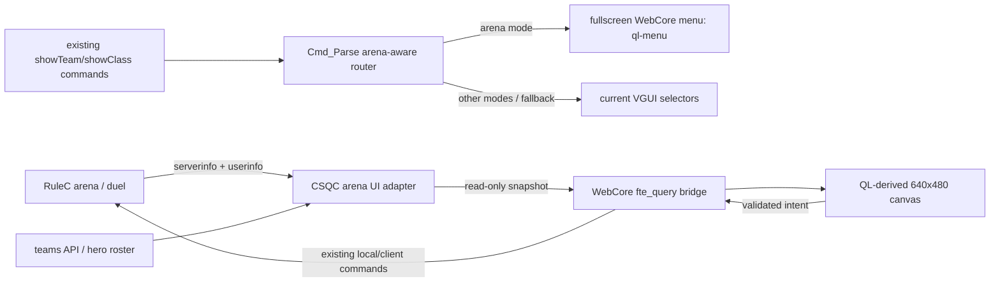

# feat: Opt-in QL-derived WebCore arena UI using existing VGUI connections

## Goal Capsule

- **Objective:** Slot `base/data/web/ql-menu/` into the in-game arena/duel join, spectate, and hero-selection flow as an opt-in test surface, while retaining the same client data sources and server-authoritative commands currently used by `VGUI_ShowTeamSelectionMenu()` and `VGUI_ShowClassSelectionMenu()`.
- **Canonical UI entry point:** The exact page to load and evolve is `base/data/web/ql-menu/index.html`. Its companion `app.js`, fonts, and assets remain part of that page. Do not substitute the earlier root-level `ql-menus.html`, the pause/title/lobby pages, or a newly created WebCore document.
- **Authority:** Existing VGUI behavior and RuleC arena/duel behavior are the functional contract. The QL v495 `intro.smenu` conversion is the presentation contract.
- **Stop when:** With the test feature enabled, duel requests to show team or hero selection open the QL-derived WebCore canvas; its controls drive the existing `joinTeam`, `selecthero`, `ready`/`notready`, and spectator paths; the canvas follows real arena state; no duplicate VGUI selector appears. With the feature disabled, the existing VGUI path remains unchanged.
- **Non-goals:** Rewriting the arena director, emulating the QL UI VM/ownerdraw ABI, replacing all Nuclide VGUI, redesigning the title/lobby UI, or adding new network protocol semantics.

## Problem Frame

Nuclide already has two complete halves that do not yet meet:

1. The VGUI selectors have working game connections. Team buttons query `teams`, send `cmd joinTeam`, chain into class selection, and class buttons send server-validated `cmd selecthero` (`src/client/vgui_chooseteam.qc:32-49`, `src/client/vgui_changeclass.qc:88-102`).
2. The QL-derived WebCore canvas has the desired 640x480 presentation, real v495 assets, working pointer input, and an engine-backed menu surface, but still contains demo players and demo-only warmup state (`base/data/web/ql-menu/app.js:97-124`, `base/data/web/ql-menu/app.js:846-872`).

The implementation should replace only the presentation layer. It should adapt the exact state and action seams used by VGUI rather than introducing a second arena model or changing RuleC ownership.

## Requirements

- **R1. Opt-in arena integration.** When the default-off test feature is enabled in an arena/duel session, `showTeamSelectionMenu`, `showClassSelectionMenu`, and `showHeroSelectionMenu` route to the QL-derived WebCore canvas instead of also showing their VGUI windows. When disabled, dispatch remains exactly as it is today.
- **R2. Existing connection contract.** The WebCore path derives team roster, hero roster, local team/hero state, map/server text, and arena status from the same `teams`, `userinfo`, and `serverinfo` sources used by current CSQC/VGUI.
- **R3. Existing server authority.** Canvas actions terminate in the current server command paths: `joinTeam`, `selecthero`, `ready`, `notready`, and spectator handling. The browser does not directly mutate arena state.
- **R4. Real state only.** In engine mode, hardcoded players and the JavaScript warmup simulator are disabled. The canvas renders a client-published snapshot of current state.
- **R5. QL presentation fidelity.** Preserve the existing 640x480 virtual coordinate system, QL bitmap fonts, extracted assets, frame composition, and `intro.smenu`-derived warmup layout. Nuclide-specific state may replace QL ownerdraw content without changing the authored chrome.
- **R6. Complete selector flow.** The canvas supports join/auto-assign, spectate, current queue/readiness status, hero roster display, hover/selection feedback, and return to game. Duel must not expose internal “Duelist 1 / Duelist 2” team slots.
- **R7. Lifecycle ownership.** The UI opens once per selector request or relevant arena transition, does not reopen every frame after a user closes it, releases input when closed/live/disconnected, and survives resize/video reset through the existing WebCore menu surface.
- **R8. Preserve VGUI intact.** Team/class VGUI source, registration, construction, and behavior remain intact for ordinary use, comparison testing, and immediate fallback. This integration does not delete or rewrite the VGUI implementation.
- **R9. Trusted bridge.** Web content remains local `fte://data/web/...`; action inputs are narrowly validated; arbitrary command strings are not accepted from JavaScript.
- **R10. No duplicate UI.** Only one selector implementation owns input and drawing at a time. The QL canvas and VGUI windows must never stack.
- **R11. Full arena lifecycle.** Warmup, countdown, live, spectator/rejoin, round end, match end, disconnect, and next-match warmup transitions produce coherent visibility and input behavior.
- **R12. Backend preservation.** `base/src/rules/arena.qc` and `base/src/rules/duel.qc` remain authoritative; UI work may expose missing presentation fields but must not change queue, promotion, round, spawn, or winner semantics.

## Acceptance Examples

- **AE1 — First duel join:** A player joins a duel server with no selected hero. The QL warmup canvas appears, the generic team selector does not, and hero selection is available from the same server-triggered `showClassSelectionMenu` flow.
- **AE2 — Hero selection:** Selecting a hero in the canvas sends the existing `selecthero <id>` server command. The server validates it through `Hero_TrySelect`; the selected hero is reflected back from userinfo before the canvas treats the choice as committed.
- **AE3 — Spectate and rejoin:** Selecting SPECTATE uses the existing spectator/team request path, updates the authoritative local state, and leaves the canvas in a coherent spectator state. JOIN MATCH reuses auto-assign/queue entry rather than assigning an internal duel slot directly.
- **AE4 — Two-player start:** Two clients enter the duel queue. Both canvases reflect real queue/competitor state. COUNTDOWN removes join/hero mutation controls; LIVE closes the selector surface and returns input to gameplay.
- **AE5 — Round and match transitions:** ROUND END and MATCH END show state from the arena director without running a second JavaScript timer/state machine. Returning to WARMUP makes the selector available again without duplicate menu instances.
- **AE6 — User closes warmup:** Esc/RETURN TO MATCH closes the WebCore surface and does not reopen it every frame. A later explicit selector command or new lifecycle transition may reopen it.
- **AE7 — Non-arena regression:** In an ordinary team ruleset, `showTeamSelectionMenu` still shows the existing VGUI selector and its class-selection chain behaves unchanged.
- **AE8 — WebCore unavailable:** With the plugin/host missing or the feature cvar disabled, arena selector requests fall back to current VGUI rather than leaving the player without controls.
- **AE9 — Rejected action:** An invalid hero ID or malformed browser action is rejected by the client bridge or server, leaves authoritative state unchanged, and does not execute arbitrary console text.
- **AE10 — Role reversal lifecycle:** Client A hosts and client B joins, both complete warmup → live → disconnect/return. The clients then reverse host/join roles and complete the same flow without stale local UI state.

## Key Technical Decisions

1. **Replace presentation at the existing CSQC command entry points.** `Cmd_Parse()` already receives `showTeamSelectionMenu`, `showClassSelectionMenu`, and `showHeroSelectionMenu` (`src/client/cmd.qc:631-646`). Arena-aware routing belongs there, so existing server `stuffcmd` calls and bindings do not change.
2. **Use a CSQC adapter, not a second server protocol.** VGUI can call `teams`, `userinfo`, and `serverinfo` directly; WebCore cannot. A small arena UI adapter will publish a read-only normalized client snapshot from those same sources for the existing WebCore query bridge. This adapter is presentation plumbing, not new game authority.
3. **Reuse existing commands behind structured actions.** Browser actions map to the same local/server commands VGUI emits. Parameterized values such as hero IDs must pass a narrow validated action path; the existing generic `cbuf:` allowlist intentionally rejects spaces and arbitrary arguments (`plugins/webcore/webcore.c:177-207`).
4. **Use the dedicated full-screen WebCore `menu_t`.** The current engine menu already handles stretch drawing, transparent in-game composition, input, resize/reset, and close behavior. Add an arena/QL URL alias rather than creating a parallel CSQC gecko input stack (`engine/client/m_webcore_menu.c:458-472`, `engine/client/m_webcore_menu.c:490-540`).
5. **One WebCore arena document owns both team and hero presentation.** Team and class requests open the same page with a requested view/mode. This avoids stacking a WebCore warmup screen with the old VGUI hero picker and fulfills the “canvas is the UI” requirement.
6. **Duel exposes intent, not internal team slots.** JOIN MATCH maps to the current auto-assign/queue path; SPECTATE maps to the current spectator path. Closed Duelist teams stay hidden, matching existing `teamclosed_*` filtering (`src/client/vgui_chooseteam.qc:113-121`).
7. **Server/userinfo echo confirms mutations.** The canvas may show pending feedback, but selected hero, team, queue/readiness, and competitor state are committed only after the existing authoritative state changes are observed.
8. **Default-off test slot.** An arena WebCore UI cvar selects WebCore vs VGUI and defaults to the existing VGUI path for this implementation. Enabling it is an explicit integration test. Making WebCore the default, or removing the gate, requires a later decision outside this plan.
9. **Preserve standalone demo mode.** Outside FTE, the page may keep fixture data for visual development. Engine mode must use live state exclusively and clearly separate fixture logic from runtime logic.
10. **Arena state controls visibility; page does not own arena progression.** JavaScript countdown/fight simulation remains demo-only. Runtime phases come from `arena_state` and related published values (`base/src/rules/arena.qc:358-376`).

## High-Level Technical Design

> Directional architecture only; the implementer decides concrete function names and encoding details with current code in front of them.



### Snapshot responsibilities

The runtime snapshot must be sufficient to render the existing VGUI contract and QL warmup presentation without browser-side inference. It should cover:

- Whether arena UI applies and which selector view was requested.
- Map/server/mode text currently sourced from serverinfo.
- Team count, open/closed state, names, and auto-assign result where applicable.
- Hero roster IDs and display names for the effective team/arena roster.
- Local team, selected hero, spectator state, arena queue/readiness state.
- Arena phase, round label, ready/queue count, competitor names/scores, and countdown/deadline presentation data already made authoritative by RuleC.
- Capabilities derived from current state: may join, spectate, select hero, return, or wait.

The snapshot is a view model only. It must not duplicate queue ordering or compute winners.

### Action responsibilities

- **Join/auto-assign:** Equivalent to the current tag-0 VGUI team button and duel queue behavior.
- **Select hero:** Equivalent to `VGUIChangeClassButton::OnMouseUp()` and remains server-validated.
- **Spectate:** Equivalent to the current spectator team button/current duel spectator command path.
- **Ready/not-ready:** Exposed only where the active arena mode uses manual readiness; duel auto-join must not invent an extra mandatory ready click.
- **Return:** Closes only the WebCore menu/input surface.
- **Leave match:** Keeps current disconnect/leave semantics distinct from return-to-game.

## Scope Boundaries

### In scope

- Arena-aware rerouting of existing selector commands.
- Client-side snapshot adapter over existing VGUI data sources.
- Narrow WebCore query/action bridge additions.
- `ql-menu` conversion from demo state to live state.
- Canvas hero roster/selection presentation within the QL shell.
- Menu alias, lifecycle, feature gate, fallback, and verification.
- Suppression/hiding of arena VGUI selectors while WebCore owns them.

### Out of scope

- General replacement of every Nuclide VGUI window.
- Deleting, disabling, or refactoring the existing team/class VGUI implementation.
- Making WebCore the unconditional/default selector before separate approval after testing.
- Replacing `base/data/web/ql-menu/index.html` with the earlier root-level `ql-menus.html` prototype or another newly authored page.
- Repurposing the title, lobby, or pause-menu documents as the arena selector.
- QL `.menu` parser or QL ownerdraw/feeder emulation.
- RuleC arena mechanic changes.
- New lobby transport, matchmaking, or host migration work.
- Replacing the live gameplay HUD beyond any fields needed to transition cleanly out of the selector.
- Redesigning QL assets, coordinates, text style, or frame composition.
- Removing VGUI source files.

## Implementation Units

- U1. **Define the arena selector view-model adapter**
  - **Goal:** Expose a read-only client snapshot built from the same `teams`, `userinfo`, `serverinfo`, player, and arena fields used by VGUI/current HUD code.
  - **Files:** `src/client/` new focused adapter or an existing arena/UI module; `src/client/progs.src`; only presentation-oriented additions to `base/src/rules/arena.qc` if a required authoritative field is not currently published.
  - **Constraints:** No duplicated arena state machine; no browser-owned queue; no per-frame console spam; strings safely encoded; split-screen seat state must not leak between seats.
  - **Test scenarios:**
    - Happy path: duel warmup snapshot reports mode, map, local spectator/queue state, roster, selected hero, ready count, and competitors.
    - Edge: no local player entity yet returns an inactive/not-ready snapshot instead of invalid entity access.
    - Edge: no selected hero returns an explicit empty selection and complete roster.
    - Edge: closed teams are represented as unavailable and are not offered as direct duel choices.
    - Integration: values match what current VGUI would render or act upon for the same client state. Covers AE1, AE2, AE3.

- U2. **Add a narrow WebCore arena bridge**
  - **Goal:** Let trusted local pages read the U1 snapshot and submit validated selector intents that terminate in existing client/server commands.
  - **Files:** `workspace/fteqw/_worktrees/webcore-cpu-renderer/plugins/webcore/webcore.c`; staged/build copy only if the established build workflow requires it.
  - **Constraints:** Do not relax generic `cbuf:` validation; reject malformed or oversized actions; hero IDs must be constrained to the identifier vocabulary already used by the roster; no arbitrary command concatenation.
  - **Test scenarios:**
    - Happy path: snapshot query returns parseable data when connected and inactive data when not connected.
    - Happy path: join, spectate, ready/not-ready, and valid hero selection reach their existing command handlers.
    - Failure: unknown action and malformed hero ID return failure and execute nothing. Covers AE9.
    - Failure: unavailable CSQC/client state produces a safe inactive response.
    - Integration: server-side `Hero_TrySelect` and `Arena_OnClientCommand` remain the final validators. Covers AE2, AE3.

- U3. **Expose the QL arena page through the existing WebCore menu surface**
  - **Goal:** Give the current full-screen WebCore menu a stable arena/QL route and ensure it is classified as an in-game, transparent, closable surface.
  - **Files:** `workspace/fteqw/_worktrees/webcore-cpu-renderer/engine/client/m_webcore_menu.c`; associated declarations/build files only if required.
  - **Constraints:** Reuse the single menu context; do not create another input system; do not start title music or load a background map for the arena route; preserve pause/title/lobby routing.
  - **Test scenarios:**
    - `menu_webcore <arena alias>` opens `fte://data/web/ql-menu/index.html` over a real map.
    - Esc/close returns input to gameplay and does not disconnect.
    - Video resize/reset recreates the page and remains interactive.
    - Opening pause after closing arena still opens the normal pause page.
    - Failure: missing WebCore media reports failure and allows the caller to use VGUI fallback. Covers AE6, AE8.

- U4. **Convert the QL canvas from simulation to the live selector view model**
  - **Goal:** Render live Nuclide selector and arena state inside the existing `intro.smenu`-derived canvas.
  - **Files:** `base/data/web/ql-menu/app.js`; `base/data/web/ql-menu/index.html`; existing local asset/font files only where references are corrected.
  - **Constraints:** Preserve 640x480 authored geometry and v495 assets; keep fixture/demo mode isolated; do not derive authoritative transitions in JavaScript; avoid DOM duplication over the canvas.
  - **Test scenarios:**
    - Happy path: live map/server/mode, local status, queue count, competitors, and selected hero replace demo values. Covers AE1.
    - Hero view lists the current `teams.ClassForIndex()` roster with selected/hover feedback and submits selection. Covers AE2.
    - Duel view offers JOIN MATCH and SPECTATE but no Duelist 1/2 or red/blue assignment. Covers AE3.
    - COUNTDOWN disables mutations; LIVE closes or yields to gameplay; round/match state never advances from the demo timer. Covers AE4, AE5.
    - Standalone browser still renders fixture data for visual iteration.
    - Empty/error snapshot presents a safe waiting/fallback state rather than fake players.

- U5. **Route arena selector commands to WebCore and retain VGUI fallback**
  - **Goal:** Slot the canvas into the arena selector command flow behind a test feature while preserving existing command triggers and VGUI behavior.
  - **Files:** `src/client/cmd.qc`; focused adapter/router file from U1; `src/client/progs.src` as needed. No changes to `src/client/vgui_chooseteam.qc` or `src/client/vgui_changeclass.qc` are expected.
  - **Constraints:** Arena detection must use authoritative session data, not map-name guesses; one default-off feature cvar controls the test slot; existing VGUI functions remain the unchanged default/fallback; no duplicate window show.
  - **Test scenarios:**
    - Arena `showTeamSelectionMenu` opens the QL warmup view and no VGUI team window. Covers AE1.
    - Arena `showClassSelectionMenu` and `showHeroSelectionMenu` open the canvas hero view and no VGUI class window. Covers AE1, AE2.
    - Non-arena team and class commands retain current VGUI behavior. Covers AE7.
    - Feature disabled or WebCore open failure invokes VGUI. Covers AE8.
    - MOTD close in arena routes through the same decision and does not bypass into VGUI (`src/client/vgui_motd.qc:26-38`).

- U6. **Own arena menu lifecycle across game transitions**
  - **Goal:** Ensure opening, closing, input capture, and state changes remain coherent throughout the complete arena lifecycle.
  - **Files:** U1 adapter/router module; `src/client/entry.qc` only for a lifecycle hook if existing command triggers are insufficient; `base/data/web/ql-menu/app.js` for view reaction.
  - **Constraints:** Transition-edge driven, not “open every frame”; explicit user close is respected until a new selector request or meaningful phase epoch; disconnect/world shutdown clears local state; pause and console remain usable according to existing WebCore policy.
  - **Test scenarios:**
    - Connect → warmup → hero selection → queue → countdown → live releases menu input. Covers AE1, AE4.
    - Spectate during warmup and rejoin use one menu instance with authoritative state. Covers AE3.
    - Closing with Esc does not immediately reopen; pressing the existing selector binding explicitly reopens. Covers AE6.
    - Round end/match end/next warmup transition without stale view or simulated state. Covers AE5.
    - Disconnect while open destroys/unlinks the selector and returns to the normal title/connection flow.
    - Two-client full lifecycle followed by host/client role reversal completes without stale snapshot or ownership. Covers AE10.

- U7. **Build, stage, and verify the integrated replacement**
  - **Goal:** Produce verified CSQC and FTE WebCore binaries/assets with a documented rollback switch.
  - **Files:** Generated `base/csprogs.dat`; rebuilt/staged WebCore plugin and engine artifacts where U2/U3 require them; concise WebCore/arena documentation or existing concept page.
  - **Constraints:** Use the repository’s established FTE/WebCore build and staging paths; do not package development-only source trees; no PATH-dependent runtime assumptions.
  - **Test scenarios:**
    - CSQC compiles without warnings introduced by the adapter/router.
    - WebCore plugin and engine build successfully and staged binaries load.
    - Browser smoke confirms no missing QL assets or font pages.
    - In-engine one-client and two-client scenarios AE1-AE10 pass.
    - Rollback cvar restores current VGUI without restart where feasible, or after a documented menu/client reload where required.

## Dependency Order

```text
U1 ──► U2 ──► U4
 │             │
 └────► U5 ◄── U3
          │
          ▼
         U6 ──► U7
```

- U1 defines the view-model contract before browser or bridge work hardens around demo data.
- U2 and U3 can proceed independently after the contract and route are agreed.
- U4 consumes U1/U2.
- U5 performs cutover only after the page can load and consume real state.
- U6 closes lifecycle gaps after the functional path exists.
- U7 verifies and stages the complete chain.

## Files Expected to Change

### Nuclide CSQC/content

- `src/client/cmd.qc`
- `src/client/vgui_chooseteam.qc` — reference only; preserve unchanged unless a proven blocker requires explicit approval
- `src/client/vgui_changeclass.qc` — reference only; preserve unchanged unless a proven blocker requires explicit approval
- `src/client/vgui_motd.qc` only if routing cannot remain centralized in `Cmd_Parse()`
- `src/client/entry.qc` only if lifecycle transitions need a frame/world hook
- `src/client/progs.src`
- New focused client arena UI adapter module if no existing module is suitable
- `base/data/web/ql-menu/app.js`
- `base/data/web/ql-menu/index.html` only if view semantics require markup changes
- `base/src/rules/arena.qc` only for missing authoritative presentation fields
- Generated `base/csprogs.dat`

### FTE/WebCore integration tree

- `workspace/fteqw/_worktrees/webcore-cpu-renderer/plugins/webcore/webcore.c`
- `workspace/fteqw/_worktrees/webcore-cpu-renderer/engine/client/m_webcore_menu.c`
- Build/declaration files only if required by the established engine integration

## Risks and Mitigations

| Risk | Mitigation |
|---|---|
| “Reuse VGUI connections” turns into duplicate browser-owned game state | U1 is explicitly a read-only adapter over existing sources; RuleC remains authoritative. |
| Generic `cbuf:` cannot send `joinTeam`/`selecthero` arguments | Use a narrow validated arena action path; do not weaken the generic allowlist. |
| Arena WebCore and VGUI both capture input | Centralize selection in `Cmd_Parse()` and enforce one feature gate/owner. |
| Auto-join duel conflicts with a QL READY button | Render capabilities from mode/state; duel JOIN reflects queue intent and does not add a redundant readiness requirement. |
| Hero roster changes after first VGUI initialization | Build the snapshot from live `teams.TotalClasses/ClassForIndex`; canvas reconciles by ID rather than fixed button allocation. |
| User closes warmup and the lifecycle watcher reopens it every frame | Track request/phase epochs and explicit dismissal; open on edges or explicit commands only. |
| WebCore page sees stale values immediately after action | Treat action as pending until userinfo/serverinfo echo confirms it. |
| Menu alias is mistaken for title and starts menu music/menumap | Arena route is explicitly non-title/in-game and inherits transparent composition. |
| Plugin/host absent strands the player | Keep VGUI source and implement open-failure/feature-off fallback before cutover. |
| Existing `arena_state` fields are insufficient for countdown/local queue status | Add presentation-only published fields at the authority, without moving progression logic. |
| Split-screen seat data is conflated | Snapshot is seat-aware or feature is explicitly disabled for unsupported multi-seat configurations until proven. |
| Extracted QL asset licensing/distribution differs from local modding use | Keep provenance documented and resolve redistribution separately before public packaging; integration mechanics do not silently relicense assets. |

## Verification Contract

### Static/build

- Compile Nuclide CSQC after U1/U5/U6.
- Build the WebCore plugin after U2 and engine after U3.
- Confirm the runtime stages `fteplug_webcore_x64.dll`, `ftewebcore.dll`, and existing dependencies beside the executable/plugin as currently required.
- Load the QL page in a browser and inspect console/network output for missing local assets.

### One-client runtime

1. Start a duel map with WebCore arena UI enabled.
2. Verify no VGUI selector appears.
3. Exercise canvas hero selection, spectate, rejoin, close, and explicit reopen.
4. Disable the feature and verify the VGUI fallback.
5. Repeat in a non-arena team ruleset and verify unchanged VGUI.

### Two-client runtime

1. Host creates duel; client joins.
2. Both select heroes and enter queue.
3. Verify synchronized warmup count, competitors, countdown, live close, round end, match end, and next warmup.
4. Disconnect the client at warmup and live phases; verify host state and client menu cleanup.
5. Reverse roles and repeat the complete lifecycle.

### Failure runtime

- Launch with WebCore plugin/host missing.
- Submit invalid/unknown browser actions.
- Change resolution while canvas is open.
- Open console while canvas is visible and return without stuck input.
- Disconnect or change map while canvas is open.

## Definition of Done

- [ ] U1: Canvas snapshot is sourced from the same client APIs/data used by VGUI.
- [ ] U2: Narrow query/action bridge works without broadening arbitrary command access.
- [ ] U3: Stable in-game QL menu route uses the current full-screen WebCore surface.
- [ ] U4: Engine mode has no hardcoded players or browser-owned arena progression.
- [ ] U5: With the default-off test feature enabled, arena selector commands use the canvas; with it disabled, the unchanged VGUI path is used.
- [ ] U6: Complete arena lifecycle has coherent visibility and input ownership.
- [ ] U7: CSQC/plugin/engine artifacts build, stage, and pass AE1-AE10.
- [ ] RuleC arena/duel gameplay semantics are unchanged.
- [ ] QL asset/layout fidelity is preserved rather than approximated.
- [ ] Existing VGUI team/class files and behavior remain available and intact.

## Implementation-Time Questions

These do not block the plan; resolve them with current code during execution:

1. Whether the CSQC snapshot is serialized into one cvar or a compact group consumed by the plugin. Choose the option with the least escaping/staleness risk while keeping one logical snapshot revision.
2. Whether explicit menu-view selection is carried in the URL, a client cvar, or snapshot state. It must not require multiple WebCore documents.
3. Which authoritative source should expose countdown remaining if the current `arena_state`/round strings are insufficient. Keep deadline arithmetic at the authority or derive display time from an authoritative deadline.
4. Whether runtime feature-gate changes can switch owners immediately or require closing/reopening the selector. Document whichever behavior is reliable.
5. Whether split-screen can be supported seat-correctly in the first pass; otherwise fail closed to VGUI for multi-seat sessions.

## Grounding References

- VGUI team action and class chain: `src/client/vgui_chooseteam.qc:32-49`
- VGUI team data and closed-team filtering: `src/client/vgui_chooseteam.qc:73-163`
- VGUI hero roster and action: `src/client/vgui_changeclass.qc:88-123`, `src/client/vgui_changeclass.qc:180-201`
- Existing command interception: `src/client/cmd.qc:631-646`
- MOTD-triggered team selector: `src/client/vgui_motd.qc:26-38`
- Duel auto-join and hero prompt: `base/src/rules/duel.qc:64-95`
- Duel existing team/spectate/hero server paths: `base/src/rules/duel.qc:125-193`
- Arena serverinfo publication: `base/src/rules/arena.qc:358-376`
- QL canvas demo/runtime boundary: `base/data/web/ql-menu/app.js:97-139`, `base/data/web/ql-menu/app.js:846-892`
- Existing WebCore menu routing and close behavior: `engine/client/m_webcore_menu.c:458-550`
- Existing strict WebCore command allowlist: `plugins/webcore/webcore.c:177-207`, `plugins/webcore/webcore.c:540-552`
