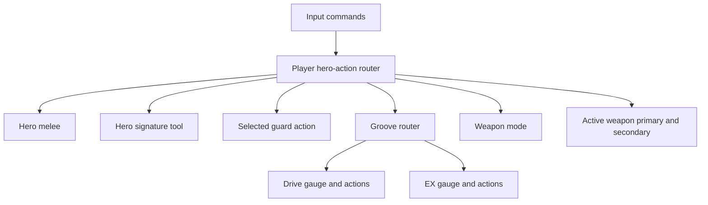

# Hero Actions and Groove Implementation Plan

## Objective

Replace the current weapon-coupled Stiletto ability inputs with a small, reusable **hero action layer**:

- every hero has a distinct, always-available melee;
- every hero has a frequently used signature movement/combat tool independent of
  the weapon currently equipped;
- Guard is a selected hero action (initial selection: shield) which blocks
  weapon attacks and melee while held;
- Groove is the umbrella resource/action system with independent Drive and EX
  gauges, plus a held modifier/mode-shift interaction;
- `Z`, `X`, and `C` are direct action-slot shortcuts; the Groove hold can alter
  the requested action context;
- `R` selects an available weapon mode rather than serving as the permanent
  reload/parry input.

This is a refactor of gameplay ownership, not merely a bind change. Weapons
should retain weapon fire behavior; hero identity should be owned by player
hero-action state and hero entityDef data. Existing commands remain registered
and usable: new commands are introduced as the canonical interface, while
legacy commands forward to the same new routing where appropriate. No legacy
command is removed as part of this work.

## Target Input Contract

| Default input | Command | Role | Transport |
|---|---|---|---|
| `MOUSE1` | `+attack` | weapon primary fire | existing engine usercmd |
| `MOUSE2` | `+hero_tool` | held hero signature tool | `INPUT_HERO_TOOL` / button 11 |
| `ALT` | `+hero_melee` | universal hero-specific melee | `INPUT_MELEE` / button 10 |
| `Q` | `+hero_guard` | selected guard action, initially shield | reliable press/release initially |
| `SHIFT` | `+groove` | Groove modifier/context | client-local modifier for one-shot commands initially |
| `Z` | `hero_action 0` | direct slot 1 | validated one-shot server command |
| `X` | `hero_action 1` | direct slot 2 | validated one-shot server command |
| `C` | `hero_action 2` | direct slot 3 | validated one-shot server command |
| `R` | `weapon_mode` | change supported weapon mode | validated one-shot server command |

`MOUSE2` is deliberately retained as the frequent hero-tool input: it is already
where the shipped autoexec places the current grapple ability. `+attack2` remains
available as an optional weapon-level secondary binding, but it will no longer be
Vagrant's universal melee path.

### Groove request contexts

The action router should receive a stable request shape:

```text
hero_action <slot: 0..2> <context: normal|groove>
```

- A bare `Z`/`X`/`C` request is a direct normal-slot action.
- Holding Groove while pressing a slot sends the `groove` context, allowing the
  hero's Drive/EX mapping to differ without the server trying to infer a network
  chord from unrelated command ordering.
- The client-side Groove modifier should also provide the desired HUD feedback.
- Which gauge/action suite wins in a `groove` context must be declared by hero
  action data (or by a later explicit Drive/EX selector), not hard-coded into
  the input command.

## Current-State Constraints

1. `+stiletto_grapple` currently sends `cmd nuclide_abi_grapple 0|1`, whose
   server handler invokes `m_activeWeapon.DoAbilityAction()` in
   `src/server/cmd_cl.qc`. This incorrectly ties signature tools to whichever
   weapon is active.
2. `INPUT_BUTTON10` (`INPUT_MELEE`) and `INPUT_BUTTON11`
   (`INPUT_STILETTO_GRAPPLE`) are the two unconsumed custom usercmd bits in
   `src/shared/input/input.h`. Use them for high-frequency held actions only.
3. `Z`/`X`/`C`, weapon mode, and initial Guard cannot each consume a new usercmd
   bit. They need validated command/event routing unless the engine input
   protocol is explicitly extended.
4. Vagrant's melee is currently embedded in `ncWeaponVagrantKnife` and is a
   line-only trace; the shared `ncWeaponBaseMelee` already provides the intended
   reusable line-then-hull melee implementation.
5. The current reload-edge `Stiletto_ParryWindow()` only creates a timer/flag;
   no damage path consumes it. It is not an implemented Guard mechanic.
6. The WebCore HUD has Drive/EX art, but no authoritative Drive or EX gameplay
   state exists. The WebCore plugin source that implements `gethud` is outside
   this repository, so its accepted HUD payload keys must be confirmed before
   relying on new cvars.

## Architecture



### Ownership boundaries

| Concern | Owner | Notes |
|---|---|---|
| hero identity, kit identifiers, tuning | hero entityDefs | Continue existing `hero_*` inheritance and spawn flow. |
| primary/secondary weapon fire | active `ncWeapon` | Preserve existing M1/M2 behavior. |
| universal melee | player-owned auxiliary melee weapon | Never change `m_activeWeapon` to perform melee. |
| signature tool | player-owned hero action | Must not dispatch from `m_activeWeapon`. |
| guard state and attack lockout | `ncPlayer` / hero action router | Central gate so every weapon observes it. |
| Drive and EX | authoritative player resource state | Integer values; server mutates. |
| direct slots | server-validated hero action router | Hero data resolves the requested action. |
| HUD | CSQC publisher + WebCore renderer | HUD never owns resource truth. |

### New shared module

Create a deliberately small shared module:

- `src/shared/game/HeroActions.h`
- `src/shared/game/HeroActions.qc`

Expose procedural APIs rather than a wide hero-class hierarchy. Grow the
surface per phase; do not stub later-phase entry points in Phase 1:

```text
# Phase 1
HeroActions_Reset(player)
HeroActions_InputFrame(player, currentButtons, previousButtons)
HeroActions_HeroToolPress(player)
HeroActions_HeroToolRelease(player)
# Phase 2+
HeroActions_MeleePress(player)
# Phase 4+
HeroActions_SetGuardHeld(player, held)
HeroActions_CanAttack(player)
HeroActions_ApplyGuardDamageRules(victim, attacker, damage)
# Phase 5+
HeroActions_CycleWeaponMode(player)
# Phase 7+
HeroActions_RequestSlot(player, slot, context)
```

New player state belongs in `src/shared/game/Player.h` and follows existing
player replication patterns in `src/shared/game/Player.qc`:

```text
m_heroMeleeWeapon              auxiliary melee entity reference
m_heroToolState                hero-specific execution state as needed
m_heroGuardHeld                authoritative hold state
m_heroGuardState               replicated active guard state
m_heroWeaponMode               replicated selected mode
m_drive, m_driveMax            replicated integer Drive units
m_ex, m_exMax                  replicated integer EX units
```

Introduce a dedicated player replication group such as `PLAYER_HERO_ACTIONS` in
Phase 4 with the first replicated guard fields, then extend it for weapon mode
(Phase 5) and Drive/EX (Phase 6). Do not permanently add unrelated combat state
to `PLAYER_STILETTO`. Add only fields that need rendering/reconciliation to
client serialization. Add prediction save/rollback state only after a specific
action genuinely needs it.

### Hero entityDef schema

Extend `base/decls/def/heroes/hero_base.def` with inherited, neutral keys:

```text
hero_melee_weapon
hero_tool
hero_guard_action
hero_weapon_modes
groove_drive_max
groove_ex_max
groove_normal_action_z/x/c
groove_action_z/x/c
```

The exact action identifier format should be decided before Phase 7 (slot
protocol). Start with named, whitelisted action identifiers resolved only from
the current hero def; do not let clients supply entity names, costs, targets, or
coordinates.

Per-hero entityDefs then name their content:

- Collier: revolver remains a normal weapon; melee and grapple are distinct
  hero actions.
- Vagrant: thrown knife remains weapon primary; knife melee and warpknife move
  to hero melee/tool ownership.
- Archstiletto: lunge becomes the hero tool rather than a `declclass` branch in
  generic weapon code.

Vagrant sequencing note: `WeaponVagrantKnife` is touched across Phases 1–3 on
purpose — Phase 1 only routes through existing helpers, Phase 2 extracts melee,
Phase 3 extracts warpknife ownership. Do not combine those into one rewrite.

## Phased Implementation

Phase boundaries below keep **routing**, **ownership moves**, **Guard**,
**weapon mode**, **gauges**, **slot protocol**, **HUD**, and **default binds**
as separately shippable units. Grow `HeroActions_*` APIs only as each phase
needs them; do not stub Guard/slot/mode surfaces in Phase 1.

### Phase 1 — Routing seam and observability

**Goal:** install the player-owned input seam and compatibility shims while
preserving current combat outcomes. This phase does **not** claim tool
independence from weapon ownership.

1. Document aliases in `src/shared/input/input.h`:
   - retain `INPUT_MELEE` for `+hero_melee`;
   - introduce `INPUT_HERO_TOOL` as the generic name for button 11;
   - retain `INPUT_STILETTO_GRAPPLE` as a compatibility alias temporarily.
2. Add a developer action-debug cvar/logging for tool press/release, melee,
   guard transitions, slot requests, resource mutations, and mode changes
   (stubs may log no-ops until later phases implement those paths).
3. Add `HeroActions.{h,qc}` with only the APIs this phase needs
   (`Reset`, `InputFrame`, tool press/release) and include it in the relevant
   shared program manifests.
4. In `src/client/defs.h`, add client-seat held flags for `+hero_melee` and
   `+hero_tool`.
5. In `src/client/cmd.qc`, map those commands to the seat flags and register
   `+/-hero_melee`, `+/-hero_tool`, `+/-hero_guard`, `+/-groove`, direct slot
   commands, and `weapon_mode`. Guard/slot/mode handlers may be no-ops or
   logged placeholders until their phases.
6. In `ncPlayer::ClientInputFrame()` (`src/shared/game/Player.qc`), pack melee
   and hero tool into buttons 10 and 11, exactly as dash is packed today.
7. In the shared player input route, call `HeroActions_InputFrame()` before
   ordinary active-weapon dispatch and use rising edges based on the existing
   prior-button tracking.
8. Convert `nuclide_abi_grapple` in `src/server/cmd_cl.qc` to a compatibility
   shim that forwards to the player router rather than directly invoking the
   active weapon.
9. Wire the router to existing helpers for parity only (ownership stays where
   it is today):
   - default/Collier tool -> `Stiletto_FireGrapple()`;
   - Archstiletto -> existing lunge press/release helpers;
   - Vagrant -> existing warpknife tool logic.
10. Retain `+stiletto_grapple` as a supported legacy alias that forwards to
    `+hero_tool` routing. Keep `+attack2`, `+reload`, and all current Stiletto
    commands registered and behaviorally available; new defaults simply stop
    assigning them the new hero-action keys. Do not change shipped binds yet.

**Critical files:**

- `src/shared/input/input.h`
- `src/client/defs.h`
- `src/client/cmd.qc`
- `src/shared/game/Player.h`
- `src/shared/game/Player.qc`
- `src/server/cmd_cl.qc`
- `src/shared/game/HeroActions.h`
- `src/shared/game/HeroActions.qc`
- `src/shared/physics/stiletto_tuning.qc`

**Exit criteria:** existing Collier grapple, Vagrant warpknife, Archstiletto
lunge, dash, reload, and weapon switching still work; new tool/melee button
packing and command names are live; `nuclide_abi_grapple` no longer calls
`m_activeWeapon.DoAbilityAction()` directly; tools may still depend on weapon-
owned helpers/state until Phase 3.

### Phase 2 — Universal auxiliary melee

**Goal:** `ALT` triggers a hero-specific melee without weapon switching.

1. Add `hero_melee_weapon` to `hero_base.def` and populate initial hero defs.
2. Extend the existing spawn/loadout path in `src/shared/game/Actor.qc` (or add
   a dedicated player-spawn helper) to create and retain the auxiliary melee
   entity without placing it in active weapon selection.
3. On an `INPUT_MELEE` rising edge, have the router invoke that melee entity's
   normal attack path. The server remains authoritative for hit resolution.
4. Define standard hero melee weapons through `weapon_melee_base.def` so they
   reuse `ncWeaponBaseMelee`'s line-first, configurable hull fallback, direct
   damage, cleave, and projectile-cut behavior.
5. Migrate Vagrant's melee tuning and special backstab behavior into a focused
   subclass/hook built on `ncWeaponBaseMelee`; do not retain its duplicate
   line-only trace.
6. Rewire Vagrant's `SecondaryAttack()` melee to the new shared hero-melee
   route only after automated/manual parity confirms range, cut cooldown,
   backstab, sounds, damage, and knockback. Keep `+attack2` supported as a
   weapon-secondary command; it is simply no longer the canonical Vagrant
   melee bind.

**Critical files:**

- `src/shared/game/Actor.qc`
- `src/shared/game/Player.h`
- `src/shared/game/Player.qc`
- `src/shared/game/HeroActions.qc`
- `src/shared/game/WeaponBaseMelee.h`
- `src/shared/game/WeaponBaseMelee.qc`
- `src/shared/game/WeaponVagrantKnife.h`
- `src/shared/game/WeaponVagrantKnife.qc`
- `base/decls/def/heroes/hero_base.def`
- `base/decls/def/heroes/hero_collier.def`
- `base/decls/def/heroes/hero_vagrant.def`
- `base/decls/def/weapons/weapon_melee_base.def`
- new `base/decls/def/weapons/hero_*_melee.def`
- `base/decls/def/weapons.def`

**Exit criteria:** changing weapons never removes the ability to melee; melee
never alters `m_activeWeapon`; every current hero has its defined unique melee;
Vagrant retains intended special rules.

### Phase 3 — Tool ownership migration

**Goal:** move signature-tool ownership off the active weapon so tools work with
any valid loadout. This is where independence from `m_activeWeapon` is earned.

Migrate in this order:

1. **Default / Collier grapple:** move default `Stiletto_FireGrapple()` dispatch
   from `ncWeapon::DoAbilityAction()` into the hero-tool router.
2. **Archstiletto lunge:** move the `weapon_archstiletto` `declclass` branch out
   of `src/shared/game/Weapon.qc`; the router directly calls its lunge helpers.
3. **Vagrant warpknife:** separate persistent warpknife state from
   `ncWeaponVagrantKnife` into player-owned hero-tool state or a dedicated
   non-active tool entity. Keep thrown knife primary on the weapon.
4. Implement tool hold/release lifecycle cleanup on death, respawn, class
   change, spectator state, and UI focus. The old server-command release route
   must remain a compatibility adapter until all callers use button 11.
5. After parity testing, retain the old active-weapon ability virtuals
   (`DoAbilityAction` / `OnAbilityReleased`) as compatibility adapters that
   forward to the hero-tool router. Retain the old grapple command as a legacy
   alias. Internal duplication may be retired, but the command/API surface
   stays available.

**Critical files:**

- `src/shared/game/HeroActions.qc`
- `src/shared/game/Weapon.qc`
- `src/shared/game/WeaponVagrantKnife.h`
- `src/shared/game/WeaponVagrantKnife.qc`
- `src/shared/game/WeaponArchstiletto.qc`
- `src/shared/physics/stiletto_tuning.qc`
- `src/server/cmd_cl.qc`
- relevant hero defs (`hero_tool` keys as needed)

**Exit criteria:** every tool works with any valid active weapon; no canonical
new tool behavior depends on `m_activeWeapon`; no generic weapon code needs a
hero `declclass` branch to decide a tool.

### Phase 4 — Guard

**Goal:** make `Q` a real held guard with attack lockout and damage rules.
Introduce `PLAYER_HERO_ACTIONS` here for the first replicated hero-action
fields (guard held/active). Later phases add Drive/EX/mode into the same group.

1. Represent selected guard action in hero data (`hero_guard_action`); initial
   action is a shield.
2. Route `+hero_guard` to authoritative held state. Because it does not have a
   spare input button in the first pass, use reliable press/release messages
   with defensive cleanup and an expiry/heartbeat policy so a lost release
   cannot leave Guard stuck.
3. Clear Guard on death, respawn, spectator transition, class change, UI focus,
   disconnect, and forced combat-lock states.
4. In `ncPlayer`'s shared input dispatch, gate before the current
   secondary -> primary -> reload chain:
   - call `m_activeWeapon.Release()` once on Guard entry;
   - suppress primary, secondary, reload/weapon-mode attacks, and universal
     melee while guarded;
   - allow movement unless the hero guard config says otherwise.
5. Add incoming-damage behavior only in the authoritative server damage route:
   begin with configurable block/reduction and directional validation. Do not
   reuse `VFL_STILETTO_PARRY`; it is only a legacy timer/flag.
6. Wire guard fields through `PLAYER_HERO_ACTIONS` (change eval, serialize,
   client receive, spawn/reset). Prediction save/rollback only if a later
   action genuinely needs it.

**Critical files:**

- `src/shared/game/HeroActions.qc`
- `src/shared/game/Player.h`
- `src/shared/game/Player.qc`
- `src/shared/physics/stiletto_tuning.qc`
- the shared server damage route used by `ncSurfacePropEntity::Damage`
- `base/decls/def/heroes/hero_base.def`
- relevant hero defs

**Exit criteria:** Guard reliably stops all weapon fire and melee on client and
server, release restores use, guard cannot become stuck, and remote
observers/spectators see correct guard state.

### Phase 5 — Weapon mode

**Goal:** introduce a validated weapon-mode cycle without silently breaking
reload behavior. Independent of Guard.

1. Add a generic weapon-mode hook to `ncWeapon` (for example,
   `OnWeaponModeChanged(mode)`) and a server-validated `weapon_mode` cycle.
   Unsupported weapons must remain mode 0.
2. Replicate `m_heroWeaponMode` via `PLAYER_HERO_ACTIONS`.
3. Add `hero_weapon_modes` (or per-weapon mode lists) only for the first
   supported set; leave everything else inert.
4. During migration, preserve bare `+reload` for weapons which still reload.
   Do not change shipped `R` binds in this phase.

**Critical files:**

- `src/shared/game/HeroActions.qc`
- `src/shared/game/Player.h`
- `src/shared/game/Player.qc`
- `src/shared/game/Weapon.h`
- `src/shared/game/Weapon.qc`
- relevant hero and weapon defs

**Exit criteria:** unsupported weapons stay at mode 0; supported weapons cycle
correctly via the command; reload remains available where it still matters;
`R` is not stolen from shipped defaults yet.

### Phase 6 — Drive/EX gauge state

**Goal:** make both gauges authoritative, replicated, and mutated only on the
server. No slot actions required yet.

1. Resolve gauge scale before coding (recommended Drive `0..1000`, EX `0..3`
   or `0..1000` if EX needs fractional fill).
2. Add integer player resources (`m_drive`, `m_driveMax`, `m_ex`, `m_exMax`)
   and extend `PLAYER_HERO_ACTIONS` for them.
3. Wire spawn/reset, save/restore, and local prediction snapshots only if a
   later action requires prediction.
4. Create server-only helpers for bounded resource mutation:
   `AddDrive`, `SpendDrive`, `AddEX`, `SpendEX` (and a shared clamp/log path).
5. Award gauges only from server-confirmed outcomes (damage, guard, round
   rules, etc.). Clamp all mutations and log invalid attempts in developer
   builds.
6. Add hero def keys `groove_drive_max` / `groove_ex_max` and apply them on
   spawn/hero select.

**Critical files:**

- `src/shared/game/HeroActions.h`
- `src/shared/game/HeroActions.qc`
- `src/shared/game/Player.h`
- `src/shared/game/Player.qc`
- `base/decls/def/heroes/hero_base.def`
- relevant hero defs

**Exit criteria:** Drive and EX coexist, mutate independently, never become
client-writable, and survive death/respawn/spectating/reconnect with correct
replicated values (HUD display can still be stubbed until Phase 8).

### Phase 7 — Slot protocol and first Groove actions

**Goal:** validate the direct/chord `hero_action` protocol with one low-risk
Drive action and one EX action before building full hero suites.

1. Decide normal vs Groove-context slot mappings and which gauge suite a
   `groove` context selects (see Decisions Needed).
2. Add hero def keys for `groove_normal_action_z/x/c` and `groove_action_z/x/c`
   using the agreed whitelisted identifier format.
3. Implement client Groove modifier capture for one-shot slot commands so the
   request shape is `hero_action <slot> <normal|groove>`.
4. Add generic `hero_action` server parsing. Validate alive state, selected
   hero, slot range, context, current guard/punish/tool restrictions, cooldown,
   resource cost, and duplicate/rate-limited requests. Validate completely
   before spending; never accept client costs, target entities, positions, or
   timestamps.
5. Implement `CanUseAction` against the Phase 6 helpers.
6. Ship one low-risk Drive and one EX action first; migrate each hero's
   complete action suite only after the protocol is proven.

**Critical files:**

- `src/client/cmd.qc`
- `src/server/cmd_cl.qc`
- `src/shared/game/HeroActions.qc`
- `src/shared/game/Player.qc`
- `base/decls/def/heroes/hero_base.def`
- relevant hero defs / action identifiers

**Exit criteria:** bare and Groove-chorded `Z`/`X`/`C` deliver the correct
context; invalid/spammed actions cannot spend or execute; the two pilot
actions spend the correct gauge and respect cooldowns.

### Phase 8 — HUD publish and render

**Goal:** display authoritative hero-action state in the WebCore HUD without
owning resource truth.

1. Confirm how the external WebCore plugin serializes additional HUD payload
   keys/cvars before treating arbitrary `webcore_hud_*` cvars as a stable API.
2. `base/src/hud/hud.qc`: publish local Drive, Drive max, EX, EX max, guard
   state, selected slot/mode, and optional pending/cooldown fields; maintain
   letterboxed `g_hudMins`/`g_hudRes` rendering.
3. `base/data/web/hud/app.js`: retain Drive/ability pip DOM elements, parse the
   new payload, update Drive and EX displays, and apply guard/availability
   classes. Preserve fallback handling for older `gethud` JSON.

**Critical files:**

- `base/src/hud/hud.qc`
- `base/data/web/hud/app.js`
- external WebCore plugin contract (confirm only; source may be outside repo)

**Exit criteria:** HUD values update after action, death, respawn, and
reconnect; letterboxed layout is preserved; older payload shapes still degrade
gracefully.

### Phase 9 — Finalize default bindings while retaining compatibility

**Goal:** switch official mappings only after the mechanics and UI are usable.

1. Update all bind surfaces together:
   - `base/default_controls.cfg`
   - `base/gfx/shell/kb_def.lst`
   - `base/gfx/shell/kb_act.lst`
   - `base/autoexec.cfg`
2. Replace the current autoexec default bindings (without unregistering their
   commands):
   - `Q +attack2`
   - `MOUSE2 +stiletto_grapple`
3. Set the chosen defaults:

```cfg
bind MOUSE1 "+attack"
bind MOUSE2 "+hero_tool"
bind ALT "+hero_melee"
bind Q "+hero_guard"
bind SHIFT "+groove"
bind Z "hero_action 0"
bind X "hero_action 1"
bind C "hero_action 2"
bind R "weapon_mode"
```

4. Resolve the *default-binding* conflicts: `ALT +strafe`, `SHIFT +sprint`,
   `C +moveup`, `X +movedown`, and `R +reload` must be assigned elsewhere or
   omitted from the shipped defaults. Their commands remain available for
   players, compatibility configs, and optional alternate schemes.
5. Keep legacy commands and entry points as supported adapters:
   `+stiletto_grapple` forwards to hero-tool routing; `+attack2` remains a
   weapon-secondary command; reload remains available where weapons support
   it; and old internal tool/parry paths forward to their new owning systems.
   Refactor duplicated internals only after replacement behavior is covered by
   the test matrix.

## Verification

### Build checks

For each QC phase, compile every affected shared client/server program. EntityDef
changes require a game restart rather than QC recompilation; QC changes require
rebuilding the relevant programs.

### Gameplay matrix

Run a local server with two clients and cover:

| Scenario | Expected result |
|---|---|
| Collier, Vagrant, Archstiletto tool use | Tool is correct for hero, independent of active weapon. |
| Hero melee while switching weapons | `ALT` always uses the hero's melee and never changes selected weapon. |
| Guard plus M1/M2/Alt/R | Attacks/melee are blocked while Guard is active; movement remains as configured. |
| Guard lifecycle | Death, class switch, spectator mode, pause/focus/UI loss, reconnect clear it. |
| Groove direct vs chorded Z/X/C | Correct context reaches server; slot/cost/cooldown validation is enforced. |
| Drive/EX boundary values | Zero, exact cost, one below cost, max, and overflow clamp correctly. |
| Action command spam | No duplicate execution or negative resources. |
| Existing movement | Dash/acro, jump, grapple pull, wall movement, and reload behavior remain correct until intentionally migrated. |
| Networking | Local player, remote observer, and spectator receive correct Guard/resource/mode snapshots. |
| HUD | Values use the letterboxed HUD rect and update after action, death, respawn, and reconnect. |

### UI reload workflow

For WebCore HUD changes, reload its view by toggling `webcore_hud` off/on. If
cached assets are involved, bump `webcore_hud_url`'s query version before the
toggle. `menu_restart` is not the primary reload path for this WebCore HUD.

## Decisions Needed Before Implementation

1. **Direct versus Groove slot mapping:** define the normal and Groove-context
   actions for `Z/X/C`, including whether Groove chooses Drive, EX, or a current
   gauge selection state.
2. **Gauge rules:** max values, gain sources, costs, decay, and whether either
   gauge persists through death and rounds.
3. **Guard rules:** hold vs toggle preference, directional requirement, movement
   penalty, damage reduction/block amount, break/cooldown, and whether it gains
   Drive/EX.
4. **Weapon-mode behavior:** identify first supported modes per hero weapon and
   decide when bare reload can safely disappear.
5. **Tool behavior:** confirm that `MOUSE2` is the final shared signature-tool
   bind, and document each current/future hero's press/hold/release semantics.
6. **Visibility:** decide whether opponents see Drive/EX values or only Guard
   and visible action state; the plan assumes full meter is local HUD data and
   gameplay-visible state is replicated as required.
